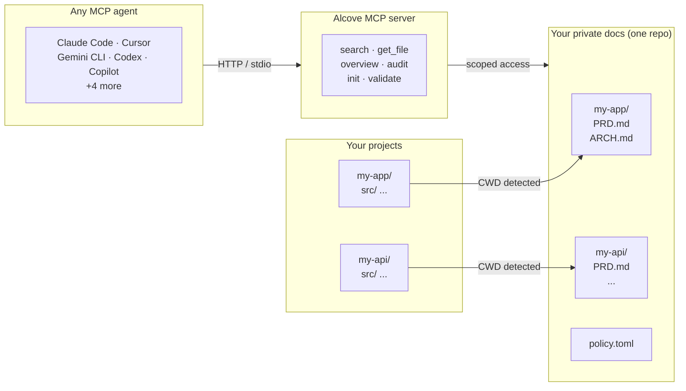

<p align="center">
  
</p>

<p align="center"><strong>Your AI agent doesn't know your project. Alcove fixes that.</strong></p>

<p align="center">
  <a href="README.md">English</a> ·
  <a href="docs/README.ko.md">한국어</a> ·
  <a href="docs/README.ja.md">日本語</a> ·
  <a href="docs/README.zh-CN.md">简体中文</a> ·
  <a href="docs/README.es.md">Español</a> ·
  <a href="docs/README.hi.md">हिन्दी</a> ·
  <a href="docs/README.pt-BR.md">Português</a> ·
  <a href="docs/README.de.md">Deutsch</a> ·
  <a href="docs/README.fr.md">Français</a> ·
  <a href="docs/README.ru.md">Русский</a>
</p>

<p align="center">
  <a href="https://glama.ai/mcp/servers/epicsagas/alcove"></a>
  <a href="https://crates.io/crates/alcove"></a>
  <a href="https://crates.io/crates/alcove"></a>
  <a href="LICENSE"></a>
  <a href="https://buymeacoffee.com/epicsaga"></a>
</p>

Alcove is an MCP server that gives AI coding agents on-demand access to your private project docs — without dumping everything into the context window, without leaking docs into public repos, and without per-project config for every agent you use.

## Demo


> *Claude, Gemini, Codex — search · switch projects · global search · validate & generate. One setup.*

<details>
<summary>CLI demo</summary>


> *`alcove search` · project switch · `--scope global` · `alcove validate`*

</details>

## The problem

You have two bad options.

**Option A: Put docs in `CLAUDE.md` / `AGENTS.md`**
Every file gets injected into the context window on every run.
Works for short conventions. Breaks down with real project docs.
10 architecture files = context bloat = slower, more expensive, less accurate responses.

**Option B: Don't put docs in**
Your agent invents requirements you already documented.
It ignores constraints from decisions you already made.
It asks you to explain the same things every session.

Neither option scales. Now multiply it across 5 projects and 3 agents, each configured differently. Every time you switch, you lose context.

## How Alcove solves this

Alcove doesn't inject your docs. **Agents search for what they need, when they need it.**

```
~/projects/my-app $ claude "how is auth implemented?"

  → Alcove detects project: my-app
  → BM25 search: "auth" → ARCHITECTURE.md (score: 0.94), DECISIONS.md (score: 0.71)
  → Agent gets the 2 most relevant docs, not all 12
```

```
~/projects/my-api $ codex "review the API design"

  → Alcove detects project: my-api
  → Same doc structure, same access pattern
  → Different project, zero reconfiguration
```

**Switch agents anytime. Switch projects anytime. The document layer stays standardized.**

## The right split

**`CLAUDE.md` / `AGENTS.md`** is for agent behavior: repeated mistakes to avoid, coding conventions, and session-specific instructions. Keep it under 200 lines.

**Alcove** is for project knowledge: architecture, decisions, runbooks, API docs, and anything else your agent needs to understand — but not necessarily on every run.

The pattern:
```
CLAUDE.md | AGENTS.md                             ← agent rules, coding conventions, recurring corrections
~/.config/alcove/docs/my-app/
  ARCHITECTURE.md                      ← tech stack, data model, system design
  DECISIONS.md                         ← why X was chosen over Y
  DEBT.md                              ← known issues, workarounds
  ...                                  ← agent searches here when it needs context
```

Agents call `search_project_docs("auth flow")` and get the 2 most relevant docs — not all 12. Nothing hits the context window unless it's actually needed.

## Why Alcove

> **Why not just use `CLAUDE.md`?** Short conventions and agent behaviors belong there. Project documentation — architecture, decisions, runbooks, PRDs — doesn't scale in a context file. Alcove is not a replacement; it's the layer `CLAUDE.md` was never meant to be.

| Without Alcove | With Alcove |
|----------------|-------------|
| Docs in `CLAUDE.md` bloat context on every run | BM25 search — agents pull only what they need |
| Internal docs scattered across Notion, Google Docs, local files | One doc-repo, structured by project |
| Each AI agent configured separately for doc access | One setup, all agents share the same access |
| Switching projects means re-explaining context | CWD auto-detection, instant project switch |
| Agent search returns random matching lines | Ranked results — best matches first, one result per file |
| "Search all my notes about OAuth" — impossible | Global search across every project in one query |
| Sensitive docs sitting in project repos | Private docs on your machine, never in public repos |
| Doc structure differs per project and team member | `policy.toml` enforces standards across all projects |
| No way to check if docs are complete | `validate` catches missing files, empty templates, missing sections |
| Stale docs with broken links or WIP markers go unnoticed | `lint` detects broken links, orphans, and stale markers automatically |
| Notes from Obsidian or other tools stay siloed | `promote` brings any note into your doc-repo with one command |

## Quick start

```bash
# macOS
brew install epicsagas/tap/alcove

# Linux / Windows — pre-built binary (fast, no compilation)
cargo install cargo-binstall
cargo binstall alcove

# Any platform — build from source
cargo install alcove

# Clone and build
git clone https://github.com/epicsagas/alcove.git
cd alcove
make install

alcove setup
```

### Claude Code Plugin

If you use [Claude Code](https://claude.ai/claude-code), you can install Alcove as a plugin — it auto-installs the binary and registers the MCP server in one step:

```bash
claude plugin install epicsagas/alcove
```

This runs a `SessionStart` hook that:
1. Installs the `alcove` binary if not found (via brew / cargo-binstall / cargo)
2. Runs `alcove setup` to register the MCP server

**Optional dependencies**

| Tool | Purpose | Install |
|---|---|---|
| `pdftotext` (poppler) | Full PDF text extraction — required for PDF search | macOS: `brew install poppler` · Debian/Ubuntu: `apt install poppler-utils` · Fedora: `dnf install poppler-utils` · Windows: [poppler for Windows](https://github.com/oschwartz10612/poppler-windows/releases) |

Without `pdftotext`, Alcove falls back to a built-in PDF parser which may fail on some files. Run `alcove doctor` to check your setup.

> **Note**: Pre-built binaries are available for Linux (x86\_64), macOS (Apple Silicon & Intel), and Windows.

`setup` walks you through everything interactively:

1. Where your docs live
2. Which document categories to track
3. Preferred diagram format
4. Embedding model for hybrid search
5. **HTTP server** — host, port, auto-generated bearer token, and login item registration
6. Which AI agents to configure (MCP + skill files)

Re-run `alcove setup` anytime to change settings. It remembers your previous choices.

---

## How it works



Your docs are organized in a separate directory (`DOCS_ROOT`), one folder per project. Alcove manages docs there and serves them to any MCP-compatible AI agent. When the background HTTP server is running (via `alcove enable`), agents connect directly via HTTP for instant response with zero cold-start. Without the background server, agents fall back to stdio mode which loads the engine on each session.

## What it does

- **On-demand doc retrieval** — agents search and retrieve; nothing is pre-loaded into context
- **BM25 ranked search** — fast full-text search powered by [tantivy](https://github.com/quickwit-oss/tantivy); most relevant docs first, auto-indexed, falls back to grep
- **One doc-repo, multiple projects** — private docs organized by project, managed in a single place
- **One setup, any agent** — configure once, every MCP-compatible agent gets the same access
- **Auto-detects your project** from CWD — no per-project config needed
- **Scoped access** — each project only sees its own docs
- **Cross-project search** — search across all projects at once with `scope: "global"`
- **Private docs stay private** — docs never touch your public repo, runs entirely on your machine
- **Persistent HTTP server** — optional background server eliminates cold-start latency; agents connect via HTTP for instant response
- **Standardized doc structure** — `policy.toml` enforces consistent docs across all projects and teams
- **Cross-repo audit** — finds internal docs misplaced in your project repo, suggests fixes
- **Document validation** — checks for missing files, unfilled templates, required sections
- **Semantic lint** — detects broken wikilinks, orphan files, stale WIP/DRAFT markers, and date claims that are 2+ years old
- **External vault promotion** — bring a note from Obsidian (or any vault) into your alcove doc-repo with one command; auto-routes to the right project
- **Works with 9+ agents** — Claude Code, Cursor, Claude Desktop, Cline, OpenCode, Codex, Copilot, Antigravity, Gemini CLI

## MCP Tools

| Tool | What it does |
|------|-------------|
| `get_project_docs_overview` | List all docs with classification and sizes |
| `search_project_docs` | Smart search — auto-selects BM25 ranked or grep, supports `scope: "global"` for cross-project search |
| `get_doc_file` | Read a specific doc by path (supports `offset`/`limit` for large files) |
| `list_projects` | Show all projects in your docs repo |
| `audit_project` | Cross-repo audit — scans doc-repo and local project repo, suggests actions |
| `init_project` | Scaffold docs for a new project (internal + external docs, selective file creation) |
| `validate_docs` | Validate docs against team policy (`policy.toml`) |
| `rebuild_index` | Rebuild the full-text search index (usually automatic) |
| `check_doc_changes` | Detect added, modified, or deleted docs since last index build |
| `lint_project` | Semantic lint — broken links, orphan files, stale markers, stale date claims |
| `promote_document` | Copy or move a file from an external vault into the alcove doc-repo |

## CLI

```
alcove              Start MCP server (agents call this)
alcove setup        Interactive setup — re-run anytime to reconfigure
alcove doctor       Check the health of your alcove installation
alcove validate     Validate docs against policy (--format json, --exit-code)
alcove lint         Semantic lint — broken links, orphans, stale markers (--format json)
alcove promote      Bring a file from an external vault into your doc-repo
alcove index        Update the search index (incremental — only changed files)
alcove rebuild      Rebuild the search index from scratch (use after schema changes)
alcove search       Search docs from the terminal
alcove serve        Start HTTP RAG server for external access
alcove enable       Register as macOS login item and start background server
alcove disable      Unregister from login items and stop server
alcove start        Start the background server
alcove stop         Stop the background server
alcove restart      Restart the background server
alcove token        Print the bearer token for team sharing
alcove uninstall    Remove skills, config, and legacy files
```

### Lint

```bash
# Lint the current project (auto-detected from CWD)
alcove lint

# Lint a specific project by name
alcove lint --project my-app

# Machine-readable output for CI
alcove lint --format json
```

Lint checks four things:

| Check | What it catches |
|-------|----------------|
| `broken-link` | `[[wikilinks]]` and `[text](path)` pointing to missing files |
| `orphan` | Files that no other document links to |
| `stale-marker` | WIP / TODO / FIXME / DRAFT / DEPRECATED markers |
| `stale-date` | Year mentions that are 2+ years old (e.g. "as of 2022") |

### Promote

```bash
# Copy a note from Obsidian into your doc-repo (auto-routes to matching project)
alcove promote ~/my-brain/Projects/auth-notes.md

# Route to a specific project
alcove promote ~/my-brain/Projects/auth-notes.md --project my-app

# Move instead of copy
alcove promote ~/my-brain/Projects/auth-notes.md --mv
```

Files with no matching project land in `inbox/` for manual review.

### Background Server

Alcove can run as a persistent HTTP RAG server, accessible via REST API. This is useful for external integrations, dashboards, or non-MCP clients. **When enabled, MCP agents connect directly via HTTP** — eliminating cold-start latency (ONNX model load, index open) on every new session.

```bash
# Start the server in the foreground
alcove serve                       # default: 127.0.0.1:8080
alcove serve --port 9090           # custom port
alcove serve --host 0.0.0.0       # listen on all interfaces
```

The server uses a **bearer token** for authentication. During `alcove setup`, a token is auto-generated and stored in `config.toml`. You can also pass one explicitly with `--token` or the `ALCOVE_TOKEN` environment variable.

#### Token management

```bash
# Print the stored token (for sharing with teammates)
alcove token

# Teammates set it in their shell profile:
export ALCOVE_TOKEN="alcove-a3f7b2e14d5c..."
```

Tokens are resolved with priority: **`--token` flag > `ALCOVE_TOKEN` env var > `config.toml`**.

#### macOS Login Item (launchd)

Register Alcove as a macOS login item so the HTTP server starts automatically on login and stays running in the background. **This is the default during `alcove setup`** — the setup wizard asks whether to enable it (default: Yes).

```bash
# Register and start (persists across reboots)
alcove enable

# Lifecycle management
alcove stop         # stop the server
alcove start        # start it again
alcove restart      # stop + start

# Unregister (stops server and removes login item)
alcove disable
```

This installs a LaunchAgent at `~/Library/LaunchAgents/com.epicsagas.alcove.plist`. Logs are written to `~/.alcove/logs/`.

#### Connection Modes

When the background HTTP server is running, MCP agents connect to it directly via HTTP — no cold start, no process spawning per session. Without the background server, agents fall back to stdio mode (the alcove binary starts as a subprocess).

```
alcove setup (enable = Yes):
  Agent → HTTP POST http://127.0.0.1:8080/mcp → running server (instant)

alcove setup (enable = No):
  Agent → spawns alcove (stdio) → loads engine (cold start)
```

Setup configures the right mode automatically in each agent's MCP config file — HTTP `url` when enabled, `command` (stdio) when not.

## Search

Alcove automatically picks the best search strategy. When the search index exists, it uses **BM25 ranked search** (powered by [tantivy](https://github.com/quickwit-oss/tantivy)) for relevance-scored results. When it doesn't, it falls back to grep. You never have to think about it.

### Hybrid Search (RAG)

Alcove supports **Hybrid Search** which combines BM25 with **Vector Similarity Search** (powered by [fastembed](https://github.com/ankane/fastembed-rs)).

During `alcove setup`, you can choose an embedding model and download it immediately. You can also manage models manually:

```bash
# Set and download an embedding model
alcove model set MultilingualE5Small
alcove model download

# Check model status
alcove model status
```

#### Choosing a model

| Model | Disk | Dim | Languages | Best for |
|-------|------|-----|-----------|----------|
| `SnowflakeArcticEmbedXSQ` | 15 MB | 384 | English | CI, resource-constrained environments |
| `SnowflakeArcticEmbedXS` | 30 MB | 384 | English | Fast English-only indexing |
| `SnowflakeArcticEmbedSQ` | 65 MB | 384 | English | Balanced quality + size (English) |
| `SnowflakeArcticEmbedS` | 130 MB | 384 | English | Good English recall |
| **`MultilingualE5Small`** | **235 MB** | **384** | **100+ languages** | **Default — multilingual / mixed-language projects** |
| `SnowflakeArcticEmbedMQ` | 200 MB | 768 | English | High quality, quantized |
| `SnowflakeArcticEmbedM` | 400 MB | 768 | English | Best English recall |
| `MultilingualE5Base` | 555 MB | 768 | 100+ languages | Better multilingual quality |
| `MultilingualE5Large` | 2.2 GB | 1024 | 100+ languages | Maximum multilingual quality |
| `BGEM3` | 2.3 GB | 1024 | 100+ languages | State-of-the-art multilingual |

**Q (quantized) variants** use int8 quantization — ~50% smaller on disk, slightly lower recall, no meaningful accuracy loss for typical document search. Use the XSQ/SQ/MQ variants when memory is a constraint.

Once a model is downloaded and ready, Alcove will automatically use Hybrid Search for both CLI search and agent-based MCP tools. This is particularly effective for multilingual projects and complex semantic queries.

```bash
# Search the current project (auto-detected from CWD)
alcove search "authentication flow"

# Force grep mode if you want exact substring matching
alcove search "FR-023" --mode grep
```

The index builds automatically in the background when the MCP server starts, and rebuilds when it detects file changes. No cron jobs, no manual steps.

**How it works for agents:** agents just call `search_project_docs` with a query. Alcove handles the rest — ranking, deduplication (one result per file), cross-project search, and fallback. The agent never needs to choose a search mode.

#### Index lifecycle

Understanding when to run `alcove index` vs `alcove rebuild`:

| Command | What it does | When to use |
|---------|-------------|-------------|
| `alcove index` | Incremental update — only processes new/changed files | Default: run after adding or editing docs |
| `alcove rebuild` | Full rebuild — drops and recreates all index data | After changing embedding models, or after index corruption |

**First-time setup:**

```bash
# Step 1: BM25 search is ready immediately after setup
alcove index            # builds full-text index (no model needed)

# Step 2: Enable Hybrid Search (optional but recommended)
alcove model set MultilingualE5Small
alcove model download   # ~235 MB download

# Step 3: Build vector index for all existing docs
alcove rebuild          # one-time full rebuild with embeddings
                        # ⚠ peak RAM = model size + corpus vectors (see note below)

# After this: incremental updates just work
alcove index            # fast — only re-embeds changed files
```

**Switching models:**

```bash
alcove model set SnowflakeArcticEmbedS   # change model
alcove rebuild                            # required: vectors are model-specific
```

**Memory during rebuild:**  
Peak RAM = model size + all document vectors held in RAM while building the HNSW graph. For `MultilingualE5Small` with ~3,500 docs, expect ~700 MB peak. This is structural — after rebuild completes, steady-state drops to ~50–200 MB depending on your `[memory]` config. You can reduce steady-state further with lower `max_hnsw_cache` and shorter `model_unload_secs`.

### Global search

Every architecture decision, every runbook, every project note — searchable across all your projects at once.

```bash
# Search across ALL projects
alcove search "rate limiting patterns" --scope global
alcove search "OAuth token refresh" --scope global
```

Agents can do the same with `scope: "global"` in `search_project_docs`. One query, every project.

## Project detection

By default, Alcove detects the current project from your terminal's working directory (CWD). You can override this with the `MCP_PROJECT_NAME` environment variable:

```bash
MCP_PROJECT_NAME=my-api alcove
```

This is useful when your CWD doesn't match a project name in your docs repo.

## Document policy

Define team-wide documentation standards with `policy.toml` in your docs repo:

```toml
[policy]
enforce = "strict"    # strict | warn

[[policy.required]]
name = "PRD.md"
aliases = ["prd.md", "product-requirements.md"]

[[policy.required]]
name = "ARCHITECTURE.md"

  [[policy.required.sections]]
  heading = "## Overview"
  required = true

  [[policy.required.sections]]
  heading = "## Components"
  required = true
  min_items = 2
```

Policy files are resolved with priority: **project** (`<project>/.alcove/policy.toml`) > **team** (`DOCS_ROOT/.alcove/policy.toml`) > **built-in default** (from your `config.toml` core files). This ensures consistent doc quality across all your projects while allowing per-project overrides.

## Document classification

Alcove classifies docs into tiers:

| Classification | Where it lives | Examples |
|---------------|----------------|----------|
| **doc-repo-required** | Alcove (private) | PRD, Architecture, Decisions, Conventions |
| **doc-repo-supplementary** | Alcove (private) | Deployment, Onboarding, Testing, Runbook |
| **reference** | Alcove `reports/` folder | Audit reports, benchmarks, analysis |
| **project-repo** | Your GitHub repo (public) | README, CHANGELOG, CONTRIBUTING |

The `audit` tool scans both your doc-repo and local project directory, then suggests actions — like generating a public README from your private PRD, or pulling misplaced reports back into Alcove.

## Configuration

Config lives at `~/.config/alcove/config.toml`:

```toml
docs_root = "/Users/you/documents"

[core]
files = ["PRD.md", "ARCHITECTURE.md", "PROGRESS.md", "DECISIONS.md", "CONVENTIONS.md", "SECRETS_MAP.md", "DEBT.md"]

[team]
files = ["ENV_SETUP.md", "ONBOARDING.md", "DEPLOYMENT.md", "TESTING.md", ...]

[public]
files = ["README.md", "CHANGELOG.md", "CONTRIBUTING.md", "SECURITY.md", ...]

[diagram]
format = "mermaid"

[server]
host = "127.0.0.1"          # bind address (0.0.0.0 for all interfaces)
port = 8080                  # listen port
token = "alcove-a3f7b2..."   # auto-generated bearer token

[memory]
reader_ttl_secs   = 300   # evict idle IndexReader after N seconds (0 = never)
max_cached_readers = 1    # max concurrent IndexReader instances in RAM
model_unload_secs  = 600  # unload embedding model after N seconds of inactivity (0 = never)
max_hnsw_cache     = 3    # max HNSW graphs held in memory simultaneously
```

All of this is set interactively via `alcove setup`. You can also edit the file directly.

**Memory usage note:** During initial indexing or a full rebuild, Alcove loads the embedding model (~235–500 MB) and holds all document vectors in RAM while constructing the HNSW graph — peak usage scales with corpus size and is unavoidable for that operation. The `[memory]` settings above control *steady-state* RAM after indexing is complete.

File lists are fully customizable — add any filename to any category, or move files between categories to match your team's workflow:

```toml
[core]
files = ["PRD.md", "ARCHITECTURE.md", "DECISIONS.md", "MY_SPEC.md"]  # added custom doc

[public]
files = ["README.md", "CHANGELOG.md", "PRD.md"]  # PRD exposed as public for this project
```

## Supported agents

| Agent | MCP | Skill |
|-------|-----|-------|
| Claude Code | `~/.claude.json` | `~/.claude/skills/alcove/` |
| Cursor | `~/.cursor/mcp.json` | `~/.cursor/skills/alcove/` |
| Claude Desktop | platform config | — |
| Cline (VS Code) | VS Code globalStorage | `~/.cline/skills/alcove/` |
| OpenCode | `~/.config/opencode/opencode.json` | `~/.opencode/skills/alcove/` |
| Codex CLI | `~/.codex/config.toml` | `~/.codex/skills/alcove/` |
| Copilot CLI | `~/.copilot/mcp-config.json` | `~/.copilot/skills/alcove/` |
| Antigravity | `~/.gemini/antigravity/mcp_config.json` | — |
| Gemini CLI | `~/.gemini/settings.json` | `~/.gemini/skills/alcove/` |

Agents with skill support activate Alcove automatically when you ask about project architecture, conventions, decisions, or status. They can also be invoked explicitly:

```
/alcove                          Summarize current project docs and status
/alcove search auth flow         Search docs for a specific topic
/alcove what conventions apply?  Ask a doc question directly
```

## Supported languages

The CLI automatically detects your system locale. You can also override it with the `ALCOVE_LANG` environment variable.

| Language | Code |
|----------|------|
| English | `en` |
| 한국어 | `ko` |
| 简体中文 | `zh-CN` |
| 日本語 | `ja` |
| Español | `es` |
| हिन्दी | `hi` |
| Português (Brasil) | `pt-BR` |
| Deutsch | `de` |
| Français | `fr` |
| Русский | `ru` |

```bash
# Override language
ALCOVE_LANG=ko alcove setup
```

## Update

```bash
# Homebrew
brew upgrade epicsagas/tap/alcove

# cargo-binstall
cargo binstall alcove

# From source
cargo install alcove
```

## Uninstall

```bash
alcove uninstall          # remove skills & config
cargo uninstall alcove    # remove binary
```

## Ecosystem

### [obsidian-forge](https://github.com/epicsagas/obsidian-forge)

Alcove pairs naturally with **obsidian-forge**, an Obsidian vault generator and automation daemon. Use obsidian-forge to build and strengthen your knowledge graph in Obsidian, then promote notes into alcove with `alcove promote` — your AI agents get ranked, scoped search over your project knowledge base without any context bloat.

```
obsidian-forge (personal knowledge)   →   alcove promote   →   alcove (project docs)
  vault / inbox / graph                    one command           BM25 + vector search
```

## Contributing

Bug reports, feature requests, and pull requests are welcome. Please open an issue on [GitHub](https://github.com/epicsagas/alcove/issues) to start a discussion.

## License

Apache-2.0
