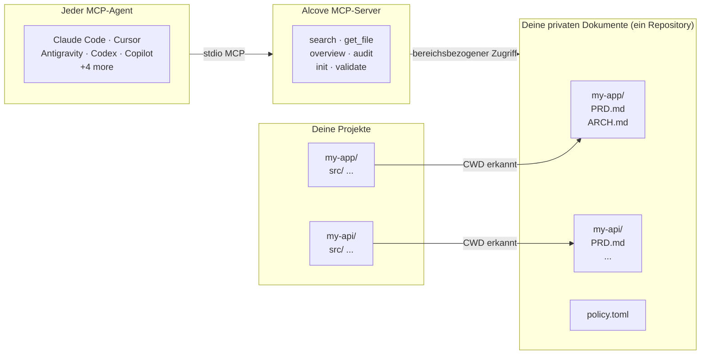

<p align="center">
  
</p>

<p align="center"><strong>Dein KI-Agent kennt dein Projekt nicht. Alcove ändert das.</strong></p>

<p align="center">
  <a href="../README.md">English</a> ·
  <a href="README.ko.md">한국어</a> ·
  <a href="README.ja.md">日本語</a> ·
  <a href="README.zh-CN.md">简体中文</a> ·
  <a href="README.es.md">Español</a> ·
  <a href="README.hi.md">हिन्दी</a> ·
  <a href="README.pt-BR.md">Português</a> ·
  <a href="README.de.md">Deutsch</a> ·
  <a href="README.fr.md">Français</a> ·
  <a href="README.ru.md">Русский</a>
</p>

<p align="center">
  <a href="https://glama.ai/mcp/servers/epicsagas/alcove"></a>
  <a href="https://crates.io/crates/alcove"></a>
  <a href="https://crates.io/crates/alcove"></a>
  <a href="../LICENSE"></a>
  <a href="https://buymeacoffee.com/epicsaga"></a>
</p>

Alcove ermöglicht jedem KI-Codierungs-Agenten, deine private Projektdokumentation zu lesen und verwalten — ohne sie in öffentliche Repositories zu leaken.

Speichere PRDs, Architekturentscheidungen, Secret-Maps und interne Runbooks an einem Ort. Jeder MCP-kompatible Agent erhält dieselben Tools, über alle Projekte hinweg, ohne Konfiguration pro Projekt.

## Das Problem

Dein KI-Agent startet jede Session von null.

Er kennt deine Architektur nicht. Ignoriert Einschränkungen aus bereits getroffenen Entscheidungen. Bittet dich jede Session, dieselben Dinge zu erklären.

Das Kontextfenster ist der Flaschenhals. Jeder Token kostet Geld und Aufmerksamkeit. 10 Architektur-Dokumente in den Kontext zu laden verschwendet 50K+ Tokens bei jeder Ausführung — und Anthropic's eigene Docs warnen, dass aufgeblähte Config-Dateien Agenten dazu bringen, *deine tatsächlichen Anweisungen zu ignorieren*.

Du hast also drei schlechte Optionen:

**Alles in die Agent-Konfiguration stopfen** — jede Datei wird bei jeder Ausführung in den Kontext geladen. 10 Docs = Kontext-Aufblähung = langsamere, teurere, ungenauere Antworten.

**In jeden Chat kopieren** — funktioniert einmal, skaliert nicht über eine Session hinaus.

**Einfach lassen** — dein Agent erfindet Anforderungen, die du bereits dokumentiert hast, ignoriert Einschränkungen aus bereits getroffenen Entscheidungen, und du erklärst dieselbe Architektur jeden Montagmorgen neu.

Multipliziere das mit 5 Projekten und 3 Agenten. Jedes Mal wenn du wechselst, verlierst du den Kontext.

## Wie Alcove das löst

Alcove speichert alle deine privaten Dokumente in **einem gemeinsamen Repository**, organisiert nach Projekt. Jeder MCP-kompatible Agent greift auf dieselbe Weise darauf zu — egal ob du Claude Code, Cursor, Antigravity oder Codex verwendest.

```
~/projects/my-app $ claude "Wie ist die Authentifizierung implementiert?"

  → Alcove erkennt Projekt: my-app
  → Liest ~/documents/my-app/ARCHITECTURE.md
  → Agent antwortet mit echtem Projektkontext
```

```
~/projects/my-api $ codex "Überprüfe das API-Design"

  → Alcove erkennt Projekt: my-api
  → Gleiche Dokumentstruktur, gleiches Zugriffsmuster
  → Anderes Projekt, gleicher Workflow
```

**Wechsle den Agenten jederzeit. Wechsle das Projekt jederzeit. Die Dokumentschicht bleibt standardisiert.**

## Hauptfunktionen

- **Ein Docs-Repository, mehrere Projekte** — private Dokumente nach Projekt organisiert, an einem Ort verwaltet
- **Einmal einrichten, jeder Agent** — einmal konfigurieren, jeder MCP-kompatible Agent erhält dieselben Tools
- **Automatische Projekterkennung** vom CWD — keine Konfiguration pro Projekt nötig
- **Bereichsbezogener Zugriff** — jedes Projekt sieht nur seine eigenen Dokumente
- **Intelligente Suche** — BM25-Ranking-Suche mit automatischer Indexierung; findet die relevantesten Dokumente zuerst, fällt bei Bedarf auf grep zurück
- **Projektübergreifende Suche** — suche in allen Projekten gleichzeitig mit `scope: "global"` — nutze es als persönliche Wissensdatenbank
- **Private Dokumente bleiben privat** — sensible Dokumente (Secret-Map, interne Entscheidungen, technische Schulden) berühren nie dein öffentliches Repository
- **Standardisierte Dokumentstruktur** — `policy.toml` erzwingt konsistente Dokumente über alle Projekte und Teams
- **Cross-Repo-Audit** — findet fehlplatzierte interne Dokumente im Projektrepository und schlägt Korrekturen vor
- **Dokumentvalidierung** — prüft auf fehlende Dateien, unausgefüllte Templates, erforderliche Abschnitte
- **Semantisches Lint** — erkennt automatisch defekte Wikilinks, verwaiste Dateien, veraltete WIP/DRAFT-Markierungen und Datumsangaben älter als 2 Jahre
- **Import aus externen Vaults** — bringt eine Notiz aus Obsidian (oder einem anderen Vault) mit einem Befehl ins doc-repo; automatisches Routing zum richtigen Projekt
- **Funktioniert mit 9+ Agenten** — Claude Code, Cursor, Claude Desktop, Cline, OpenCode, Codex, Copilot, Antigravity

## Warum Alcove

| Ohne Alcove | Mit Alcove |
|-------------|------------|
| Interne Dokumente verstreut über Notion, Google Docs, lokale Dateien | Ein Docs-Repository, nach Projekt strukturiert |
| Jeder KI-Agent separat für Dokumentzugriff konfiguriert | Einmal einrichten, alle Agenten teilen dieselben Tools |
| Projektwechsel bedeutet Verlust des Dokumentkontexts | CWD-Autoerkennung, sofortiger Projektwechsel |
| Agentensuche liefert zufällige Treffer | BM25-Ranking-Suche — beste Treffer zuerst, automatische Indexierung |
| "Alle meine Notizen zur Authentifizierung durchsuchen" — unmöglich | Globale Suche über alle Projekte in einer Abfrage |
| Sensible Dokumente riskieren Leak in öffentliche Repos | Private Dokumente physisch von Projekt-Repos getrennt |
| Dokumentstruktur variiert pro Projekt und Teammitglied | `policy.toml` erzwingt Standards über alle Projekte |
| Keine Möglichkeit zu prüfen, ob Dokumente vollständig sind | `validate` erkennt fehlende Dateien, leere Templates, fehlende Abschnitte |
| Defekte Links oder WIP-Markierungen bleiben unbemerkt | `lint` erkennt automatisch defekte Links, verwaiste Dateien und veraltete Markierungen |
| Notizen aus Obsidian oder anderen Tools bleiben isoliert | `promote` integriert externe Notizen mit einem Befehl ins doc-repo |

## Schnellstart

### Claude Code (empfohlen)

```
/plugin marketplace add epicsagas/plugins
/plugin install alcove@epicsagas
```

Installiert automatisch das Binary und registriert den MCP-Server beim nächsten Sitzungsstart.

> **Erforderlich**: Führe `alcove setup` einmal nach der Installation aus, um dein Dokumenten-Root zu konfigurieren und die volle Funktionalität zu aktivieren. Das Plugin seedet die MCP-Verbindung automatisch, aber Alcove kann erst nach Ausführung von `setup` Dokumente suchen oder indexieren.

```bash
alcove setup   # einmal nach der Plugin-Installation ausführen
```

Aktualisierungen mit `claude plugin update epicsagas/alcove`.

### Codex CLI

```bash
codex plugin marketplace add epicsagas/plugins
```

Skills sind sofort verfügbar — keine weiteren Schritte erforderlich.

### Antigravity

```bash
agy marketplace add epicsagas/plugins
```

Skills sind sofort verfügbar — keine weiteren Schritte erforderlich.

> **Hinweis**: Antigravity unterstützt noch keine Subagenten. Der Alcove MCP-Server wird unter `~/.gemini/config/mcp_config.json` registriert.

### macOS (nur Apple Silicon)

```bash
brew install epicsagas/tap/alcove
```

Kein Homebrew? Verwende das Installationsskript:

```bash
curl --proto '=https' --tlsv1.2 -LsSf \
  https://github.com/epicsagas/alcove/releases/latest/download/alcove-installer.sh | sh
```

> **Hinweis**: Vorgefertigte Binaries sind nur für macOS Apple Silicon verfügbar. Linux- und Windows-Nutzer können die obigen Einzeilen-Installer verwenden.

### Linux (x86_64 / ARM64)

```bash
curl --proto '=https' --tlsv1.2 -LsSf \
  https://github.com/epicsagas/alcove/releases/latest/download/install.sh | sh
```

### Windows (x86_64 / ARM64)

```powershell
irm https://github.com/epicsagas/alcove/releases/latest/download/install.ps1 | iex
```

### Über die Rust-Werkzeugkette

```bash
cargo binstall alcove   # vorgefertigtes Binary (schnell)
cargo install alcove    # aus Quellcode kompilieren
```

Dann führe setup aus:

```bash
alcove setup
alcove --version
alcove doctor
```

**Optionale Abhängigkeiten**

| Tool | Zweck | Installation |
|---|---|---|
| `pdftotext` (poppler) | Vollständige PDF-Textextraktion — erforderlich für PDF-Suche | macOS: `brew install poppler` · Debian/Ubuntu: `apt install poppler-utils` · Fedora: `dnf install poppler-utils` · Windows: [poppler for Windows](https://github.com/oschwartz10612/poppler-windows/releases) |

Ohne `pdftotext` fällt Alcove auf einen integrierten PDF-Parser zurück, der bei einigen Dateien fehlschlagen kann. Führe `alcove doctor` aus, um deine Installation zu überprüfen.

> **Hinweis**: Vorgefertigte Binaries sind verfügbar für Linux (x86\_64), macOS (Apple Silicon und Intel) und Windows.

`setup` führt dich interaktiv durch alles:

1. Wo deine Dokumente liegen
2. Welche Dokumentkategorien verfolgt werden sollen
3. Bevorzugtes Diagrammformat
4. Embedding-Modell für hybride Suche
5. **Hintergrund-Server** — Kaltstart bei jeder Sitzung eliminieren (macOS-Login-Objekt)
6. Welche KI-Agenten konfiguriert werden sollen (MCP + Skill-Dateien)

Führe `alcove setup` jederzeit erneut aus, um Einstellungen zu ändern. Es merkt sich deine vorherigen Auswahlen.

## Verwendung

### CLI-Suche

Durchsuchen Sie Ihre Dokumente direkt vom Terminal aus. Standardmäßig wird über **alle Projekte** hinweg gesucht (globaler Bereich).

```bash
# Einfache Suche (globaler Bereich)
alcove search "authentication"

# Suche auf das aktuelle Projekt beschränken (automatisch erkannt via CWD)
alcove search "auth flow" --scope project

# Grep-Modus erzwingen (exakte Teilstring-Suche)
alcove search "TODO" --mode grep

# Ranking-Modus erzwingen (BM25/Hybrid)
alcove search "data model" --mode ranked

# Ergebnislimit anpassen
alcove search "deployment" --limit 5
```

### Codierungs-Agenten (MCP)

KI-Codierungs-Agenten nutzen Alcove über **MCP-Tools**. Normalerweise müssen Sie diese nicht selbst aufrufen; der Agent ruft sie auf, wenn Sie Fragen zu Ihrem Projekt stellen.

| Ziel | Agenten-Tool | Beschreibung |
|------|--------------|--------------|
| **Erkunden** | `get_project_docs_overview` | Listet alle Dateien im aktuellen Projekt auf, um die Struktur zu verstehen. |
| **Suchen** | `search_project_docs` | Sucht nach bestimmten Schlüsselwörtern oder Konzepten. Unterstützt `scope: "global"`. |
| **Lesen** | `get_doc_file` | Liest den Inhalt einer bestimmten Datei, die bei der Suche gefunden wurde. |
| **Audit** | `audit_project` | Prüft auf fehlende Dokumente oder Inkonsistenzen zwischen Code und Dokumenten. |

**Beispiel für die Interaktion mit dem Agenten:**
> **Benutzer:** "Wie füge ich einen neuen API-Endpunkt hinzu?"
> **Agent:** (ruft `search_project_docs(query="add api endpoint")` auf)
> **Agent:** (liest das relevanteste Dokument über `get_doc_file`)
> **Agent:** "Laut `ARCHITECTURE.md` müssen Sie..."

---

## Funktionsweise



Deine Dokumente sind in einem separaten Verzeichnis (`DOCS_ROOT`) organisiert, ein Ordner pro Projekt. Alcove verwaltet Dokumente dort und stellt sie über stdio jedem MCP-kompatiblen KI-Agenten bereit.

## Dokumentklassifizierung

Alcove klassifiziert Dokumente in folgende Stufen:

| Klassifizierung | Ort | Beispiele |
|----------------|-----|-----------|
| **doc-repo-required** | Alcove (privat) | PRD, Architecture, Decisions, Conventions |
| **doc-repo-supplementary** | Alcove (privat) | Deployment, Onboarding, Testing, Runbook |
| **reference** | Alcove `reports/` Ordner | Audit-Berichte, Benchmarks, Analysen |
| **project-repo** | GitHub-Repository (öffentlich) | README, CHANGELOG, CONTRIBUTING |

Das `audit`-Tool scannt sowohl das Docs-Repository als auch das lokale Projektverzeichnis und schlägt Aktionen vor — wie das Generieren einer öffentlichen README aus deinem privaten PRD oder das Zurückholen fehlplatzierter Berichte nach Alcove.

## MCP-Tools

| Tool | Funktion |
|------|----------|
| `get_project_docs_overview` | Alle Dokumente mit Klassifizierung und Größen auflisten |
| `search_project_docs` | Intelligente Suche — wählt automatisch BM25-Ranking oder grep, unterstützt `scope: "global"` für projektübergreifende Suche |
| `get_doc_file` | Ein bestimmtes Dokument nach Pfad lesen (unterstützt `offset`/`limit` für große Dateien) |
| `list_projects` | Alle Projekte im Docs-Repository anzeigen |
| `audit_project` | Cross-Repo-Audit — scannt Docs-Repository und lokales Projekt, schlägt Aktionen vor |
| `init_project` | Dokumente für ein neues Projekt scaffolden (interne+externe Dokumente, selektive Dateierstellung) |
| `validate_docs` | Dokumente gegen Team-Policy (`policy.toml`) validieren |
| `rebuild_index` | Volltextsuchindex neu aufbauen (normalerweise automatisch) |
| `check_doc_changes` | Seit dem letzten Index-Build hinzugefügte, geänderte oder gelöschte Dokumente erkennen |
| `lint_project` | Semantisches Lint — defekte Links, verwaiste Dateien, veraltete Markierungen und Datumsangaben |
| `promote_document` | Datei aus einem externen Vault ins alcove doc-repo kopieren oder verschieben |
| `index_code_structure` | Quellcode mit tree-sitter analysieren und pro Projekt `CODE_INDEX.md` generieren |

## CLI

```
alcove              MCP-Server starten (Agenten rufen das auf)
alcove setup        Interaktives Setup — jederzeit erneut ausführen
alcove doctor       Gesundheit der Alcove-Installation prüfen
alcove validate     Dokumente gegen Policy validieren (--format json, --exit-code)
alcove lint         Semantisches Lint — defekte Links, verwaiste Dateien, veraltete Markierungen (--format json)
alcove promote      Notizen aus einem externen Vault ins doc-repo importieren
alcove index        Suchindex inkrementell aktualisieren (nur geänderte Dateien)
alcove rebuild      Suchindex von Grund auf neu aufbauen (nach Schema-Änderungen)
alcove search       Dokumente vom Terminal aus suchen
alcove index-code   Code-Struktur-Index aus Quellcode generieren [--language LANG] [--source PATH]
alcove token        Bearer-Token ausgeben (für Hintergrund-Server-Authentifizierung)
alcove uninstall    Skills, Konfiguration und Legacy-Dateien entfernen

alcove mcp <CMD>      Lebenszyklus des MCP-Servers im Hintergrund verwalten (start, stop, status, enable, disable)

alcove vault link     Externes Verzeichnis als Vault verknüpfen (z. B. Obsidian)
alcove vault list     Alle Vaults mit Dokumentanzahl auflisten
alcove vault index    Suchindex für Vaults aufbauen
```

### Code-Indexierung

Analysiert Quelldateien mit tree-sitter und generiert `CODE_INDEX.md`—eine modulebene Markdown-Zusammenfassung Ihrer Codebasis, die in die Tantivy-Suchpipeline integriert ist.

```bash
# Aktuelles Projekt indexieren (alle Sprachen automatisch erkennen)
alcove index-code --source ./src

# Monorepo: Verzeichnis mit mehreren Sprachen auf einmal indexieren
alcove index-code --source ./

# Auf eine einzelne Sprache beschränken
alcove index-code --source ./src --language typescript
alcove index-code --source ./src --language rust
```

**Unterstützte Sprachen:**

| Sprache | Feature-Flag | Dateierweiterungen |
|---------|-------------|-------------------|
| Rust | `lang-rust` | `.rs` |
| Python | `lang-python` | `.py`, `.pyi` |
| TypeScript | `lang-typescript` | `.ts`, `.tsx` |
| JavaScript | `lang-javascript` | `.js`, `.jsx`, `.mjs` |
| Go | `lang-go` | `.go` |
| Java | `lang-java` | `.java` |
| Kotlin | `lang-kotlin` | `.kt`, `.kts` |
| C | `lang-c` | `.c`, `.h` |
| C++ | `lang-cpp` | `.cpp`, `.cc`, `.cxx`, `.hpp`, `.hxx`, `.h` |
| Swift | `lang-swift` | `.swift` |
| Ruby | `lang-ruby` | `.rb` |
| C# | `lang-csharp` | `.cs` |

Offizielle Binärdateien aktivieren alle 12 Parser (`lang-all`). Ohne `--language` werden **alle erkannten Erweiterungen automatisch indexiert**—sicher für Monorepos.

`--language` akzeptiert Abkürzungen: `ts` → TypeScript, `cpp` → C++, `csharp` → C#, `py` → Python, `js` → JavaScript, `kt` → Kotlin, `rb` → Ruby.

### Lint

```bash
# Lint des aktuellen Projekts (automatisch aus CWD erkannt)
alcove lint

# Projekt angeben
alcove lint --project my-app

# Maschinenlesbare Ausgabe für CI
alcove lint --format json
```

Lint prüft vier Dinge:

| Prüfung | Was erkannt wird |
|---------|-----------------|
| `broken-link` | `[[Wikilinks]]` oder `[Text](Pfad)` die auf fehlende Dateien zeigen |
| `orphan` | Dateien, auf die kein anderes Dokument verlinkt |
| `stale-marker` | WIP / TODO / FIXME / DRAFT / DEPRECATED Markierungen |
| `stale-date` | Datumsangaben älter als 2 Jahre (z. B. "as of 2022") |

### Promote

```bash
# Obsidian-Notiz ins doc-repo kopieren (automatisches Routing zum Projekt)
alcove promote ~/my-brain/Projects/auth-notes.md

# Bestimmtes Projekt angeben
alcove promote ~/my-brain/Projects/auth-notes.md --project my-app

# Verschieben statt kopieren
alcove promote ~/my-brain/Projects/auth-notes.md --mv
```

Dateien ohne passendes Projekt werden in `inbox/` zur manuellen Überprüfung gespeichert.

## Hintergrund-Server

Das Ausführen eines dauerhaften Hintergrund-Servers eliminiert die Kaltstart-Latenz bei jeder neuen Agenten-Sitzung. **`alcove setup` aktiviert dies standardmäßig** (macOS-Login-Objekt).

```bash
alcove mcp enable --now     # Aktivieren und starten (bleibt nach Neustarts bestehen)
alcove mcp stop / start / restart / status
alcove mcp disable          # Deaktivieren und Login-Objekt entfernen
```

Wenn der Hintergrund-Server läuft, fungiert der stdio-Prozess als leichter Proxy — anstatt bei jeder Sitzung die Such-Engine zu laden, leitet er Anfragen an den aktiven Server weiter. Beim Start prüft der stdio-Prozess `GET /health` und wechselt automatisch in den Proxy-Modus.

## Suche

Alcove wählt automatisch die beste Suchstrategie. Wenn der Suchindex existiert, verwendet es **BM25-Ranking-Suche** (basierend auf [tantivy](https://github.com/quickwit-oss/tantivy)) für relevanzbasierte Ergebnisse. Ohne Index fällt es auf grep zurück. Du musst nie darüber nachdenken.

```bash
# Aktuelles Projekt durchsuchen (automatisch vom CWD erkannt)
alcove search "authentication flow"

# Alle Projekte durchsuchen — deine persönliche Wissensdatenbank
alcove search "OAuth token refresh" --scope global

# Grep-Modus erzwingen für exakte Teilstring-Suche
alcove search "FR-023" --mode grep
```

Der Index wird automatisch im Hintergrund erstellt, wenn der MCP-Server startet, und wird bei Dateiänderungen automatisch neu aufgebaut. Keine Cron-Jobs, keine manuellen Schritte.

**Wie es für Agenten funktioniert:** Agenten rufen einfach `search_project_docs` mit einer Abfrage auf. Alcove kümmert sich um den Rest — Ranking, Deduplizierung (ein Ergebnis pro Datei), projektübergreifende Suche und Fallback. Der Agent muss nie einen Suchmodus wählen.

## Projekterkennung

Standardmäßig erkennt Alcove das aktuelle Projekt aus dem Arbeitsverzeichnis deines Terminals (CWD). Du kannst dies mit der Umgebungsvariable `MCP_PROJECT_NAME` überschreiben:

```bash
MCP_PROJECT_NAME=my-api alcove
```

Nützlich, wenn dein CWD nicht mit einem Projektnamen in deinem Docs-Repository übereinstimmt.

## Dokumentrichtlinie

Definiere teamweite Dokumentationsstandards mit `policy.toml` in deinem Docs-Repository:

```toml
[policy]
enforce = "strict"    # strict | warn

[[policy.required]]
name = "PRD.md"
aliases = ["prd.md", "product-requirements.md"]

[[policy.required]]
name = "ARCHITECTURE.md"

  [[policy.required.sections]]
  heading = "## Overview"
  required = true

  [[policy.required.sections]]
  heading = "## Components"
  required = true
  min_items = 2
```

Policy-Dateien werden mit Priorität aufgelöst: **Projekt** (`<project>/.alcove/policy.toml`) > **Team** (`DOCS_ROOT/.alcove/policy.toml`) > **eingebauter Standard** (core-Dateiliste aus config.toml). Dies stellt konsistente Dokumentqualität über alle Projekte sicher und erlaubt projektspezifische Überschreibungen.

## Konfiguration

Die Konfiguration liegt unter `~/.config/alcove/config.toml`:

```toml
docs_root = "/Users/you/documents"

[core]
files = ["PRD.md", "ARCHITECTURE.md", "PROGRESS.md", "DECISIONS.md", "CONVENTIONS.md", "SECRETS_MAP.md", "DEBT.md"]

[team]
files = ["ENV_SETUP.md", "ONBOARDING.md", "DEPLOYMENT.md", "TESTING.md", ...]

[public]
files = ["README.md", "CHANGELOG.md", "CONTRIBUTING.md", "SECURITY.md", ...]

[diagram]
format = "mermaid"
```

Alles wird interaktiv über `alcove setup` eingestellt. Du kannst die Datei auch direkt bearbeiten.

## Unterstützte Agenten

| Agent | MCP | Skill |
|-------|-----|-------|
| Claude Code | `~/.claude.json` | `~/.claude/skills/alcove/` |
| Cursor | `~/.cursor/mcp.json` | `~/.cursor/skills/alcove/` |
| Claude Desktop | Plattformkonfiguration | — |
| Cline (VS Code) | VS Code globalStorage | `~/.cline/skills/alcove/` |
| OpenCode | `~/.config/opencode/opencode.json` | `~/.opencode/skills/alcove/` |
| Codex CLI | `~/.codex/config.toml` | `~/.codex/skills/alcove/` |
| Copilot CLI | `~/.copilot/mcp-config.json` | `~/.copilot/skills/alcove/` |
| Antigravity | `~/.gemini/config/mcp_config.json` | — |

## Unterstützte Sprachen

Das CLI erkennt automatisch deine Systemsprache. Du kannst sie auch mit der Umgebungsvariable `ALCOVE_LANG` überschreiben.

| Sprache | Code |
|---------|------|
| English | `en` |
| 한국어 | `ko` |
| 简体中文 | `zh-CN` |
| 日本語 | `ja` |
| Español | `es` |
| हिन्दी | `hi` |
| Português (Brasil) | `pt-BR` |
| Deutsch | `de` |
| Français | `fr` |
| Русский | `ru` |

```bash
# Sprache überschreiben
ALCOVE_LANG=de alcove setup
```

## Aktualisieren

| Methode | Befehl |
|---------|-------|
| Homebrew | `brew upgrade alcove` |
| curl Installer | Das obige Installationsskript erneut ausführen |
| cargo binstall | `cargo binstall alcove@latest` |
| cargo install | `cargo install alcove@latest` |
| Claude Code Plugin | `claude plugin update epicsagas/alcove` |

```bash
alcove --version
```

## Deinstallieren

```bash
alcove uninstall          # Skills & Konfiguration entfernen
cargo uninstall alcove    # Binary entfernen
```

## Wissensdatenbank-Vaults

Über die Projektdokumentation hinaus unterstützt Alcove **unabhängige Wissensdatenbank-Vaults** für Forschungsnotizen, Referenzmaterialien und kuratiertes Wissen, das LLMs durchsuchen können.

```bash
# Einen Vault für KI-Forschungsnotizen erstellen
alcove vault create ai-research

# Einen bestehenden Obsidian-Vault verknüpfen (kein Kopieren — Indexierung vor Ort)
alcove vault link my-obsidian ~/Obsidian/research

# Ein Dokument hinzufügen
alcove vault add ai-research ~/Downloads/transformer-survey.md

# Suchindex für Vaults aufbauen
alcove vault index

# Alle Vaults auflisten
alcove vault list
#   areas (8 docs) → (linked)
#   resources (71 docs) → (linked)
#   zettelkasten (17 docs) → (linked)

# Über CLI suchen
alcove search "attention mechanism" --vault ai-research

# Agenten suchen über MCP
search_vault(query="attention mechanism", vault="ai-research")

# Alle Vaults gleichzeitig durchsuchen
search_vault(query="transformer", vault="*")
```

Vaults sind **vollständig isoliert** von Projektdokumenten — separate Indizes, separate Caches, separate Suche. Die Suche Ihres Codierungs-Agenten nach Projektdokumenten wird niemals durch Vault-Aktivitäten beeinflusst.

| Funktion | Projektdokumente | Vaults |
|---------|-------------|--------|
| Zweck | Dokumentation pro Projekt | Allgemeine Wissensdatenbank |
| Speicherung | `~/.alcove/docs/` | `~/.alcove/vaults/` |
| Index | Gemeinsamer Projektindex | Unabhängiger Index pro Vault |
| Cache | `PROJECT_READER_CACHE` | `VAULT_READER_CACHE` |
| Suche | `search_project_docs` | `search_vault` |
| Symlink | Nein | Ja (externe Verzeichnisse verknüpfen) |

### Vault-Konfiguration

Standardmäßig werden Vaults in `~/.alcove/vaults/` gespeichert. Sie können dies in Ihrer `config.toml` ändern:

```toml
[vaults]
root = "/pfad/zu/deinen/vaults"
```

Weitere Details zur `config.toml` finden Sie im Abschnitt [Konfiguration](#konfiguration).

## Ökosystem

### [obsidian-forge](https://github.com/epicsagas/obsidian-forge)

Alcove lässt sich nahtlos mit **obsidian-forge** kombinieren, einem Obsidian-Vault-Generator und Automatisierungs-Daemon. Für die beste Integration sollte dein Alcove **`docs_root`** auf die obsidian-forge Projektarchive zeigen.

**1. Dokumenten-Root festlegen**
Verweise mit deinen primären Dokumenten auf das obsidian-forge Projektverzeichnis (direkt oder über einen Symlink):
```bash
# Setze während des Alcove-Setups docs_root auf:
~/Obsidian/SecondBrain/99-Archives/projects
```

**2. Wissensbereiche als Vaults verknüpfen**
Verknüpfe die anderen drei obsidian-forge Kategorien als unabhängige Alcove-Vaults. Dies erstellt Symlinks in `~/.alcove/vaults/`:
```bash
# obsidian-forge Kategorien verknüpfen
alcove vault link areas ~/Obsidian/SecondBrain/02-Areas
alcove vault link resources ~/Obsidian/SecondBrain/03-Resources
alcove vault link zettelkasten ~/Obsidian/SecondBrain/10-Zettelkasten
```

Jetzt haben deine Agenten strukturierten Zugriff:
- **`search_project_docs`**: Durchsucht archiviertes Projektwissen (PRDs usw.)
- **`search_vault`**: Durchsucht deine breiteren Wissensbereiche und Forschungsnotizen.

Du kannst das physische Speicher-Mapping überprüfen, indem du die Symlinks in `~/.alcove/vaults/` kontrollierst.

## Fahrplan

- **Multi-User-Fernzugriff** — REST-API für Team-Dokumentenfreigabe über LAN/VPN (Bearer-Token-Authentifizierung, Rate-Limiting bereits implementiert). Erforderlich: Schreib-API, gleichzeitige Index-Koordination, Projekt-Lebenszyklusverwaltung.

## Mitwirken

Fehlerberichte, Funktionsanfragen und Pull Requests sind willkommen. Bitte öffne ein Issue auf [GitHub](https://github.com/epicsagas/alcove/issues), um eine Diskussion zu beginnen.

## Lizenz

Apache-2.0
