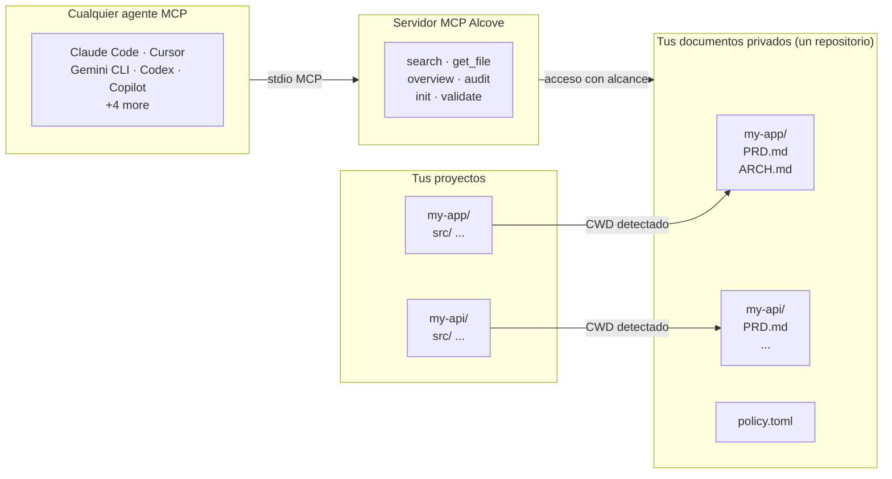

<p align="center">
  
</p>

<p align="center"><strong>Tu agente de IA no conoce tu proyecto. Alcove lo soluciona.</strong></p>

<p align="center">
  <a href="../README.md">English</a> ·
  <a href="README.ko.md">한국어</a> ·
  <a href="README.ja.md">日本語</a> ·
  <a href="README.zh-CN.md">简体中文</a> ·
  <a href="README.es.md">Español</a> ·
  <a href="README.hi.md">हिन्दी</a> ·
  <a href="README.pt-BR.md">Português</a> ·
  <a href="README.de.md">Deutsch</a> ·
  <a href="README.fr.md">Français</a> ·
  <a href="README.ru.md">Русский</a>
</p>

<p align="center">
  <a href="https://glama.ai/mcp/servers/epicsagas/alcove"></a>
  <a href="https://crates.io/crates/alcove"></a>
  <a href="https://crates.io/crates/alcove"></a>
  <a href="../LICENSE"></a>
  <a href="https://buymeacoffee.com/epicsaga"></a>
</p>

Alcove permite que cualquier agente de codificación con IA lea y gestione la documentación privada de tu proyecto, sin exponerla en repositorios públicos.

Guarda PRDs, decisiones de arquitectura, mapas de secretos y runbooks internos en un solo lugar. Cada agente compatible con MCP obtiene las mismas herramientas, en todos los proyectos, sin configuración por proyecto.

## El problema

Tienes dos malas opciones.

**Opción A: Poner documentos en `CLAUDE.md` / `AGENTS.md`**
Cada archivo se inyecta en la ventana de contexto en cada ejecución.
Funciona para convenciones cortas. Se rompe con documentación real del proyecto.
10 archivos de arquitectura = inflación de contexto = respuestas más lentas, costosas e imprecisas.

**Opción B: No poner documentos**
Tu agente inventa requisitos que ya documentaste.
Ignora restricciones de decisiones que ya tomaste.
Te pide que expliques las mismas cosas en cada sesión.

Ninguna opción escala. Multiplícalo por 5 proyectos y 3 agentes, cada uno configurado diferente. Cada vez que cambias, pierdes el contexto.

## Cómo Alcove resuelve esto

Alcove mantiene toda tu documentación privada en **un único repositorio compartido**, organizado por proyecto. Cualquier agente compatible con MCP accede de la misma manera — ya sea Claude Code, Cursor, Gemini CLI o Codex.

```
~/projects/my-app $ claude "¿cómo está implementada la autenticación?"

  → Alcove detecta el proyecto: my-app
  → Lee ~/documents/my-app/ARCHITECTURE.md
  → El agente responde con el contexto real del proyecto
```

```
~/projects/my-api $ codex "revisa el diseño de la API"

  → Alcove detecta el proyecto: my-api
  → Misma estructura de documentos, mismo patrón de acceso
  → Diferente proyecto, mismo flujo de trabajo
```

**Cambia de agente en cualquier momento. Cambia de proyecto en cualquier momento. La capa de documentación permanece estandarizada.**

## Qué hace

- **Un repositorio de documentos, múltiples proyectos** — documentos privados organizados por proyecto, gestionados en un solo lugar
- **Una configuración, cualquier agente** — configura una vez, cada agente compatible con MCP obtiene el mismo acceso
- **Detecta tu proyecto automáticamente** desde CWD — no se necesita configuración por proyecto
- **Acceso con alcance limitado** — cada proyecto solo ve sus propios documentos
- **Búsqueda inteligente** — búsqueda BM25 con ranking e indexación automática; encuentra los documentos más relevantes primero, recurre a grep cuando es necesario
- **Búsqueda entre proyectos** — busca en todos los proyectos a la vez con `scope: "global"` — úsalo como base de conocimiento personal
- **Los documentos privados permanecen privados** — documentos sensibles (mapa de secretos, decisiones internas, deuda técnica) nunca tocan tu repositorio público
- **Estructura de documentos estandarizada** — `policy.toml` impone documentación consistente en todos los proyectos y equipos
- **Auditoría entre repositorios** — detecta documentos internos mal ubicados en tu repositorio de proyecto y sugiere correcciones
- **Validación de documentos** — verifica archivos faltantes, plantillas sin completar, secciones requeridas
- **Lint semántico** — detecta wikilinks rotos, archivos huérfanos, marcadores WIP/DRAFT obsoletos y referencias temporales de más de 2 años
- **Importación de vault externo** — lleva una nota de Obsidian (u otro vault) al doc-repo con un solo comando; enrutamiento automático al proyecto correcto
- **Funciona con más de 9 agentes** — Claude Code, Cursor, Claude Desktop, Cline, OpenCode, Codex, Copilot, Antigravity, Gemini CLI

## Por qué Alcove

| Sin Alcove | Con Alcove |
|------------|------------|
| Documentos internos dispersos en Notion, Google Docs, archivos locales | Un repositorio de documentos, estructurado por proyecto |
| Cada agente de IA configurado por separado para acceder a documentos | Una configuración, todos los agentes comparten el mismo acceso |
| Cambiar de proyecto significa perder el contexto documental | Detección automática por CWD, cambio instantáneo de proyecto |
| Las búsquedas del agente devuelven líneas aleatorias | Búsqueda BM25 con ranking — mejores coincidencias primero, indexación automática |
| "Buscar todas mis notas sobre autenticación" — imposible | Búsqueda global en todos los proyectos en una sola consulta |
| Documentos sensibles con riesgo de filtrarse en repositorios públicos | Documentos privados físicamente separados de los repositorios del proyecto |
| La estructura de documentos varía por proyecto y miembro del equipo | `policy.toml` impone estándares en todos los proyectos |
| Sin forma de verificar si los documentos están completos | `validate` detecta archivos faltantes, plantillas vacías, secciones ausentes |
| Los enlaces rotos o marcadores WIP pasan desapercibidos | `lint` detecta automáticamente enlaces rotos, huérfanos y marcadores obsoletos |
| Las notas de Obsidian u otras herramientas quedan aisladas | `promote` integra notas externas al doc-repo con un solo comando |

## Inicio rápido

```bash
# macOS
brew install epicsagas/tap/alcove

# Linux / Windows — binario precompilado (rápido, sin compilación)
cargo install cargo-binstall
cargo binstall alcove

# Cualquier plataforma — compilar desde el código fuente
cargo install alcove

# Clonar y compilar
git clone https://github.com/epicsagas/alcove.git
cd alcove
make install

alcove setup
```

Eso es todo. `setup` te guía a través de todo de forma interactiva:

1. Dónde viven tus documentos
2. Qué categorías de documentos rastrear
3. Formato preferido de diagramas
4. Qué agentes de IA configurar (MCP + archivos de habilidades)

Ejecuta `alcove setup` en cualquier momento para cambiar la configuración. Recuerda tus elecciones anteriores.

## Uso

### Búsqueda por CLI

Busca en tus documentos directamente desde la terminal. Por defecto, busca en **todos los proyectos** (alcance global).

```bash
# Búsqueda básica (alcance global)
alcove search "authentication"

# Limitar la búsqueda al proyecto actual (detectado automáticamente vía CWD)
alcove search "auth flow" --scope project

# Forzar modo grep (coincidencia exacta de subcadena)
alcove search "TODO" --mode grep

# Forzar modo clasificado (BM25/Híbrido)
alcove search "data model" --mode ranked

# Ajustar límite de resultados
alcove search "deployment" --limit 5
```

### Agentes de codificación (MCP)

Los agentes de codificación de IA utilizan Alcove a través de las **herramientas MCP**. Normalmente no necesitas llamarlas tú mismo; el agente las invocará cuando hagas preguntas sobre tu proyecto.

| Objetivo | Herramienta del Agente | Descripción |
|----------|------------------------|-------------|
| **Explorar** | `get_project_docs_overview` | Lista todos los archivos del proyecto actual para comprender la estructura. |
| **Buscar** | `search_project_docs` | Busca palabras clave o conceptos específicos. Soporta `scope: "global"`. |
| **Leer** | `get_doc_file` | Lee el contenido de un archivo específico encontrado durante la búsqueda. |
| **Auditar** | `audit_project` | Comprueba si faltan documentos o si hay incoherencias entre el código y los documentos. |

**Ejemplo de interacción con el agente:**
> **Usuario:** "¿Cómo añado un nuevo endpoint a la API?"
> **Agente:** (llama a `search_project_docs(query="add api endpoint")`)
> **Agente:** (lee el documento más relevante vía `get_doc_file`)
> **Agente:** "Según `ARCHITECTURE.md`, necesitas..."

---

## Cómo funciona



Tus documentos están organizados en un directorio separado (`DOCS_ROOT`), una carpeta por proyecto. Alcove gestiona los documentos ahí y los sirve a cualquier agente de IA compatible con MCP a través de stdio. Tu agente llama a herramientas como `get_doc_file("PRD.md")` y obtiene respuestas específicas del proyecto, independientemente del agente que estés usando.

## Clasificación de documentos

Alcove clasifica los documentos en los siguientes niveles:

| Clasificación | Dónde se encuentra | Ejemplos |
|---------------|-------------------|----------|
| **doc-repo-required** | Alcove (privado) | PRD, Arquitectura, Decisiones, Convenciones |
| **doc-repo-supplementary** | Alcove (privado) | Despliegue, Incorporación, Pruebas, Guía operativa |
| **reference** | Alcove carpeta `reports/` | Informes de auditoría, benchmarks, análisis |
| **project-repo** | Tu repositorio de GitHub (público) | README, CHANGELOG, CONTRIBUTING |

La herramienta `audit` escanea tanto el repositorio de documentos como el directorio local del proyecto, y sugiere acciones — como generar un README público a partir de tu PRD privado, o mover informes mal ubicados de vuelta a Alcove.

## Herramientas MCP

| Herramienta | Qué hace |
|-------------|----------|
| `get_project_docs_overview` | Lista todos los documentos con clasificación y tamaños |
| `search_project_docs` | Búsqueda inteligente — selecciona automáticamente BM25 con ranking o grep, soporta `scope: "global"` para búsqueda entre proyectos |
| `get_doc_file` | Lee un documento específico por ruta (soporta `offset`/`limit` para archivos grandes) |
| `list_projects` | Muestra todos los proyectos en tu repositorio de documentos |
| `audit_project` | Auditoría entre repositorios — escanea el repo de documentos y el proyecto local, sugiere acciones |
| `init_project` | Genera la estructura de documentos para un nuevo proyecto (documentos internos+externos, creación selectiva) |
| `validate_docs` | Valida documentos contra la política del equipo (`policy.toml`) |
| `rebuild_index` | Reconstruye el índice de búsqueda de texto completo (normalmente automático) |
| `check_doc_changes` | Detecta documentos añadidos, modificados o eliminados desde la última indexación |
| `lint_project` | Lint semántico — enlaces rotos, huérfanos, marcadores obsoletos y referencias de fecha antigua |
| `promote_document` | Copiar o mover un archivo de un vault externo al alcove doc-repo |

## CLI

```
alcove              Iniciar el servidor MCP (los agentes lo invocan)
alcove setup        Configuración interactiva — ejecuta en cualquier momento para reconfigurar
alcove doctor       Verificar el estado de la instalación de Alcove
alcove validate     Validar documentos contra la política (--format json, --exit-code)
alcove lint         Lint semántico — enlaces rotos, huérfanos, marcadores obsoletos (--format json)
alcove promote      Importar notas de un vault externo al doc-repo
alcove index        Actualizar el índice de búsqueda (incremental — solo archivos modificados)
alcove rebuild      Reconstruir el índice de búsqueda desde cero (usar tras cambios de esquema)
alcove search       Buscar documentos desde la terminal
alcove token        Imprimir el token de portador para compartir con el equipo
alcove uninstall    Eliminar habilidades, configuración y archivos heredados

alcove mcp <CMD>      Gestionar el ciclo de vida del servidor MCP en segundo plano (start, stop, status, enable, disable)
alcove api <CMD>      Gestionar el ciclo de vida del servidor REST API en segundo plano (start, stop, status, enable, disable)

alcove vault create   Crear un nuevo vault de base de conocimiento
alcove vault link     Vincular un directorio externo como un vault (p. ej., Obsidian)
alcove vault list     Listar todos los vaults con recuentos de documentos
alcove vault remove   Eliminar un vault (enlaces simbólicos: solo elimina el enlace)
alcove vault add      Añadir un documento a un vault
alcove vault index    Construir el índice de búsqueda para vaults
alcove vault rebuild  Reconstruir el índice de búsqueda de vaults desde cero
```

### Lint

```bash
# Lint del proyecto actual (detectado automáticamente desde CWD)
alcove lint

# Especificar proyecto
alcove lint --project my-app

# Salida legible por máquina para CI
alcove lint --format json
```

El lint comprueba cuatro cosas:

| Comprobación | Qué detecta |
|-------------|-------------|
| `broken-link` | `[[wikilinks]]` o `[texto](ruta)` que apuntan a archivos inexistentes |
| `orphan` | Archivos a los que ningún otro documento enlaza |
| `stale-marker` | Marcadores WIP / TODO / FIXME / DRAFT / DEPRECATED |
| `stale-date` | Referencias temporales de más de 2 años (p. ej., "as of 2022") |

### Promote

```bash
# Copiar una nota de Obsidian al doc-repo (enrutamiento automático al proyecto)
alcove promote ~/my-brain/Projects/auth-notes.md

# Enrutar a un proyecto específico
alcove promote ~/my-brain/Projects/auth-notes.md --project my-app

# Mover en lugar de copiar
alcove promote ~/my-brain/Projects/auth-notes.md --mv
```

Los archivos sin proyecto coincidente se guardan en `inbox/` para revisión manual.

### Servidor en segundo plano

Ejecutar un servidor persistente en segundo plano elimina la latencia de arranque en frío (carga del modelo ONNX de 2 a 5 segundos) en cada nueva sesión del agente. **`alcove setup` activa esto por defecto** (ítem de inicio en macOS).

```bash
# Activar e iniciar (persiste tras reiniciar — macOS)
alcove mcp enable --now

# Ciclo de vida
alcove mcp stop / start / restart / status

# Desactivar y eliminar ítem de inicio
alcove mcp disable
```

También puedes ejecutar un servidor REST API independiente:

```bash
# Iniciar el servidor API en segundo plano
alcove api start
```

El servidor utiliza un token de portador para la autenticación — generado automáticamente durante `alcove setup` y almacenado en `config.toml`. Tu configuración MCP existente (`command: alcove`) permanece sin cambios; el proceso stdio detecta automáticamente el servidor en ejecución y actúa como proxy.

```bash
# Verificar o compartir el token
alcove token

# Configurar en el perfil del shell (setup lo hace automáticamente)
export ALCOVE_TOKEN="alcove-..."
```

Prioridad del token: flag `--token` > variable de entorno `ALCOVE_TOKEN` > `config.toml`.

Los registros se escriben en `~/.alcove/logs/`. Al iniciar, ejecuta `alcove doctor` para verificar que el servidor sea accesible.

## Búsqueda

Alcove selecciona automáticamente la mejor estrategia de búsqueda. Cuando el índice de búsqueda existe, usa **búsqueda BM25 con ranking** (impulsada por [tantivy](https://github.com/quickwit-oss/tantivy)) para resultados ordenados por relevancia. Cuando no existe, recurre a grep. No necesitas preocuparte por ello.

```bash
# Buscar en el proyecto actual (auto-detectado desde CWD)
alcove search "authentication flow"

# Buscar en TODOS los proyectos — tu base de conocimiento personal
alcove search "OAuth token refresh" --scope global

# Forzar modo grep si necesitas coincidencia exacta de subcadenas
alcove search "FR-023" --mode grep
```

El índice se construye automáticamente en segundo plano cuando el servidor MCP se inicia, y se reconstruye cuando detecta cambios en los archivos. Sin cron jobs, sin pasos manuales.

**Cómo funciona para agentes:** los agentes simplemente llaman a `search_project_docs` con una consulta. Alcove se encarga del resto — ranking, deduplicación (un resultado por archivo), búsqueda entre proyectos y fallback. El agente nunca necesita elegir un modo de búsqueda.

## Detección de proyecto

Por defecto, Alcove detecta el proyecto actual desde el directorio de trabajo de tu terminal (CWD). Puedes sobreescribirlo con la variable de entorno `MCP_PROJECT_NAME`:

```bash
MCP_PROJECT_NAME=my-api alcove
```

Útil cuando tu CWD no coincide con un nombre de proyecto en tu repositorio de documentos.

## Política de documentos

Define estándares de documentación a nivel de equipo con `policy.toml` en tu repositorio de documentos:

```toml
[policy]
enforce = "strict"    # strict | warn

[[policy.required]]
name = "PRD.md"
aliases = ["prd.md", "product-requirements.md"]

[[policy.required]]
name = "ARCHITECTURE.md"

  [[policy.required.sections]]
  heading = "## Overview"
  required = true

  [[policy.required.sections]]
  heading = "## Components"
  required = true
  min_items = 2
```

Los archivos de política se resuelven con prioridad: **proyecto** (`<project>/.alcove/policy.toml`) > **equipo** (`DOCS_ROOT/.alcove/policy.toml`) > **por defecto** (lista de archivos core de config.toml). Esto asegura calidad documental consistente en todos tus proyectos, permitiendo excepciones por proyecto.

## Configuración

La configuración se encuentra en `~/.config/alcove/config.toml`:

```toml
docs_root = "/Users/you/documents"

[core]
files = ["PRD.md", "ARCHITECTURE.md", "PROGRESS.md", "DECISIONS.md", "CONVENTIONS.md", "SECRETS_MAP.md", "DEBT.md"]

[team]
files = ["ENV_SETUP.md", "ONBOARDING.md", "DEPLOYMENT.md", "TESTING.md", ...]

[public]
files = ["README.md", "CHANGELOG.md", "CONTRIBUTING.md", "SECURITY.md", ...]

[diagram]
format = "mermaid"
```

Todo esto se configura de forma interactiva con `alcove setup`. También puedes editar el archivo directamente.

## Agentes compatibles

| Agente | MCP | Habilidad |
|--------|-----|-----------|
| Claude Code | `~/.claude.json` | `~/.claude/skills/alcove/` |
| Cursor | `~/.cursor/mcp.json` | `~/.cursor/skills/alcove/` |
| Claude Desktop | configuración de plataforma | — |
| Cline (VS Code) | VS Code globalStorage | `~/.cline/skills/alcove/` |
| OpenCode | `~/.config/opencode/opencode.json` | `~/.opencode/skills/alcove/` |
| Codex CLI | `~/.codex/config.toml` | `~/.codex/skills/alcove/` |
| Copilot CLI | `~/.copilot/mcp-config.json` | `~/.copilot/skills/alcove/` |
| Antigravity | `~/.gemini/antigravity/mcp_config.json` | — |
| Gemini CLI | `~/.gemini/settings.json` | `~/.gemini/skills/alcove/` |

## Idiomas compatibles

La CLI detecta automáticamente la configuración regional de tu sistema. También puedes sobreescribirla con la variable de entorno `ALCOVE_LANG`.

| Idioma | Código |
|--------|--------|
| English | `en` |
| 한국어 | `ko` |
| 简体中文 | `zh-CN` |
| 日本語 | `ja` |
| Español | `es` |
| हिन्दी | `hi` |
| Português (Brasil) | `pt-BR` |
| Deutsch | `de` |
| Français | `fr` |
| Русский | `ru` |

```bash
# Sobreescribir idioma
ALCOVE_LANG=es alcove setup
```

## Actualizar

```bash
# Homebrew
brew upgrade epicsagas/tap/alcove

# cargo-binstall
cargo binstall alcove

# Desde el código fuente
cargo install alcove
```

## Desinstalar

```bash
alcove uninstall          # eliminar habilidades y configuración
cargo uninstall alcove    # eliminar binario
```

## Vaults de base de conocimiento

Más allá de la documentación del proyecto, Alcove admite **vaults de base de conocimiento independientes** para notas de investigación, materiales de referencia y conocimiento curado que los LLM pueden buscar.

```bash
# Crear un vault para notas de investigación de IA
alcove vault create ai-research

# Vincular un vault de Obsidian existente (sin copiar — indexa en el lugar)
alcove vault link my-obsidian ~/Obsidian/research

# Añadir un documento
alcove vault add ai-research ~/Downloads/transformer-survey.md

# Construir el índice de búsqueda del vault
alcove vault index

# Listar todos los vaults
alcove vault list
#   areas (8 docs) → (linked)
#   resources (71 docs) → (linked)
#   zettelkasten (17 docs) → (linked)

# Buscar desde la CLI
alcove search "attention mechanism" --vault ai-research

# Los agentes buscan a través de MCP
search_vault(query="attention mechanism", vault="ai-research")

# Buscar en TODOS los vaults a la vez
search_vault(query="transformer", vault="*")
```

Los vaults están **completamente aislados** de los documentos del proyecto — índices separados, cachés separadas, búsqueda separada. La búsqueda de documentos del proyecto de tu agente de codificación nunca se ve afectada por la actividad del vault.

| Característica | Documentos del proyecto | Vaults |
|---------|-------------|--------|
| Propósito | Documentación por proyecto | Base de conocimiento general |
| Almacenamiento | `~/.alcove/docs/` | `~/.alcove/vaults/` |
| Índice | Índice de proyecto compartido | Índice independiente por vault |
| Caché | `PROJECT_READER_CACHE` | `VAULT_READER_CACHE` |
| Búsqueda | `search_project_docs` | `search_vault` |
| Enlace simbólico | No | Sí (vincular directorios externos) |

### Configuración del Vault

Por defecto, los vaults se almacenan en `~/.alcove/vaults/`. Puedes cambiar esto en tu `config.toml`:

```toml
[vaults]
root = "/path/to/your/vaults"
```

Consulta la sección de [Configuración](#configuración) para más detalles sobre `config.toml`.

## Ecosistema

### [obsidian-forge](https://github.com/epicsagas/obsidian-forge)

Alcove se integra de forma natural con **obsidian-forge**, un generador de bóvedas de Obsidian y demonio de automatización. Para una mejor integración, tu **`docs_root`** de Alcove debe apuntar a los archivos de proyectos de obsidian-forge.

**1. Establecer la raíz de documentos**
Apunta tus documentos principales al directorio de proyectos de obsidian-forge (directamente o mediante un enlace simbólico):
```bash
# Durante la configuración de alcove, establece docs_root en:
~/Obsidian/SecondBrain/99-Archives/projects
```

**2. Vincular áreas de conocimiento como vaults**
Vincula las otras tres categorías de obsidian-forge como vaults independientes de Alcove. Esto crea enlaces simbólicos en `~/.alcove/vaults/`:
```bash
# Vincular categorías de obsidian-forge
alcove vault link areas ~/Obsidian/SecondBrain/00-Areas
alcove vault link resources ~/Obsidian/SecondBrain/20-Resources
alcove vault link zettelkasten ~/Obsidian/SecondBrain/10-Zettelkasten
```

Ahora tus agentes tienen acceso estructurado:
- **`search_project_docs`**: Busca en el conocimiento de proyectos archivados (PRD, etc.)
- **`search_vault`**: Busca en tus áreas de conocimiento más amplias y notas de investigación.

Puedes verificar el mapeo de almacenamiento físico comprobando los enlaces simbólicos en `~/.alcove/vaults/`.

## Contribuir

Se aceptan informes de errores, solicitudes de funciones y pull requests. Abre un issue en [GitHub](https://github.com/epicsagas/alcove/issues) para iniciar una discusión.

## Licencia

Apache-2.0
