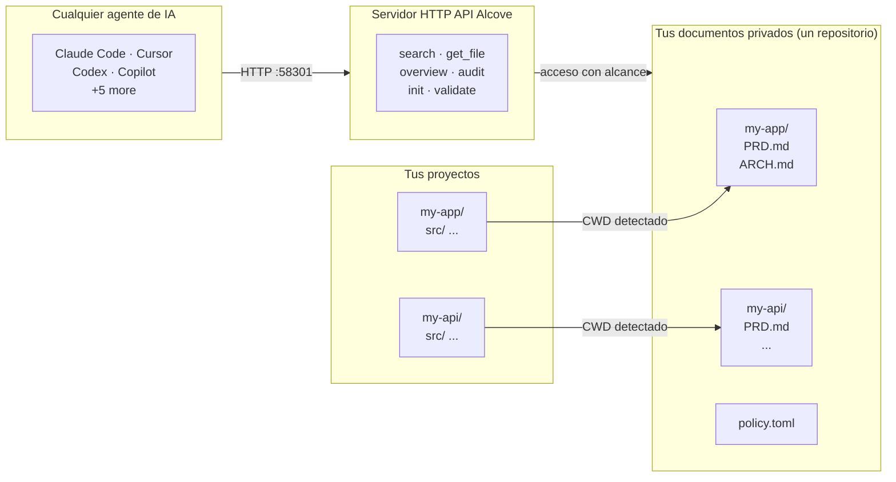

<p align="center">
  
</p>

<p align="center"><strong>Tu agente de IA no conoce tu proyecto. Alcove lo soluciona.</strong></p>

<p align="center">
  <a href="../README.md">English</a> ·
  <a href="README.ko.md">한국어</a> ·
  <a href="README.ja.md">日本語</a> ·
  <a href="README.zh-CN.md">简体中文</a> ·
  <a href="README.es.md">Español</a> ·
  <a href="README.hi.md">हिन्दी</a> ·
  <a href="README.pt-BR.md">Português</a> ·
  <a href="README.de.md">Deutsch</a> ·
  <a href="README.fr.md">Français</a> ·
  <a href="README.ru.md">Русский</a>
</p>

<p align="center">
  <a href="https://glama.ai/mcp/servers/epicsagas/alcove"></a>
  <a href="https://crates.io/crates/alcove"></a>
  <a href="https://crates.io/crates/alcove"></a>
  <a href="../LICENSE"></a>
  <a href="https://buymeacoffee.com/epicsaga"></a>
</p>

Alcove es un servidor HTTP API que da a los agentes de codificación con IA acceso bajo demanda a la documentación privada de tu proyecto — **búsqueda híbrida BM25 + vectorial** para recuperación precisa, **indexación de código con tree-sitter** para que los agentes entiendan la estructura de tu código, y **aplicación de políticas** para consistencia documental. Sin inflar el contexto, sin filtrar documentos a repositorios públicos, sin configuración por proyecto para cada agente.

Guarda PRDs, decisiones de arquitectura, mapas de secretos y runbooks internos en un solo lugar. Todos los agentes obtienen las mismas herramientas, en todos los proyectos, sin configuración por proyecto.

## Demostración


> *Claude, Codex — búsqueda · cambio de proyecto · búsqueda global · validar y generar. Una sola configuración.*

<details>
<summary>Demo CLI</summary>


> *`alcove search` · cambio de proyecto · `--scope global` · `alcove validate`*

</details>

## El problema

Tu agente de IA empieza cada sesión desde cero.

No conoce tu arquitectura. Ignora las restricciones de decisiones que ya tomaste. Te pide explicar las mismas cosas en cada sesión.

La ventana de contexto es el cuello de botella. Cada token cuesta dinero y atención. Cargar 10 documentos de arquitectura en el contexto desperdicia más de 50K tokens en cada ejecución — y la propia documentación de Anthropic advierte que los archivos de configuración sobrecargados hacen que los agentes *ignoren tus instrucciones reales*.

Así que tienes tres malas opciones:

**Meter todo en la configuración del agente** — cada archivo se carga en el contexto en cada ejecución. 10 documentos = inflación de contexto = respuestas más lentas, costosas e imprecisas.

**Copiar y pegar en cada chat** — funciona una vez, no escala más allá de una sesión.

**No molestarse** — tu agente inventa requisitos que ya documentaste, ignora restricciones de decisiones que ya tomaste, y vuelves a explicar la misma arquitectura cada lunes por la mañana.

Multiplícalo por 5 proyectos y 3 agentes. Cada vez que cambias, pierdes el contexto.

## Cómo Alcove resuelve esto

Alcove mantiene toda tu documentación privada en **un único repositorio compartido**, organizado por proyecto. Todos los agentes acceden de la misma manera vía HTTP API — ya sea Claude Code, Cursor, Antigravity o Codex.

```
~/projects/my-app $ claude "/alcove ¿cómo está implementada la autenticación?"

  → Alcove detecta el proyecto: my-app
  → Lee ~/documents/my-app/ARCHITECTURE.md
  → El agente responde con el contexto real del proyecto
```

```
~/projects/my-api $ codex "/alcove revisa el diseño de la API"

  → Alcove detecta el proyecto: my-api
  → Misma estructura de documentos, mismo patrón de acceso
  → Diferente proyecto, mismo flujo de trabajo
```

**Cambia de agente en cualquier momento. Cambia de proyecto en cualquier momento. La capa de documentación permanece estandarizada.**

## Qué hace

- **Un repositorio de documentos, múltiples proyectos** — documentos privados organizados por proyecto, gestionados en un solo lugar
- **Una configuración, cualquier agente** — configura una vez, todos los agentes obtienen el mismo acceso
- **Detecta tu proyecto automáticamente** desde CWD — no se necesita configuración por proyecto
- **Acceso con alcance limitado** — cada proyecto solo ve sus propios documentos
- **Búsqueda inteligente** — búsqueda BM25 con ranking e indexación automática; encuentra los documentos más relevantes primero, recurre a grep cuando es necesario
- **Búsqueda entre proyectos** — busca en todos los proyectos a la vez con `scope: "global"` — úsalo como base de conocimiento personal
- **Los documentos privados permanecen privados** — documentos sensibles (mapa de secretos, decisiones internas, deuda técnica) nunca tocan tu repositorio público
- **Estructura de documentos estandarizada** — `policy.toml` impone documentación consistente en todos los proyectos y equipos
- **Auditoría entre repositorios** — detecta documentos internos mal ubicados en tu repositorio de proyecto y sugiere correcciones
- **Validación de documentos** — verifica archivos faltantes, plantillas sin completar, secciones requeridas
- **Lint semántico** — detecta wikilinks rotos, archivos huérfanos, marcadores WIP/DRAFT obsoletos y referencias temporales de más de 2 años
- **Importación de vault externo** — lleva una nota de Obsidian (u otro vault) al doc-repo con un solo comando; enrutamiento automático al proyecto correcto
- **Funciona con más de 9 agentes** — Claude Code, Cursor, Claude Desktop, Cline, OpenCode, Codex, Copilot, Antigravity

## Por qué Alcove

| Sin Alcove | Con Alcove |
|------------|------------|
| Documentos internos dispersos en Notion, Google Docs, archivos locales | Un repositorio de documentos, estructurado por proyecto |
| Cada agente de IA configurado por separado para acceder a documentos | Una configuración, todos los agentes comparten el mismo acceso |
| Cambiar de proyecto significa perder el contexto documental | Detección automática por CWD, cambio instantáneo de proyecto |
| Las búsquedas del agente devuelven líneas aleatorias | Búsqueda híbrida (BM25 + RAG) — los agentes extraen solo lo que necesitan, ordenado por relevancia |
| El agente solo ve documentos de texto, no la estructura del código | Indexación de código con tree-sitter — los agentes entienden módulos, funciones y tipos en 12 lenguajes |
| "Buscar todas mis notas sobre autenticación" — imposible | Búsqueda global en todos los proyectos en una sola consulta |
| Documentos sensibles con riesgo de filtrarse en repositorios públicos | Documentos privados físicamente separados de los repositorios del proyecto |
| La estructura de documentos varía por proyecto y miembro del equipo | `policy.toml` impone estándares en todos los proyectos |
| Sin forma de verificar si los documentos están completos | `validate` detecta archivos faltantes, plantillas vacías, secciones ausentes |
| Los enlaces rotos o marcadores WIP pasan desapercibidos | `lint` detecta automáticamente enlaces rotos, huérfanos y marcadores obsoletos |
| Las notas de Obsidian u otras herramientas quedan aisladas | `promote` integra notas externas al doc-repo con un solo comando |

## Inicio rápido

> **Obligatorio**: Ejecute `alcove setup` una vez después de la instalación para configurar el directorio de documentos y habilitar todas las funciones. Los plugins inician el servidor API automáticamente, pero Alcove no puede buscar ni indexar documentos hasta que se ejecute `setup`.
>
> **¿Usa Obsidian?** Consulte la sección [Ecosistema](#ecosystem) para la estructura de documentos recomendada y la configuración de bóvedas.

### Claude Code

```
/plugin marketplace add epicsagas/plugins
/plugin install alcove@epicsagas
```

Instala automáticamente el binario e inicia el servidor API en el próximo inicio de sesión.

> **Obligatorio**: Ejecuta `alcove setup` una vez después de la instalación para configurar tu raíz de documentos y habilitar la funcionalidad completa. El plugin inicia el servidor API automáticamente, pero Alcove no puede buscar ni indexar documentos hasta que `setup` haya sido ejecutado.

```bash
alcove setup   # ejecutar una vez después de instalar el plugin
```

Actualizaciones con `claude plugin update epicsagas/alcove`.

### Codex CLI

```bash
codex plugin marketplace add epicsagas/plugins
```

Instala automáticamente la skill e inicia el servidor API.

Disponible inmediatamente — no se necesitan más pasos.

Actualizaciones con `codex plugin update alcove@epicsagas`.

### macOS (solo Apple Silicon)

```bash
brew install epicsagas/tap/alcove
```

¿No tienes Homebrew? Usa el script de instalación:

```bash
curl --proto '=https' --tlsv1.2 -LsSf \
  https://github.com/epicsagas/alcove/releases/latest/download/alcove-installer.sh | sh
```

> **Nota**: Los binarios precompilados están disponibles solo para macOS Apple Silicon. Los usuarios de Linux y Windows pueden usar los instaladores de una línea anteriores.

### Linux (x86_64 / ARM64)

```bash
curl --proto '=https' --tlsv1.2 -LsSf \
  https://github.com/epicsagas/alcove/releases/latest/download/install.sh | sh
```

### Windows (x86_64 / ARM64)

```powershell
irm https://github.com/epicsagas/alcove/releases/latest/download/install.ps1 | iex
```

### Antigravity (Gemini CLI)

```bash
agy plugins install https://github.com/epicsagas/alcove
```

Instala automáticamente el plugin (servidor API, skill, hooks) y lo inicia en el próximo inicio de sesión.

```bash
alcove setup   # run once after plugin install
```

### Vía la cadena de herramientas de Rust

```bash
cargo binstall alcove   # binario precompilado (rápido)
cargo install alcove    # compilar desde el código fuente
```

> **Nota**: Los binarios precompilados están disponibles para Linux (x86\_64), macOS (Apple Silicon e Intel) y Windows.

### Configuración inicial (obligatoria)

Después de instalar con cualquier método anterior, ejecuta:

```bash
alcove setup
alcove --version
alcove doctor
```

`setup` te guía interactivamente a través de todo:

1. Dónde viven tus documentos
2. Qué categorías de documentos rastrear
3. Formato preferido de diagramas
4. Modelo de embeddings para búsqueda híbrida
5. **Servidor en segundo plano** — eliminar el arranque en frío en cada sesión (ítem de inicio de macOS)
6. Qué agentes de IA configurar (archivos de habilidades — Claude Code y Codex se gestionan mediante sus sistemas de plugins)

Ejecuta `alcove setup` en cualquier momento para cambiar la configuración. Recuerda tus elecciones anteriores.

**Dependencias opcionales**

| Herramienta | Propósito | Instalación |
|---|---|---|
| `pdftotext` (poppler) | Extracción completa de texto PDF — requerida para búsqueda PDF | macOS: `brew install poppler` · Debian/Ubuntu: `apt install poppler-utils` · Fedora: `dnf install poppler-utils` · Windows: [poppler for Windows](https://github.com/oschwartz10612/poppler-windows/releases) |

Sin `pdftotext`, Alcove recurre a un parser PDF integrado que puede fallar en algunos archivos. Ejecuta `alcove doctor` para verificar tu instalación.

### Solución de problemas

**El agente no encuentra las herramientas de Alcove**
Ejecuta `alcove setup` de nuevo — reconfigura el servidor API para todos los agentes configurados. Luego inicia una nueva sesión del agente (los cambios surten efecto en el próximo inicio de sesión).

**La búsqueda no devuelve resultados**
Es posible que el índice aún no esté construido. Ejecuta `alcove index` para construirlo e inténtalo de nuevo.

**403 Unauthorized del servidor en segundo plano**
`ALCOVE_TOKEN` no está configurado en tu shell. Ejecuta `alcove token` para mostrarlo, luego añade `export ALCOVE_TOKEN="..."` a tu perfil de shell y recarga.

**`alcove doctor` reporta problemas**
Sigue las sugerencias mostradas por `doctor` — verifica la ubicación del binario, el estado del servidor API, el estado del índice y dependencias opcionales como `pdftotext`.

## Uso

### Búsqueda por CLI

Busca en tus documentos directamente desde la terminal. Por defecto, busca en **todos los proyectos** (alcance global).

```bash
# Búsqueda básica (alcance global)
alcove search "authentication"

# Limitar la búsqueda al proyecto actual (detectado automáticamente vía CWD)
alcove search "auth flow" --scope project

# Forzar modo grep (coincidencia exacta de subcadena)
alcove search "TODO" --mode grep

# Forzar modo clasificado (BM25/Híbrido)
alcove search "data model" --mode ranked

# Ajustar límite de resultados
alcove search "deployment" --limit 5
```

### Agentes de codificación (HTTP API)

Los agentes de codificación de IA utilizan Alcove a través de una **API HTTP local** en el puerto 58301. Las skills llaman a `curl http://localhost:58301/...` internamente. Normalmente no necesitas llamarlas tú mismo; el agente las invocará cuando hagas preguntas sobre tu proyecto.

| Endpoint | Método | Descripción |
|----------|--------|-------------|
| `/health` | GET | Health check — verificar que el servidor API está en ejecución |
| `/search?q=...` | GET | Buscar documentación (parámetro de consulta) |
| `/v1/search` | POST | Buscar con cuerpo JSON (scope, limit, mode) |
| `/projects` | GET | Listar todos los proyectos en el repositorio de documentos |
| `/projects` | POST | Inicializar un nuevo proyecto desde plantillas |
| `/projects/{name}/docs` | GET | Listar documentos de un proyecto con tamaños y clasificación |
| `/projects/{name}/audit` | GET | Auditar salud documental (faltantes, obsoletos, mal ubicados) |
| `/projects/{name}/validate` | GET | Validar documentos contra policy.toml |
| `/projects/{name}/config` | PUT | Actualizar configuración del proyecto en alcove.toml |
| `/docs/{path}` | GET | Leer un archivo de documento específico (query: `project`, `offset`, `limit`) |
| `/rebuild` | POST | Reconstruir el índice de búsqueda |
| `/changes` | GET | Verificar archivos modificados desde el último índice (query: `auto_rebuild`) |
| `/lint` | GET | Lint de documentos — enlaces rotos, huérfanos, marcadores obsoletos (query: `project`) |
| `/vaults` | GET | Listar todos los vaults de base de conocimiento |
| `/vaults/search?q=...` | GET | Buscar en vaults (query: `vault`, `limit`) |
| `/vaults/backup` | POST | Snapshot de Git del estado del vault |
| `/promote` | POST | Importar un archivo al repositorio de documentos |
| `/index-code` | POST | Indexar código fuente mediante tree-sitter |
| `/mcp` | POST | Proxy JSON-RPC (MCP heredado) |

> **Nota**: MCP sigue disponible para configuración manual — consulta `registry/mcp.json` para acceso basado en stdio.

**Ejemplo de interacción con el agente:**
> **Usuario:** "/alcove ¿Cómo añado un nuevo endpoint a la API?"
> **Agente:** (llama a `POST /v1/search` con `query="add api endpoint"`)
> **Agente:** (lee el documento más relevante vía `GET /docs/{path}?project=...`)
> **Agente:** "Según `ARCHITECTURE.md`, necesitas..."

---

## Cómo funciona



Tus documentos están organizados en un directorio separado (`DOCS_ROOT`), una carpeta por proyecto. Alcove gestiona los documentos ahí y los sirve a cualquier agente de IA a través de HTTP en el puerto 58301.

## Clasificación de documentos

Alcove clasifica los documentos en los siguientes niveles:

| Clasificación | Dónde se encuentra | Ejemplos |
|---------------|-------------------|----------|
| **doc-repo-required** | Alcove (privado) | PRD, Arquitectura, Decisiones, Convenciones |
| **doc-repo-supplementary** | Alcove (privado) | Despliegue, Incorporación, Pruebas, Guía operativa |
| **reference** | Alcove carpeta `reports/` | Informes de auditoría, benchmarks, análisis |
| **project-repo** | Tu repositorio de GitHub (público) | README, CHANGELOG, CONTRIBUTING |

La herramienta `audit` escanea tanto el repositorio de documentos como el directorio local del proyecto, y sugiere acciones — como generar un README público a partir de tu PRD privado, o mover informes mal ubicados de vuelta a Alcove.

## Endpoints de API

| Endpoint | Método | Qué hace |
|----------|--------|----------|
| `/health` | GET | Health check — verificar que el servidor API está en ejecución |
| `/search?q=...` | GET | Buscar documentación (parámetro de consulta) |
| `/v1/search` | POST | Buscar con cuerpo JSON (scope, limit, mode) |
| `/projects` | GET | Listar todos los proyectos |
| `/projects` | POST | Inicializar un nuevo proyecto |
| `/projects/{name}/docs` | GET | Listar documentos de un proyecto |
| `/projects/{name}/audit` | GET | Auditar salud documental |
| `/projects/{name}/validate` | GET | Validar documentos contra la política |
| `/projects/{name}/config` | PUT | Actualizar configuración del proyecto |
| `/docs/{path}` | GET | Leer un archivo de documento |
| `/rebuild` | POST | Reconstruir índice de búsqueda |
| `/changes` | GET | Verificar archivos modificados |
| `/lint` | GET | Lint de documentos |
| `/vaults` | GET | Listar vaults |
| `/vaults/search?q=...` | GET | Buscar en vaults |
| `/vaults/backup` | POST | Respaldar vault |
| `/promote` | POST | Importar archivo al repositorio de documentos |
| `/index-code` | POST | Indexar estructura de código |
| `/mcp` | POST | Proxy JSON-RPC (MCP heredado) |

> **Nota**: MCP sigue disponible para configuración manual — consulta `registry/mcp.json` para acceso basado en stdio.

## CLI

```
alcove              Iniciar el servidor API (los agentes lo invocan)
alcove setup        Configuración interactiva — ejecuta en cualquier momento para reconfigurar
alcove doctor       Verificar el estado de la instalación de Alcove
alcove validate     Validar documentos contra la política (--format json, --exit-code)
alcove lint         Lint semántico — enlaces rotos, huérfanos, marcadores obsoletos (--format json)
alcove promote      Importar notas de un vault externo al doc-repo
alcove index        Actualizar el índice de búsqueda (incremental — solo archivos modificados)
alcove rebuild      Reconstruir el índice de búsqueda desde cero (usar tras cambios de esquema)
alcove search       Buscar documentos desde la terminal
alcove index-code   Genera índice de estructura de código desde el fuente [--language LANG] [--source PATH]
alcove token        Imprimir el token de portador (para autenticación del servidor en segundo plano)
alcove uninstall    Eliminar habilidades, configuración y archivos heredados

alcove mcp <CMD>      Gestionar el ciclo de vida del servidor API en segundo plano (start, stop, status, enable, disable)

alcove vault create   Crear un nuevo vault de base de conocimiento
alcove vault link     Vincular un directorio externo como un vault (p. ej., Obsidian)
alcove vault list     Listar todos los vaults con recuentos de documentos
alcove vault remove   Eliminar un vault (enlaces simbólicos: solo elimina el enlace)
alcove vault add      Añadir un documento a un vault
alcove vault index    Construir el índice de búsqueda para vaults
alcove vault rebuild  Reconstruir el índice de búsqueda de vaults desde cero
```

### Indexación de código

Analiza archivos fuente con tree-sitter y genera `CODE_INDEX.md`—un resumen Markdown a nivel de módulo de tu código base que se integra con el pipeline de búsqueda Tantivy.

```bash
# Indexar el proyecto actual (detecta todos los lenguajes automáticamente)
alcove index-code --source ./src

# Monorepo: indexar un directorio con múltiples lenguajes a la vez
alcove index-code --source ./

# Restringir a un solo lenguaje
alcove index-code --source ./src --language typescript
alcove index-code --source ./src --language rust
```

**Lenguajes soportados:**

| Lenguaje | Feature flag | Extensiones |
|----------|-------------|-------------|
| Rust | `lang-rust` | `.rs` |
| Python | `lang-python` | `.py`, `.pyi` |
| TypeScript | `lang-typescript` | `.ts`, `.tsx` |
| JavaScript | `lang-javascript` | `.js`, `.jsx`, `.mjs` |
| Go | `lang-go` | `.go` |
| Java | `lang-java` | `.java` |
| Kotlin | `lang-kotlin` | `.kt`, `.kts` |
| C | `lang-c` | `.c`, `.h` |
| C++ | `lang-cpp` | `.cpp`, `.cc`, `.cxx`, `.hpp`, `.hxx`, `.h` |
| Swift | `lang-swift` | `.swift` |
| Ruby | `lang-ruby` | `.rb` |
| C# | `lang-csharp` | `.cs` |

Los binarios oficiales habilitan los 12 parsers (`lang-all`). Sin `--language`, **se indexan automáticamente todas las extensiones reconocidas**—seguro para monorepos.

`--language` acepta abreviaturas: `ts` → TypeScript, `cpp` → C++, `csharp` → C#, `py` → Python, `js` → JavaScript, `kt` → Kotlin, `rb` → Ruby.

### Lint

```bash
# Lint del proyecto actual (detectado automáticamente desde CWD)
alcove lint

# Especificar proyecto
alcove lint --project my-app

# Salida legible por máquina para CI
alcove lint --format json
```

El lint comprueba cuatro cosas:

| Comprobación | Qué detecta |
|-------------|-------------|
| `broken-link` | `[[wikilinks]]` o `[texto](ruta)` que apuntan a archivos inexistentes |
| `orphan` | Archivos a los que ningún otro documento enlaza |
| `stale-marker` | Marcadores WIP / TODO / FIXME / DRAFT / DEPRECATED |
| `stale-date` | Referencias temporales de más de 2 años (p. ej., "as of 2022") |

### Promote

```bash
# Copiar una nota de Obsidian al doc-repo (enrutamiento automático al proyecto)
alcove promote ~/my-brain/Projects/auth-notes.md

# Enrutar a un proyecto específico
alcove promote ~/my-brain/Projects/auth-notes.md --project my-app

# Mover en lugar de copiar
alcove promote ~/my-brain/Projects/auth-notes.md --mv
```

Los archivos sin proyecto coincidente se guardan en `inbox/` para revisión manual.

### Servidor en segundo plano

Ejecutar un servidor persistente en segundo plano elimina la latencia de arranque en frío en cada nueva sesión del agente. **`alcove setup` activa esto por defecto** (ítem de inicio en macOS).

```bash
alcove mcp enable --now     # Activar e iniciar (persiste tras reiniciar)
alcove mcp stop / start / restart / status
alcove mcp disable          # Desactivar y eliminar ítem de inicio
```

Cuando el servidor en segundo plano está en ejecución, el proceso stdio actúa como un proxy ligero — en lugar de cargar el motor de búsqueda cada sesión, reenvía las solicitudes al servidor activo. Al iniciar, el proceso stdio verifica `GET /health` y entra automáticamente en modo proxy.

## Búsqueda

Alcove selecciona automáticamente la mejor estrategia de búsqueda. Cuando el índice de búsqueda existe, usa **búsqueda BM25 con ranking** (impulsada por [tantivy](https://github.com/quickwit-oss/tantivy)) para resultados ordenados por relevancia. Cuando no existe, recurre a grep. No necesitas preocuparte por ello.

### Búsqueda híbrida (RAG)

Alcove soporta **Búsqueda Híbrida** que combina BM25 con **Búsqueda de Similitud Vectorial** (impulsada por [fastembed](https://github.com/ankane/fastembed-rs)).

Durante `alcove setup`, puedes elegir un modelo de embeddings y descargarlo inmediatamente. También puedes gestionar modelos manualmente:

```bash
# Establecer y descargar un modelo de embeddings
alcove model set MultilingualE5Small
alcove model download

# Verificar estado del modelo
alcove model status
```

#### Elección de modelo

| Modelo | Disco | Dim | Idiomas | Mejor para | RAM pico |
|--------|-------|-----|---------|------------|----------|
| `AllMiniLML6V2` | 90 MB | 384 | Inglés | Huella mínima, indexación rápida solo en inglés | ~400 MB |
| **`MultilingualE5Small`** | **235 MB** | **384** | **100+ idiomas** | **Predeterminado — proyectos multilingües / mixtos** | **~700 MB** |
| `MultilingualE5Base` | 555 MB | 768 | 100+ idiomas | Mejor calidad multilingüe | ~2 GB |
| `MultilingualE5Large` | 2.2 GB | 1024 | 100+ idiomas | Máxima calidad multilingüe | ~7 GB |
| `BGEM3` | 2.3 GB | 1024 | 100+ idiomas | Multilingüe de última generación | ~8 GB |
| `ArcticEmbedXS` | 90 MB | 384 | Inglés | Snowflake — mejor calidad a 384 dim | ~400 MB |
| `ArcticEmbedS` | 130 MB | 384 | Inglés | Snowflake — recuperación mejorada en tamaño pequeño | ~500 MB |
| `ArcticEmbedM` | 430 MB | 768 | Inglés | Snowflake — calidad de recuperación de trabajo | ~1.5 GB |
| `ArcticEmbedL` | 1.3 GB | 1024 | Inglés | Snowflake — competitivo con APIs de código cerrado | ~5 GB |

Una vez que un modelo está descargado y listo, Alcove usará automáticamente Búsqueda Híbrida tanto para búsqueda CLI como para herramientas MCP de agentes. Esto es particularmente efectivo para proyectos multilingües y consultas semánticas complejas.

```bash
# Buscar en el proyecto actual (auto-detectado desde CWD)
alcove search "authentication flow"

# Buscar en TODOS los proyectos — tu base de conocimiento personal
alcove search "OAuth token refresh" --scope global

# Forzar modo grep si necesitas coincidencia exacta de subcadenas
alcove search "FR-023" --mode grep
```

El índice se construye automáticamente en segundo plano cuando el servidor API se inicia, y se reconstruye cuando detecta cambios en los archivos. Sin cron jobs, sin pasos manuales.

**Cómo funciona para agentes:** los agentes simplemente llaman a `search_project_docs` con una consulta. Alcove se encarga del resto — ranking, deduplicación (un resultado por archivo), búsqueda entre proyectos y fallback. El agente nunca necesita elegir un modo de búsqueda.

**Memoria durante rebuild:**
La RAM pico varía según el modelo — consulta la columna "RAM pico" en la tabla anterior. Modelos grandes (BGEM3, MultilingualE5Large, ArcticEmbedL) pueden usar 5-10 GB durante rebuild. Después de rebuild, el estado estable baja a ~50-200 MB según tu configuración `[memory]`. Puedes reducir aún más con un `max_hnsw_cache` más bajo y un `model_unload_secs` más corto.

## Detección de proyecto

Por defecto, Alcove detecta el proyecto actual desde el directorio de trabajo de tu terminal (CWD). Puedes sobreescribirlo con la variable de entorno `MCP_PROJECT_NAME`:

```bash
MCP_PROJECT_NAME=my-api alcove
```

Útil cuando tu CWD no coincide con un nombre de proyecto en tu repositorio de documentos.

## Política de documentos

Define estándares de documentación a nivel de equipo con `policy.toml` en tu repositorio de documentos:

```toml
[policy]
enforce = "strict"    # strict | warn

[[policy.required]]
name = "PRD.md"
aliases = ["prd.md", "product-requirements.md"]

[[policy.required]]
name = "ARCHITECTURE.md"

  [[policy.required.sections]]
  heading = "## Overview"
  required = true

  [[policy.required.sections]]
  heading = "## Components"
  required = true
  min_items = 2
```

Los archivos de política se resuelven con prioridad: **proyecto** (`<project>/.alcove/policy.toml`) > **equipo** (`DOCS_ROOT/.alcove/policy.toml`) > **por defecto** (lista de archivos core de config.toml). Esto asegura calidad documental consistente en todos tus proyectos, permitiendo excepciones por proyecto.

## Configuración

La configuración se encuentra en `~/.config/alcove/config.toml`:

```toml
docs_root = "/Users/you/documents"

[core]
files = ["PRD.md", "ARCHITECTURE.md", "PROGRESS.md", "DECISIONS.md", "CONVENTIONS.md", "SECRETS_MAP.md", "DEBT.md"]

[team]
files = ["ENV_SETUP.md", "ONBOARDING.md", "DEPLOYMENT.md", "TESTING.md", ...]

[public]
files = ["README.md", "CHANGELOG.md", "CONTRIBUTING.md", "SECURITY.md", ...]

[diagram]
format = "mermaid"
```

Todo esto se configura de forma interactiva con `alcove setup`. También puedes editar el archivo directamente.

## Agentes compatibles

| Agente | Acceso | Habilidad |
|--------|-----|-----------|
| Claude Code | `~/.claude.json` | `~/.claude/skills/alcove/` |
| Cursor | `~/.cursor/mcp.json` | `~/.cursor/skills/alcove/` |
| Claude Desktop | configuración de plataforma | — |
| Cline (VS Code) | VS Code globalStorage | `~/.cline/skills/alcove/` |
| OpenCode | `~/.config/opencode/opencode.json` | `~/.opencode/skills/alcove/` |
| Codex CLI | `~/.codex/config.toml` | `~/.codex/skills/alcove/` |
| Copilot CLI | `~/.copilot/mcp-config.json` | `~/.copilot/skills/alcove/` |
| Antigravity | `agy plugins install` | — |

## Idiomas compatibles

La CLI detecta automáticamente la configuración regional de tu sistema. También puedes sobreescribirla con la variable de entorno `ALCOVE_LANG`.

| Idioma | Código |
|--------|--------|
| English | `en` |
| 한국어 | `ko` |
| 简体中文 | `zh-CN` |
| 日本語 | `ja` |
| Español | `es` |
| हिन्दी | `hi` |
| Português (Brasil) | `pt-BR` |
| Deutsch | `de` |
| Français | `fr` |
| Русский | `ru` |

```bash
# Sobreescribir idioma
ALCOVE_LANG=es alcove setup
```

## Actualizar

| Método | Comando |
|--------|---------|
| Homebrew | `brew upgrade alcove` |
| curl installer | Volver a ejecutar el script de instalación arriba |
| cargo binstall | `cargo binstall alcove@latest` |
| cargo install | `cargo install alcove@latest` |
| Claude Code Plugin | `claude plugin update epicsagas/alcove` |

```bash
alcove --version
```

## Desinstalar

```bash
alcove uninstall          # eliminar habilidades y configuración
cargo uninstall alcove    # eliminar binario
```

## Vaults de base de conocimiento

Más allá de la documentación del proyecto, Alcove admite **vaults de base de conocimiento independientes** para notas de investigación, materiales de referencia y conocimiento curado que los LLM pueden buscar.

```bash
# Crear un vault para notas de investigación de IA
alcove vault create ai-research

# Vincular un vault de Obsidian existente (sin copiar — indexa en el lugar)
alcove vault link my-obsidian ~/Obsidian/research

# Añadir un documento
alcove vault add ai-research ~/Downloads/transformer-survey.md

# Construir el índice de búsqueda del vault
alcove vault index

# Listar todos los vaults
alcove vault list
#   areas (8 docs) → (linked)
#   resources (71 docs) → (linked)
#   zettelkasten (17 docs) → (linked)

# Buscar desde la CLI
alcove search "attention mechanism" --vault ai-research

# Los agentes buscan a través de MCP
search_vault(query="attention mechanism", vault="ai-research")

# Buscar en TODOS los vaults a la vez
search_vault(query="transformer", vault="*")
```

Los vaults están **completamente aislados** de los documentos del proyecto — índices separados, cachés separadas, búsqueda separada. La búsqueda de documentos del proyecto de tu agente de codificación nunca se ve afectada por la actividad del vault.

| Característica | Documentos del proyecto | Vaults |
|---------|-------------|--------|
| Propósito | Documentación por proyecto | Base de conocimiento general |
| Almacenamiento | `~/.alcove/docs/` | `~/.alcove/vaults/` |
| Índice | Índice de proyecto compartido | Índice independiente por vault |
| Caché | `PROJECT_READER_CACHE` | `VAULT_READER_CACHE` |
| Búsqueda | `search_project_docs` | `search_vault` |
| Enlace simbólico | No | Sí (vincular directorios externos) |

### Configuración del Vault

Por defecto, los vaults se almacenan en `~/.alcove/vaults/`. Puedes cambiar esto en tu `config.toml`:

```toml
[vaults]
root = "/path/to/your/vaults"
```

Consulta la sección de [Configuración](#configuración) para más detalles sobre `config.toml`.

## Ecosistema

### [obsidian-forge](https://github.com/epicsagas/obsidian-forge)

Alcove se integra de forma natural con **obsidian-forge**, un generador de bóvedas de Obsidian y demonio de automatización. Para una mejor integración, tu **`docs_root`** de Alcove debe apuntar a los archivos de proyectos de obsidian-forge.

**1. Establecer la raíz de documentos**
Apunta tus documentos principales al directorio de proyectos de obsidian-forge (directamente o mediante un enlace simbólico):
```bash
# Durante la configuración de alcove, establece docs_root en:
~/Obsidian/SecondBrain/99-Archives/projects
```

**2. Vincular áreas de conocimiento como vaults**
Vincula las otras tres categorías de obsidian-forge como vaults independientes de Alcove. Esto crea enlaces simbólicos en `~/.alcove/vaults/`:
```bash
# Vincular categorías de obsidian-forge
alcove vault link areas ~/Obsidian/SecondBrain/02-Areas
alcove vault link resources ~/Obsidian/SecondBrain/03-Resources
alcove vault link zettelkasten ~/Obsidian/SecondBrain/10-Zettelkasten
```

Ahora tus agentes tienen acceso estructurado:
- **`search_project_docs`**: Busca en el conocimiento de proyectos archivados (PRD, etc.)
- **`search_vault`**: Busca en tus áreas de conocimiento más amplias y notas de investigación.

Puedes verificar el mapeo de almacenamiento físico comprobando los enlaces simbólicos en `~/.alcove/vaults/`.

## Preguntas frecuentes

### ¿Por qué no usar simplemente ripgrep como herramienta MCP?

Ripgrep devuelve archivos completos. Si tu agente busca "auth" y encuentra 5 archivos que promedian 200 líneas cada uno, se inyectan ~10K tokens en el contexto — la mayor parte irrelevante. Alcove fragmenta los documentos, clasifica los fragmentos y devuelve solo los pasajes más relevantes. También ofrece búsqueda semántica (embeddings vectoriales) que ripgrep no puede proporcionar — una consulta como "¿cómo está estructurada la canalización de despliegue?" no coincidirá con ninguna palabra clave en tu DEPLOYMENT.md, pero la búsqueda vectorial de Alcove la encontrará.

### ¿Esto reemplaza a CLAUDE.md / AGENTS.md?

No — cumplen propósitos diferentes. Los archivos de configuración del agente (CLAUDE.md, AGENTS.md) definen **reglas de comportamiento**: estilo de commits, preferencias de idioma, restricciones de seguridad. Alcove gestiona **conocimiento institucional**: decisiones de arquitectura, seguimiento de progreso, convenciones de código, estructura del código. La configuración del agente es para *cómo debe actuar el agente*. Alcove es para *qué debe saber el agente*.

### ¿Por qué Rust?

Un único binario, sin dependencias de tiempo de ejecución. Tantivy ofrece BM25 de mejor en su clase. candle-transformers nos proporciona embeddings vectoriales locales sin ONNX ni Python. Un solo `cargo install` o curl — sin Docker, sin Node.js, sin virtualenv.

### ¿Qué pasa cuando las ventanas de contexto sean más grandes?

Ventanas más grandes no resuelven el problema de la relevancia. Incluso una ventana de 200K tokens llena de documentos irrelevantes degrada la calidad de salida del agente — la propia documentación de Anthropic advierte que los archivos de configuración sobrecargados hacen que los agentes ignoren las instrucciones reales. El objetivo no es más contexto, sino el contexto correcto en el momento adecuado.

## Hoja de ruta

- **Acceso remoto multiusuario** — compartir documentos del equipo por LAN/VPN (autenticación con token de portador, limitación de velocidad ya implementada). Requiere: API de escritura, coordinación de índices concurrentes, gestión del ciclo de vida de proyectos.

## Contribuir

Se aceptan informes de errores, solicitudes de funciones y pull requests. Abre un issue en [GitHub](https://github.com/epicsagas/alcove/issues) para iniciar una discusión.

## Licencia

Apache-2.0
