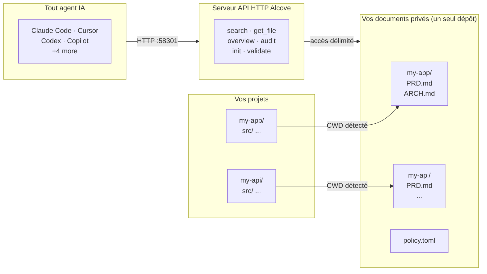

<p align="center">
  
</p>

<p align="center"><strong>Votre agent IA ne connaît pas votre projet. Alcove règle ça.</strong></p>

<p align="center">
  <a href="../README.md">English</a> ·
  <a href="README.ko.md">한국어</a> ·
  <a href="README.ja.md">日本語</a> ·
  <a href="README.zh-CN.md">简体中文</a> ·
  <a href="README.es.md">Español</a> ·
  <a href="README.hi.md">हिन्दी</a> ·
  <a href="README.pt-BR.md">Português</a> ·
  <a href="README.de.md">Deutsch</a> ·
  <a href="README.fr.md">Français</a> ·
  <a href="README.ru.md">Русский</a>
</p>

<p align="center">
  <a href="https://glama.ai/mcp/servers/epicsagas/alcove"></a>
  <a href="https://crates.io/crates/alcove"></a>
  <a href="https://crates.io/crates/alcove"></a>
  <a href="../LICENSE"></a>
  <a href="https://buymeacoffee.com/epicsaga"></a>
</p>

Alcove est un serveur d'API HTTP qui donne aux agents de codage IA un accès à la demande à la documentation privée de votre projet — **recherche hybride BM25 + vectorielle** pour une récupération précise, **indexation de code tree-sitter** pour que les agents comprennent la structure de votre codebase, et **application de politiques** pour la cohérence des documents. Pas de gonflement de contexte, pas de fuite de documents dans les dépôts publics, pas de configuration par projet pour chaque agent.

## Démonstration


> *Claude, Codex — recherche · changement de projet · recherche globale · validation et génération. Une seule configuration.*

<details>
<summary>Démo CLI</summary>


> *`alcove search` · changement de projet · `--scope global` · `alcove validate`*

</details>

## Le problème

Votre agent IA commence chaque session à zéro.

Il ne connaît pas votre architecture. Il ignore les contraintes des décisions que vous avez déjà prises. Il vous demande d'expliquer les mêmes choses à chaque session.

La fenêtre de contexte est le goulot d'étranglement. Chaque token coûte de l'argent et de l'attention. Charger 10 documents d'architecture dans le contexte gaspille plus de 50K tokens à chaque exécution — et la propre documentation d'Anthropic avertit que les fichiers de configuration surchargés font que les agents *ignorent vos instructions réelles*.

Vous avez donc trois mauvaises options :

**Tout fourrer dans la config de l'agent** — chaque fichier est chargé dans le contexte à chaque exécution. 10 documents = gonflement de contexte = réponses plus lentes, plus coûteuses, moins précises.

**Copier-coller dans chaque chat** — fonctionne une fois, ne passe pas à l'échelle au-delà d'une session.

**Ne pas s'en soucier** — votre agent invente des exigences que vous avez déjà documentées, ignore les contraintes des décisions que vous avez déjà prises, et vous réexpliquez la même architecture chaque lundi matin.

Multipliez par 5 projets et 3 agents. À chaque changement, vous perdez le contexte.

## Comment Alcove résout ce problème

Alcove conserve tous vos documents privés dans **un seul dépôt partagé**, organisé par projet. Tous les agents y accèdent de la même manière via l'API HTTP — que vous utilisiez Claude Code, Cursor ou Codex.

```
~/projects/my-app $ claude "/alcove comment l'authentification est-elle implémentée ?"

  → Alcove détecte le projet : my-app
  → Lit ~/documents/my-app/ARCHITECTURE.md
  → L'agent répond avec le contexte réel du projet
```

```
~/projects/my-api $ codex "/alcove révise la conception de l'API"

  → Alcove détecte le projet : my-api
  → Même structure de documents, même schéma d'accès
  → Projet différent, même flux de travail
```

**Changez d'agent à tout moment. Changez de projet à tout moment. La couche documentaire reste standardisée.**

## Fonctionnalités principales

- **Un dépôt de documents, plusieurs projets** — documents privés organisés par projet, gérés en un seul endroit
- **Une seule configuration, tous les agents** — configurez une fois, chaque agent IA obtient le même accès
- **Détection automatique du projet** à partir du CWD — pas de configuration par projet nécessaire
- **Accès ciblé** — chaque projet ne voit que ses propres documents
- **Recherche intelligente** — recherche BM25 classée avec indexation automatique ; trouve les documents les plus pertinents en premier, recourt au grep si nécessaire
- **Recherche inter-projets** — recherchez dans tous les projets à la fois avec `scope: "global"` — utilisez-le comme base de connaissances personnelle
- **Les documents privés restent privés** — les documents sensibles (carte de secrets, décisions internes, dette technique) ne touchent jamais votre dépôt public
- **Structure documentaire standardisée** — `policy.toml` impose des documents cohérents à travers tous les projets et équipes
- **Audit inter-dépôts** — trouve les documents internes mal placés dans le dépôt du projet et suggère des corrections
- **Validation des documents** — vérifie les fichiers manquants, les templates non remplis, les sections requises
- **Lint sémantique** — détecte automatiquement les wikilinks cassés, les fichiers orphelins, les marqueurs WIP/DRAFT obsolètes et les références temporelles de plus de 2 ans
- **Import depuis un vault externe** — importe une note d'Obsidian (ou autre vault) dans le doc-repo en une seule commande ; routage automatique vers le bon projet
- **Compatible avec 9+ agents** — Claude Code, Cursor, Claude Desktop, Cline, OpenCode, Codex, Copilot

## Pourquoi Alcove

| Sans Alcove | Avec Alcove |
|-------------|-------------|
| Documents internes éparpillés entre Notion, Google Docs, fichiers locaux | Un dépôt de documents, structuré par projet |
| Chaque agent IA configuré séparément pour l'accès aux documents | Une seule configuration, tous les agents partagent le même accès |
| Changer de projet signifie perdre le contexte documentaire | Détection automatique par CWD, changement de projet instantané |
| Les recherches de l'agent renvoient des lignes aléatoires | Recherche hybride (BM25 + RAG) — les agents récupèrent uniquement ce dont ils ont besoin, classé par pertinence |
| L'agent ne voit que des documents texte, pas la structure du code | Indexation de code tree-sitter — les agents comprennent les modules, fonctions et types sur 12 langages |
| "Chercher toutes mes notes sur l'authentification" — impossible | Recherche globale dans tous les projets en une seule requête |
| Documents sensibles risquent de fuiter dans les dépôts publics | Documents privés physiquement séparés des dépôts de projet |
| La structure documentaire varie par projet et par membre de l'équipe | `policy.toml` impose des standards à travers tous les projets |
| Aucun moyen de vérifier si les documents sont complets | `validate` détecte les fichiers manquants, les templates vides, les sections manquantes |
| Les liens cassés ou marqueurs WIP passent inaperçus | `lint` détecte automatiquement les liens cassés, orphelins et marqueurs obsolètes |
| Les notes Obsidian ou autres outils restent cloisonnées | `promote` intègre les notes externes dans le doc-repo en une commande |

## Démarrage rapide

> **Obligatoire**: Exécutez `alcove setup` une fois après l'installation pour configurer votre répertoire de documents et activer toutes les fonctionnalités. Les plugins démarrent le serveur API automatiquement, mais Alcove ne peut pas rechercher ni indexer les documents tant que `setup` n'a pas été exécuté.
>
> **Vous utilisez Obsidian ?** Consultez la section [Écosystème](#ecosystem) pour la structure de documents recommandée et la configuration des coffres.

### Claude Code

```
/plugin marketplace add epicsagas/plugins
/plugin install alcove@epicsagas
```

Installe automatiquement le binaire et démarre le serveur API au prochain démarrage de session.

> **Obligatoire** : Exécutez `alcove setup` une fois après l'installation pour configurer votre racine de documents et activer toutes les fonctionnalités. Le plugin démarre le serveur API automatiquement, mais Alcove ne peut pas rechercher ou indexer les documents tant que `setup` n'a pas été exécuté.

```bash
alcove setup   # exécuter une fois après l'installation du plugin
```

Mises à jour avec `claude plugin update epicsagas/alcove`.

### Codex CLI

```bash
codex plugin marketplace add epicsagas/plugins
```

Installe automatiquement la compétence et démarre le serveur API.

Disponible immédiatement — aucune étape supplémentaire nécessaire.

Mises à jour avec `codex plugin update alcove@epicsagas`.

### macOS (Apple Silicon uniquement)

```bash
brew install epicsagas/tap/alcove
```

Pas de Homebrew ? Utilisez le script d'installation :

```bash
curl --proto '=https' --tlsv1.2 -LsSf \
  https://github.com/epicsagas/alcove/releases/latest/download/alcove-installer.sh | sh
```

### Linux (x86_64 / ARM64)

```bash
curl --proto '=https' --tlsv1.2 -LsSf \
  https://github.com/epicsagas/alcove/releases/latest/download/install.sh | sh
```

### Windows (x86_64 / ARM64)

```powershell
irm https://github.com/epicsagas/alcove/releases/latest/download/install.ps1 | iex
```

### Antigravity (Gemini CLI)

```bash
agy plugins install https://github.com/epicsagas/alcove
```

Installe automatiquement le plugin (serveur API, skill, hooks) et le démarre au prochain démarrage de session.

```bash
alcove setup   # run once after plugin install
```

### Via la chaîne d'outils Rust

```bash
cargo binstall alcove   # binaire précompilé, recherche hybride incluse
cargo install alcove --features full-macos   # compiler depuis les sources (macOS)
cargo install alcove --features full-cross   # compiler depuis les sources (Linux/Windows)
```

> **Note** : `cargo binstall` télécharge un binaire précompilé avec recherche hybride (vectorielle + BM25). Pour compiler depuis les sources, `--features full-macos` ou `--features full-cross` est requis pour la recherche hybride. Sans features, seule la recherche BM25 (par mots-clés) est disponible.

### Première configuration (obligatoire)

Après l'installation via l'une des méthodes ci-dessus, exécutez :

```bash
alcove setup
alcove --version
alcove doctor
```

`setup` vous guide à travers tout de manière interactive :

1. Où se trouvent vos documents
2. Quelles catégories de documents suivre
3. Format de diagramme préféré
4. Modèle d'embeddings pour la recherche hybride
5. **Serveur en arrière-plan** — éliminer le démarrage à froid à chaque session (élément de connexion macOS)
6. Quels agents IA configurer (fichiers de compétences — Claude Code et Codex sont gérés par leurs systèmes de plugins)

Relancez `alcove setup` à tout moment pour modifier les paramètres. Il se souvient de vos choix précédents.

**Dépendances optionnelles**

| Outil | Objectif | Installation |
|---|---|---|
| `pdftotext` (poppler) | Extraction complète de texte PDF — requise pour la recherche PDF | macOS: `brew install poppler` · Debian/Ubuntu: `apt install poppler-utils` · Fedora: `dnf install poppler-utils` · Windows: [poppler for Windows](https://github.com/oschwartz10612/poppler-windows/releases) |

Sans `pdftotext`, Alcove se rabat sur un analyseur PDF intégré qui peut échouer sur certains fichiers. Exécutez `alcove doctor` pour vérifier votre installation.

### Résolution des problèmes

**L'agent ne trouve pas les outils Alcove**
Exécutez à nouveau `alcove setup` — il reconfigure le serveur API pour tous les agents configurés. Démarrez ensuite une nouvelle session d'agent (les changements prennent effet au prochain démarrage de session).

**La recherche ne renvoie aucun résultat**
L'index n'est peut-être pas encore construit. Exécutez `alcove index` pour le construire, puis réessayez.

**403 Unauthorized du serveur en arrière-plan**
`ALCOVE_TOKEN` n'est pas défini dans votre shell. Exécutez `alcove token` pour l'afficher, ajoutez `export ALCOVE_TOKEN="..."` à votre profil shell et rechargez.

**`alcove doctor` signale des problèmes**
Suivez les suggestions affichées par `doctor` — il vérifie l'emplacement du binaire, l'état du serveur API, l'état de l'index et les dépendances optionnelles comme `pdftotext`.

## Utilisation

### Recherche CLI

Recherchez dans vos documents directement depuis le terminal. Par défaut, la recherche s'effectue sur **tous les projets** (portée globale).

```bash
# Recherche de base (portée globale)
alcove search "authentication"

# Limiter la recherche au projet actuel (détecté via le CWD)
alcove search "auth flow" --scope project

# Forcer le mode grep (correspondance exacte de sous-chaîne)
alcove search "TODO" --mode grep

# Forcer le mode classé (BM25/Hybride)
alcove search "data model" --mode ranked

# Ajuster la limite de résultats
alcove search "deployment" --limit 5
```

### Agents de codage (API HTTP)

Les agents de codage IA utilisent Alcove via une **API HTTP locale** sur le port 58301. Les skills appellent `curl http://localhost:58301/...` en interne. Vous n'avez généralement pas besoin de les appeler vous-même ; l'agent les invoquera lorsque vous poserez des questions sur votre projet.

| Endpoint | Méthode | Description |
|----------|---------|-------------|
| `/health` | GET | Health check — vérifier que le serveur API est en cours d'exécution |
| `/search?q=...` | GET | Rechercher dans la documentation (paramètre de requête) |
| `/v1/search` | POST | Rechercher avec un corps JSON (scope, limit, mode) |
| `/projects` | GET | Lister tous les projets du dépôt de documents |
| `/projects` | POST | Initialiser un nouveau projet depuis les modèles |
| `/projects/{name}/docs` | GET | Lister les documents d'un projet avec tailles et classification |
| `/projects/{name}/audit` | GET | Auditer l'état documentaire (manquants, obsolètes, mal placés) |
| `/projects/{name}/validate` | GET | Valider les documents contre policy.toml |
| `/projects/{name}/config` | PUT | Mettre à jour les paramètres du projet dans alcove.toml |
| `/docs/{path}` | GET | Lire un fichier de document spécifique (query : `project`, `offset`, `limit`) |
| `/rebuild` | POST | Reconstruire l'index de recherche |
| `/changes` | GET | Vérifier les fichiers modifiés depuis le dernier index (query : `auto_rebuild`) |
| `/lint` | GET | Lint des documents — liens cassés, orphelins, marqueurs obsolètes (query : `project`) |
| `/vaults` | GET | Lister tous les vaults de connaissances |
| `/vaults/search?q=...` | GET | Rechercher dans les vaults (query : `vault`, `limit`) |
| `/vaults/backup` | POST | Snapshot Git de l'état du vault |
| `/promote` | POST | Importer un fichier dans le dépôt de documents |
| `/index-code` | POST | Indexer le code source via tree-sitter |
| `/mcp` | POST | Proxy JSON-RPC (MCP hérité) |

> **Note** : MCP reste disponible pour la configuration manuelle — consultez `registry/mcp.json` pour l'accès via stdio.

**Exemple d'interaction avec l'agent :**
> **Utilisateur :** "/alcove Comment ajouter un nouveau point de terminaison d'API ?"
> **Agent :** (appelle `POST /v1/search` avec `query="add api endpoint"`)
> **Agent :** (lit le document le plus pertinent via `GET /docs/{path}?project=...`)
> **Agent :** "Selon `ARCHITECTURE.md`, vous devez..."

---

## Fonctionnement



Vos documents sont organisés dans un répertoire séparé (`DOCS_ROOT`), un dossier par projet. Alcove gère les documents et les sert à tout agent IA via HTTP sur le port 58301.

## Classification des documents

Alcove classe les documents dans les niveaux suivants :

| Classification | Emplacement | Exemples |
|---------------|-------------|----------|
| **doc-repo-required** | Alcove (privé) | PRD, Architecture, Decisions, Conventions |
| **doc-repo-supplementary** | Alcove (privé) | Deployment, Onboarding, Testing, Runbook |
| **reference** | Alcove dossier `reports/` | Rapports d'audit, benchmarks, analyses |
| **project-repo** | Dépôt GitHub (public) | README, CHANGELOG, CONTRIBUTING |

L'outil `audit` scanne le dépôt de documents et le répertoire local du projet, puis suggère des actions — comme générer un README public à partir de votre PRD privé, ou ramener des rapports mal placés dans alcove.

## Endpoints API

| Endpoint | Méthode | Fonction |
|----------|---------|----------|
| `/health` | GET | Health check — vérifier que le serveur API est en cours d'exécution |
| `/search?q=...` | GET | Rechercher dans la documentation (paramètre de requête) |
| `/v1/search` | POST | Rechercher avec un corps JSON (scope, limit, mode) |
| `/projects` | GET | Lister tous les projets |
| `/projects` | POST | Initialiser un nouveau projet |
| `/projects/{name}/docs` | GET | Lister les documents d'un projet |
| `/projects/{name}/audit` | GET | Auditer l'état documentaire |
| `/projects/{name}/validate` | GET | Valider les documents contre la politique |
| `/projects/{name}/config` | PUT | Mettre à jour les paramètres du projet |
| `/docs/{path}` | GET | Lire un fichier de document |
| `/rebuild` | POST | Reconstruire l'index de recherche |
| `/changes` | GET | Vérifier les fichiers modifiés |
| `/lint` | GET | Lint des documents |
| `/vaults` | GET | Lister les vaults |
| `/vaults/search?q=...` | GET | Rechercher dans les vaults |
| `/vaults/backup` | POST | Sauvegarder le vault |
| `/promote` | POST | Importer un fichier dans le dépôt de documents |
| `/index-code` | POST | Indexer la structure du code |
| `/mcp` | POST | Proxy JSON-RPC (MCP hérité) |

> **Note** : MCP reste disponible pour la configuration manuelle — consultez `registry/mcp.json` pour l'accès via stdio.

## CLI

```
alcove              Démarrer le serveur API (les agents l'appellent)
alcove setup        Configuration interactive — relancez à tout moment pour reconfigurer
alcove doctor       Vérifier l'état de l'installation d'Alcove
alcove validate     Valider les documents contre la politique (--format json, --exit-code)
alcove lint         Lint sémantique — liens cassés, orphelins, marqueurs obsolètes (--format json)
alcove promote      Importer des notes d'un vault externe dans le doc-repo
alcove index        Mettre à jour l'index de recherche (incrémentiel — fichiers modifiés seulement)
alcove rebuild      Reconstruire l'index de recherche de zéro (après des changements de schéma)
alcove search       Rechercher des documents depuis le terminal
alcove index-code   Génère un index de structure de code depuis les sources [--language LANG] [--source PATH]
alcove token        Afficher le jeton bearer (pour l'authentification du serveur en arrière-plan)
alcove uninstall    Supprimer compétences, configuration et fichiers hérités

alcove mcp <CMD>      Gérer le cycle de vie du serveur API en arrière-plan (start, stop, status, enable, disable)

alcove vault link     Lier un répertoire externe en tant que vault (ex. : Obsidian)
alcove vault list     Lister tous les vaults avec le nombre de documents
alcove vault index    Construire l'index de recherche pour les vaults
```

### Indexation de code

Analyse les fichiers sources avec tree-sitter et génère `CODE_INDEX.md`—un résumé Markdown au niveau module de votre base de code, intégré au pipeline de recherche Tantivy.

```bash
# Indexer le projet courant (détecte tous les langages automatiquement)
alcove index-code --source ./src

# Monorepo : indexer un répertoire avec plusieurs langages en une fois
alcove index-code --source ./

# Restreindre à un seul langage
alcove index-code --source ./src --language typescript
alcove index-code --source ./src --language rust
```

**Langages supportés :**

| Langage | Feature flag | Extensions |
|---------|-------------|-----------|
| Rust | `lang-rust` | `.rs` |
| Python | `lang-python` | `.py`, `.pyi` |
| TypeScript | `lang-typescript` | `.ts`, `.tsx` |
| JavaScript | `lang-javascript` | `.js`, `.jsx`, `.mjs` |
| Go | `lang-go` | `.go` |
| Java | `lang-java` | `.java` |
| Kotlin | `lang-kotlin` | `.kt`, `.kts` |
| C | `lang-c` | `.c`, `.h` |
| C++ | `lang-cpp` | `.cpp`, `.cc`, `.cxx`, `.hpp`, `.hxx`, `.h` |
| Swift | `lang-swift` | `.swift` |
| Ruby | `lang-ruby` | `.rb` |
| C# | `lang-csharp` | `.cs` |

Les binaires officiels activent les 12 parsers (`lang-all`). Sans `--language`, **toutes les extensions reconnues sont indexées automatiquement**—sûr pour les monorepos.

`--language` accepte les abréviations : `ts` → TypeScript, `cpp` → C++, `csharp` → C#, `py` → Python, `js` → JavaScript, `kt` → Kotlin, `rb` → Ruby.

### Lint

```bash
# Lint du projet courant (détecté automatiquement depuis le CWD)
alcove lint

# Spécifier un projet
alcove lint --project my-app

# Sortie lisible par machine pour la CI
alcove lint --format json
```

Le lint vérifie quatre choses :

| Vérification | Ce qui est détecté |
|-------------|-------------------|
| `broken-link` | `[[wikilinks]]` ou `[texte](chemin)` pointant vers des fichiers manquants |
| `orphan` | Fichiers vers lesquels aucun autre document ne pointe |
| `stale-marker` | Marqueurs WIP / TODO / FIXME / DRAFT / DEPRECATED |
| `stale-date` | Références temporelles de plus de 2 ans (ex. : "as of 2022") |

### Promote

```bash
# Copier une note Obsidian dans le doc-repo (routage automatique vers le projet)
alcove promote ~/my-brain/Projects/auth-notes.md

# Spécifier un projet
alcove promote ~/my-brain/Projects/auth-notes.md --project my-app

# Déplacer plutôt que copier
alcove promote ~/my-brain/Projects/auth-notes.md --mv
```

Les fichiers sans projet correspondant sont sauvegardés dans `inbox/` pour examen manuel.

## Serveur en arrière-plan

L'exécution d'un serveur persistant en arrière-plan élimine la latence du démarrage à froid à chaque nouvelle session de l'agent. **`alcove setup` active cela par défaut** (élément de connexion macOS).

```bash
alcove mcp enable --now     # Activer et démarrer (persiste après redémarrage)
alcove mcp stop / start / restart / status
alcove mcp disable          # Désactiver et supprimer l'élément de connexion
```

Lorsque le serveur en arrière-plan est en cours d'exécution, le processus stdio agit comme un proxy léger — au lieu de charger le moteur de recherche à chaque session, il transfère les requêtes au serveur actif. Au démarrage, le processus stdio vérifie `GET /health` et passe automatiquement en mode proxy.

## Recherche

Alcove sélectionne automatiquement la meilleure stratégie de recherche. Quand l'index de recherche existe, il utilise la **recherche BM25 classée** (basée sur [tantivy](https://github.com/quickwit-oss/tantivy)) pour des résultats triés par pertinence. Sans index, il recourt au grep. Vous n'avez jamais à y penser.

```bash
# Rechercher dans le projet actuel (auto-détecté depuis le CWD)
alcove search "authentication flow"

# Rechercher dans TOUS les projets — votre base de connaissances personnelle
alcove search "OAuth token refresh" --scope global

# Forcer le mode grep pour une correspondance exacte de sous-chaîne
alcove search "FR-023" --mode grep
```

L'index se construit automatiquement en arrière-plan au démarrage du serveur API, et se reconstruit lorsqu'il détecte des modifications de fichiers. Pas de cron jobs, pas d'étapes manuelles.

**Comment ça marche pour les agents :** les agents appellent simplement `search_project_docs` avec une requête. Alcove gère le reste — classement, déduplication (un résultat par fichier), recherche inter-projets et fallback. L'agent n'a jamais besoin de choisir un mode de recherche.

### Choisir un modèle d'embedding

| Modèle | Disque | Dim | Contexte | Langues | Recommandé pour | RAM de pointe |
|--------|--------|-----|----------|---------|-----------------|---------------|
| **`ArcticEmbedXS`** (défaut) | **90 MB** | **384** | **512** | **Multilingue** | **Défaut — meilleur rapport qualité/taille** | **~400 MB** |
| `ArcticEmbedXSQ` | 90 MB | 384 | 512 | Multilingue | Quantisé, téléchargement plus petit | ~400 MB |
| `MultilingualE5Small` | 470 MB | 384 | 512 | 100+ langues | Meilleur support coréen/CJK | ~1.2 GB |
| `BGEM3` | 600 MB | 1024 | 8192 | 100+ langues | Premium — Dense+Sparse+ColBERT | ~2 GB |
| `ArcticEmbedMLong` | 430 MB | 768 | 8192 | Multilingue | Documents longs | ~1.5 GB |
| `JinaEmbeddingsV2BaseCode` | 550 MB | 768 | 8192 | Code+anglais | Optimisé pour le code | ~1.5 GB |

> Tous les modèles supportés sur [fastembed-rs](https://github.com/Anush008/fastembed-rs#supported-models). N'importe quel modèle peut être configuré directement dans le fichier de configuration.

**Mémoire pendant le rebuild :**
La RAM de pointe varie selon le modèle — consultez la colonne "RAM de pointe" dans le tableau ci-dessus. Les modèles volumineux (BGEM3, ArcticEmbedMLong) peuvent utiliser 1.5–2 Go pendant le rebuild. Une fois le rebuild terminé, l'état stationnaire chute à ~50-200 Mo selon votre configuration `[memory]`. Vous pouvez réduire davantage avec un `max_hnsw_cache` plus bas et un `model_unload_secs` plus court.

## Détection de projet

Par défaut, Alcove détecte le projet actuel à partir du répertoire de travail de votre terminal (CWD). Vous pouvez le remplacer avec la variable d'environnement `MCP_PROJECT_NAME` :

```bash
MCP_PROJECT_NAME=my-api alcove
```

Utile quand votre CWD ne correspond pas à un nom de projet dans votre dépôt de documents.

## Politique documentaire

Définissez des standards de documentation à l'échelle de l'équipe avec `policy.toml` dans votre dépôt de documents :

```toml
[policy]
enforce = "strict"    # strict | warn

[[policy.required]]
name = "PRD.md"
aliases = ["prd.md", "product-requirements.md"]

[[policy.required]]
name = "ARCHITECTURE.md"

  [[policy.required.sections]]
  heading = "## Overview"
  required = true

  [[policy.required.sections]]
  heading = "## Components"
  required = true
  min_items = 2
```

Les fichiers de politique sont résolus avec priorité : **projet** (`<project>/.alcove/policy.toml`) > **équipe** (`DOCS_ROOT/.alcove/policy.toml`) > **défaut intégré** (liste de fichiers core de config.toml). Cela garantit une qualité documentaire cohérente à travers tous vos projets tout en permettant des remplacements par projet.

## Configuration

La configuration se trouve dans `~/.config/alcove/config.toml` :

```toml
docs_root = "/Users/you/documents"

[core]
files = ["PRD.md", "ARCHITECTURE.md", "PROGRESS.md", "DECISIONS.md", "CONVENTIONS.md", "SECRETS_MAP.md", "DEBT.md"]

[team]
files = ["ENV_SETUP.md", "ONBOARDING.md", "DEPLOYMENT.md", "TESTING.md", ...]

[public]
files = ["README.md", "CHANGELOG.md", "CONTRIBUTING.md", "SECURITY.md", ...]

[diagram]
format = "mermaid"
```

Tout est configuré interactivement via `alcove setup`. Vous pouvez aussi éditer le fichier directement.

## Agents supportés

| Agent | Accès | Compétence |
|-------|-----|-----------|
| Claude Code | `~/.claude.json` | `~/.claude/skills/alcove/` |
| Cursor | `~/.cursor/mcp.json` | `~/.cursor/skills/alcove/` |
| Claude Desktop | configuration plateforme | — |
| Cline (VS Code) | VS Code globalStorage | `~/.cline/skills/alcove/` |
| OpenCode | `~/.config/opencode/opencode.json` | `~/.opencode/skills/alcove/` |
| Codex CLI | `~/.codex/config.toml` | `~/.codex/skills/alcove/` |
| Copilot CLI | `~/.copilot/mcp-config.json` | `~/.copilot/skills/alcove/` |
| Antigravity | `agy plugins install` | — |

## Langues supportées

Le CLI détecte automatiquement la langue de votre système. Vous pouvez aussi la remplacer avec la variable d'environnement `ALCOVE_LANG`.

| Langue | Code |
|--------|------|
| English | `en` |
| 한국어 | `ko` |
| 简体中文 | `zh-CN` |
| 日本語 | `ja` |
| Español | `es` |
| हिन्दी | `hi` |
| Português (Brasil) | `pt-BR` |
| Deutsch | `de` |
| Français | `fr` |
| Русский | `ru` |

```bash
# Remplacer la langue
ALCOVE_LANG=fr alcove setup
```

## Mise à jour

| Méthode | Commande |
|---------|---------|
| Homebrew | `brew upgrade alcove` |
| curl installer | Réexécuter le script d'installation ci-dessus |
| cargo binstall | `cargo binstall alcove@latest` |
| cargo install | `cargo install alcove@latest --features full-macos` |
| Claude Code Plugin | `claude plugin update epicsagas/alcove` |

```bash
alcove --version
```

## Désinstallation

```bash
alcove uninstall          # supprimer compétences et configuration
cargo uninstall alcove    # supprimer le binaire
```

## Vaults de connaissances

Au-delà de la documentation de projet, Alcove prend en charge des **vaults de connaissances indépendants** pour les notes de recherche, les documents de référence et les connaissances curatées que les LLM peuvent rechercher.

```bash
# Créer un vault pour les notes de recherche en IA
alcove vault create ai-research

# Lier un vault Obsidian existant (pas de copie — indexation sur place)
alcove vault link my-obsidian ~/Obsidian/research

# Ajouter un document
alcove vault add ai-research ~/Downloads/transformer-survey.md

# Construire l'index de recherche pour les vaults
alcove vault index

# Lister tous les vaults
alcove vault list
#   areas (8 docs) → (linked)
#   resources (71 docs) → (linked)
#   zettelkasten (17 docs) → (linked)

# Rechercher via le CLI
alcove search "attention mechanism" --vault ai-research

# Les agents recherchent via l'API
search_vault(query="attention mechanism", vault="ai-research")

# Rechercher dans TOUS les vaults à la fois
search_vault(query="transformer", vault="*")
```

Les vaults sont **complètement isolés** des documents de projet — index séparés, caches séparés, recherche séparée. La recherche de documents de projet de votre agent de codage n'est jamais affectée par l'activité des vaults.

| Fonctionnalité | Documents de projet | Vaults |
|---------|-------------|--------|
| Objectif | Documentation par projet | Base de connaissances générale |
| Stockage | `~/.alcove/docs/` | `~/.alcove/vaults/` |
| Index | Index de projet partagé | Index indépendant par vault |
| Cache | `PROJECT_READER_CACHE` | `VAULT_READER_CACHE` |
| Recherche | `search_project_docs` | `search_vault` |
| Lien symbolique | Non | Oui (lier des répertoires externes) |

### Configuration des Vaults

Par défaut, les vaults sont stockés dans `~/.alcove/vaults/`. Vous pouvez modifier cela dans votre `config.toml` :

```toml
[vaults]
root = "/chemin/vers/vos/vaults"
```

Consultez la section [Configuration](#configuration) pour plus de détails sur le `config.toml`.

## Écosystème

### [obsidian-forge](https://github.com/epicsagas/obsidian-forge)

Alcove s'associe naturellement avec **obsidian-forge**, un générateur de coffres Obsidian et un démon d'automatisation. Pour une intégration optimale, votre **`docs_root`** Alcove doit pointer vers les archives de projet obsidian-forge.

**1. Définir la racine des documents**
Pointez vos documents principaux vers le répertoire de projet obsidian-forge (directement ou via un lien symbolique) :
```bash
# Lors de la configuration d'alcove, définissez docs_root sur :
~/Obsidian/SecondBrain/99-Archives/projects
```

**2. Lier les domaines de connaissances en tant que vaults**
Liez les trois autres catégories obsidian-forge en tant que vaults Alcove indépendants. Cela crée des liens symboliques dans `~/.alcove/vaults/` :
```bash
# Lier les catégories obsidian-forge
alcove vault link areas ~/Obsidian/SecondBrain/02-Areas
alcove vault link resources ~/Obsidian/SecondBrain/03-Resources
alcove vault link zettelkasten ~/Obsidian/SecondBrain/10-Zettelkasten
```

Désormais, vos agents disposent d'un accès structuré :
- **`search_project_docs`** : Recherche dans les connaissances de projet archivées (PRD, etc.)
- **`search_vault`** : Recherche dans vos domaines de connaissances plus larges et vos notes de recherche.

Vous pouvez vérifier le mappage du stockage physique en consultant les liens symboliques dans `~/.alcove/vaults/`.

## Foire aux questions

### Pourquoi ne pas simplement utiliser ripgrep ?

Ripgrep renvoie des fichiers entiers. Si votre agent recherche « auth » et tombe sur 5 fichiers d'une moyenne de 200 lignes chacun, cela représente environ 10 000 tokens injectés dans le contexte — dont la plupart sont non pertinents. Alcove découpe les documents en fragments, les classe et ne renvoie que les passages les plus pertinents. Il offre également une recherche sémantique (embeddings vectoriels) que ripgrep ne peut pas fournir — une requête comme « comment le pipeline de déploiement est-il structuré » ne correspondra à aucun mot-clé dans votre DEPLOYMENT.md, mais la recherche vectorielle d'Alcove le trouvera.

### Est-ce que cela remplace CLAUDE.md / AGENTS.md ?

Non — ils servent des objectifs différents. Les fichiers de configuration d'agent (CLAUDE.md, AGENTS.md) définissent des **règles comportementales** : style de commit, préférences de langue, contraintes de sécurité. Alcove gère la **mémoire institutionnelle** : décisions d'architecture, suivi de progression, conventions de code, structure du code. La configuration d'agent concerne *comment l'agent doit agir*. Alcove concerne *ce que l'agent doit savoir*.

### Pourquoi Rust ?

Un seul binaire, aucune dépendance d'exécution. Tantivy offre le meilleur BM25 de sa catégorie. fastembed (ONNX Runtime) nous fournit des embeddings vectoriels locaux sans Python. Un simple `cargo install` ou curl — pas de Docker, pas de Node.js, pas de virtualenv.

### Qu'en est-il de l'agrandissement des fenêtres de contexte ?

Des fenêtres plus grandes ne résolvent pas le problème de pertinence. Même une fenêtre de 200 000 tokens remplie de documents non pertinents dégrade la qualité des résultats de l'agent — la propre documentation d'Anthropic avertit que des fichiers de configuration surchargés amènent les agents à ignorer les instructions réelles. L'objectif n'est pas d'avoir plus de contexte, mais le bon contexte au bon moment.

## Feuille de route

- **Accès distant multi-utilisateur** — API REST pour le partage de documents d'équipe via LAN/VPN (authentification par jeton bearer, limitation de débit déjà implémentée). Requis : API d'écriture, coordination d'index concurrente, gestion du cycle de vie des projets.

## Contribuer

Les rapports de bugs, demandes de fonctionnalités et pull requests sont les bienvenus. Ouvrez un issue sur [GitHub](https://github.com/epicsagas/alcove/issues) pour démarrer une discussion.

## Licence

Apache-2.0
