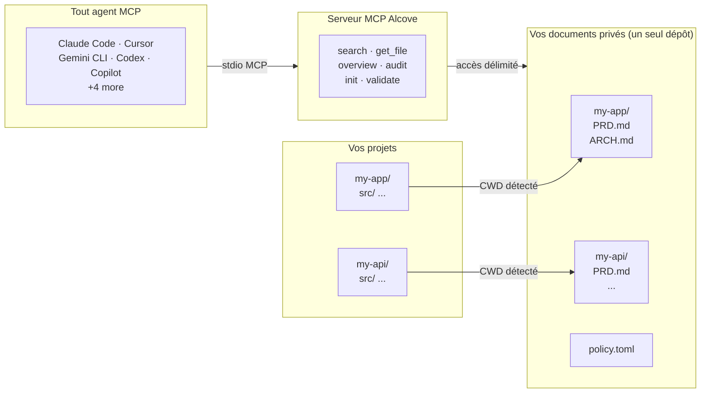

<p align="center">
  
</p>

<p align="center"><strong>Votre agent IA ne connaît pas votre projet. Alcove règle ça.</strong></p>

<p align="center">
  <a href="../README.md">English</a> ·
  <a href="README.ko.md">한국어</a> ·
  <a href="README.ja.md">日本語</a> ·
  <a href="README.zh-CN.md">简体中文</a> ·
  <a href="README.es.md">Español</a> ·
  <a href="README.hi.md">हिन्दी</a> ·
  <a href="README.pt-BR.md">Português</a> ·
  <a href="README.de.md">Deutsch</a> ·
  <a href="README.fr.md">Français</a> ·
  <a href="README.ru.md">Русский</a>
</p>

<p align="center">
  <a href="https://glama.ai/mcp/servers/epicsagas/alcove"></a>
  <a href="https://crates.io/crates/alcove"></a>
  <a href="https://crates.io/crates/alcove"></a>
  <a href="../LICENSE"></a>
  <a href="https://buymeacoffee.com/epicsaga"></a>
</p>

Alcove permet à tout agent de codage IA de lire et gérer la documentation privée de votre projet — sans la divulguer dans les dépôts publics.

Gardez les PRDs, décisions d'architecture, cartes de secrets et runbooks internes en un seul endroit. Chaque agent compatible MCP obtient les mêmes outils, sur tous les projets, sans configuration par projet.

## Le problème

Votre agent IA commence chaque session à zéro.

Il ne connaît pas votre architecture. Il ignore les contraintes des décisions que vous avez déjà prises. Il vous demande d'expliquer les mêmes choses à chaque session.

La fenêtre de contexte est le goulot d'étranglement. Chaque token coûte de l'argent et de l'attention. Charger 10 documents d'architecture dans le contexte gaspille plus de 50K tokens à chaque exécution — et la propre documentation d'Anthropic avertit que les fichiers de configuration surchargés font que les agents *ignorent vos instructions réelles*.

Vous avez donc trois mauvaises options :

**Tout fourrer dans la config de l'agent** — chaque fichier est chargé dans le contexte à chaque exécution. 10 documents = gonflement de contexte = réponses plus lentes, plus coûteuses, moins précises.

**Copier-coller dans chaque chat** — fonctionne une fois, ne passe pas à l'échelle au-delà d'une session.

**Ne pas s'en soucier** — votre agent invente des exigences que vous avez déjà documentées, ignore les contraintes des décisions que vous avez déjà prises, et vous réexpliquez la même architecture chaque lundi matin.

Multipliez par 5 projets et 3 agents. À chaque changement, vous perdez le contexte.

## Comment Alcove résout ce problème

Alcove conserve tous vos documents privés dans **un seul dépôt partagé**, organisé par projet. Tout agent compatible MCP y accède de la même manière — que vous utilisiez Claude Code, Cursor, Gemini CLI ou Codex.

```
~/projects/my-app $ claude "comment l'authentification est-elle implémentée ?"

  → Alcove détecte le projet : my-app
  → Lit ~/documents/my-app/ARCHITECTURE.md
  → L'agent répond avec le contexte réel du projet
```

```
~/projects/my-api $ codex "révise la conception de l'API"

  → Alcove détecte le projet : my-api
  → Même structure de documents, même schéma d'accès
  → Projet différent, même flux de travail
```

**Changez d'agent à tout moment. Changez de projet à tout moment. La couche documentaire reste standardisée.**

## Fonctionnalités principales

- **Un dépôt de documents, plusieurs projets** — documents privés organisés par projet, gérés en un seul endroit
- **Une seule configuration, tous les agents** — configurez une fois, chaque agent compatible MCP obtient le même accès
- **Détection automatique du projet** à partir du CWD — pas de configuration par projet nécessaire
- **Accès ciblé** — chaque projet ne voit que ses propres documents
- **Recherche intelligente** — recherche BM25 classée avec indexation automatique ; trouve les documents les plus pertinents en premier, recourt au grep si nécessaire
- **Recherche inter-projets** — recherchez dans tous les projets à la fois avec `scope: "global"` — utilisez-le comme base de connaissances personnelle
- **Les documents privés restent privés** — les documents sensibles (carte de secrets, décisions internes, dette technique) ne touchent jamais votre dépôt public
- **Structure documentaire standardisée** — `policy.toml` impose des documents cohérents à travers tous les projets et équipes
- **Audit inter-dépôts** — trouve les documents internes mal placés dans le dépôt du projet et suggère des corrections
- **Validation des documents** — vérifie les fichiers manquants, les templates non remplis, les sections requises
- **Lint sémantique** — détecte automatiquement les wikilinks cassés, les fichiers orphelins, les marqueurs WIP/DRAFT obsolètes et les références temporelles de plus de 2 ans
- **Import depuis un vault externe** — importe une note d'Obsidian (ou autre vault) dans le doc-repo en une seule commande ; routage automatique vers le bon projet
- **Compatible avec 9+ agents** — Claude Code, Cursor, Claude Desktop, Cline, OpenCode, Codex, Copilot, Antigravity, Gemini CLI

## Pourquoi Alcove

| Sans Alcove | Avec Alcove |
|-------------|-------------|
| Documents internes éparpillés entre Notion, Google Docs, fichiers locaux | Un dépôt de documents, structuré par projet |
| Chaque agent IA configuré séparément pour l'accès aux documents | Une seule configuration, tous les agents partagent le même accès |
| Changer de projet signifie perdre le contexte documentaire | Détection automatique par CWD, changement de projet instantané |
| Les recherches de l'agent renvoient des lignes aléatoires | Recherche BM25 classée — meilleures correspondances en premier, indexation automatique |
| "Chercher toutes mes notes sur l'authentification" — impossible | Recherche globale dans tous les projets en une seule requête |
| Documents sensibles risquent de fuiter dans les dépôts publics | Documents privés physiquement séparés des dépôts de projet |
| La structure documentaire varie par projet et par membre de l'équipe | `policy.toml` impose des standards à travers tous les projets |
| Aucun moyen de vérifier si les documents sont complets | `validate` détecte les fichiers manquants, les templates vides, les sections manquantes |
| Les liens cassés ou marqueurs WIP passent inaperçus | `lint` détecte automatiquement les liens cassés, orphelins et marqueurs obsolètes |
| Les notes Obsidian ou autres outils restent cloisonnées | `promote` intègre les notes externes dans le doc-repo en une commande |

## Démarrage rapide

### Claude Code (recommandé)

```
/plugin marketplace add epicsagas/plugins
/plugin install alcove@epicsagas
```

Installe automatiquement le binaire et enregistre le serveur MCP au prochain démarrage de session.

> **Obligatoire** : Exécutez `alcove setup` une fois après l'installation pour configurer votre racine de documents et activer toutes les fonctionnalités. Le plugin initialise automatiquement la connexion MCP, mais Alcove ne peut pas rechercher ou indexer les documents tant que `setup` n'a pas été exécuté.

```bash
alcove setup   # exécuter une fois après l'installation du plugin
```

Mises à jour avec `claude plugin update epicsagas/alcove`.

### macOS (Apple Silicon uniquement)

```bash
brew install epicsagas/tap/alcove
```

Pas de Homebrew ? Utilisez le script d'installation :

```bash
curl --proto '=https' --tlsv1.2 -LsSf \
  https://github.com/epicsagas/alcove/releases/latest/download/alcove-installer.sh | sh
```

> **Note** : Les binaires précompilés sont disponibles **uniquement pour macOS Apple Silicon** en raison des contraintes des binaires précompilés d'ONNX Runtime. Les utilisateurs de Linux et Windows doivent compiler depuis le code source.

### Via la chaîne d'outils Rust

```bash
cargo binstall alcove   # binaire précompilé (rapide)
cargo install alcove    # compiler depuis le code source
```

Puis exécutez setup :

```bash
alcove setup
alcove --version
alcove doctor
```

**Dépendances optionnelles**

| Outil | Objectif | Installation |
|---|---|---|
| `pdftotext` (poppler) | Extraction complète de texte PDF — requise pour la recherche PDF | macOS: `brew install poppler` · Debian/Ubuntu: `apt install poppler-utils` · Fedora: `dnf install poppler-utils` · Windows: [poppler for Windows](https://github.com/oschwartz10612/poppler-windows/releases) |

Sans `pdftotext`, Alcove se rabat sur un analyseur PDF intégré qui peut échouer sur certains fichiers. Exécutez `alcove doctor` pour vérifier votre installation.

> **Note** : Les binaires précompilés sont disponibles pour Linux (x86\_64), macOS (Apple Silicon et Intel) et Windows.

`setup` vous guide à travers tout de manière interactive :

1. Où se trouvent vos documents
2. Quelles catégories de documents suivre
3. Format de diagramme préféré
4. Modèle d'embeddings pour la recherche hybride
5. **Serveur HTTP** — hôte, port, jeton bearer auto-généré, et inscription de l'élément de connexion
6. Quels agents IA configurer (MCP + fichiers de compétences)

Relancez `alcove setup` à tout moment pour modifier les paramètres. Il se souvient de vos choix précédents.

## Utilisation

### Recherche CLI

Recherchez dans vos documents directement depuis le terminal. Par défaut, la recherche s'effectue sur **tous les projets** (portée globale).

```bash
# Recherche de base (portée globale)
alcove search "authentication"

# Limiter la recherche au projet actuel (détecté via le CWD)
alcove search "auth flow" --scope project

# Forcer le mode grep (correspondance exacte de sous-chaîne)
alcove search "TODO" --mode grep

# Forcer le mode classé (BM25/Hybride)
alcove search "data model" --mode ranked

# Ajuster la limite de résultats
alcove search "deployment" --limit 5
```

### Agents de codage (MCP)

Les agents de codage IA utilisent Alcove via les **outils MCP**. Vous n'avez généralement pas besoin de les appeler vous-même ; l'agent les invoquera lorsque vous poserez des questions sur votre projet.

| Objectif | Outil de l'agent | Description |
|----------|------------------|-------------|
| **Explorer** | `get_project_docs_overview` | Liste tous les fichiers du projet actuel pour comprendre la structure. |
| **Rechercher** | `search_project_docs` | Recherche des mots-clés ou concepts spécifiques. Supporte `scope: "global"`. |
| **Lire** | `get_doc_file` | Lit le contenu d'un fichier spécifique trouvé lors de la recherche. |
| **Auditer** | `audit_project` | Vérifie les documents manquants ou les incohérences entre le code et les docs. |

**Exemple d'interaction avec l'agent :**
> **Utilisateur :** "Comment ajouter un nouveau point de terminaison d'API ?"
> **Agent :** (appelle `search_project_docs(query="add api endpoint")`)
> **Agent :** (lit le document le plus pertinent via `get_doc_file`)
> **Agent :** "Selon `ARCHITECTURE.md`, vous devez..."

---

## Fonctionnement



Vos documents sont organisés dans un répertoire séparé (`DOCS_ROOT`), un dossier par projet. Alcove gère les documents et les sert à tout agent IA compatible MCP via stdio. Votre agent appelle des outils comme `get_doc_file("PRD.md")` et obtient des réponses spécifiques au projet — quel que soit l'agent que vous utilisez.

## Classification des documents

Alcove classe les documents dans les niveaux suivants :

| Classification | Emplacement | Exemples |
|---------------|-------------|----------|
| **doc-repo-required** | Alcove (privé) | PRD, Architecture, Decisions, Conventions |
| **doc-repo-supplementary** | Alcove (privé) | Deployment, Onboarding, Testing, Runbook |
| **reference** | Alcove dossier `reports/` | Rapports d'audit, benchmarks, analyses |
| **project-repo** | Dépôt GitHub (public) | README, CHANGELOG, CONTRIBUTING |

L'outil `audit` scanne le dépôt de documents et le répertoire local du projet, puis suggère des actions — comme générer un README public à partir de votre PRD privé, ou ramener des rapports mal placés dans alcove.

## Outils MCP

| Outil | Fonction |
|-------|----------|
| `get_project_docs_overview` | Lister tous les documents avec classification et tailles |
| `search_project_docs` | Recherche intelligente — sélectionne automatiquement BM25 classé ou grep, supporte `scope: "global"` pour la recherche inter-projets |
| `get_doc_file` | Lire un document spécifique par chemin (supporte `offset`/`limit` pour les gros fichiers) |
| `list_projects` | Afficher tous les projets dans le dépôt de documents |
| `audit_project` | Audit inter-dépôts — scanne le dépôt de documents et le projet local, suggère des actions |
| `init_project` | Créer la structure de documents pour un nouveau projet (documents internes+externes, création sélective) |
| `validate_docs` | Valider les documents contre la politique d'équipe (`policy.toml`) |
| `rebuild_index` | Reconstruire l'index de recherche plein texte (normalement automatique) |
| `check_doc_changes` | Détecter les documents ajoutés, modifiés ou supprimés depuis le dernier index |
| `lint_project` | Lint sémantique — liens cassés, orphelins, marqueurs obsolètes et références temporelles |
| `promote_document` | Copier ou déplacer un fichier depuis un vault externe vers le alcove doc-repo |

## CLI

```
alcove              Démarrer le serveur MCP (les agents l'appellent)
alcove setup        Configuration interactive — relancez à tout moment pour reconfigurer
alcove doctor       Vérifier l'état de l'installation d'Alcove
alcove validate     Valider les documents contre la politique (--format json, --exit-code)
alcove lint         Lint sémantique — liens cassés, orphelins, marqueurs obsolètes (--format json)
alcove promote      Importer des notes d'un vault externe dans le doc-repo
alcove index        Mettre à jour l'index de recherche (incrémentiel — fichiers modifiés seulement)
alcove rebuild      Reconstruire l'index de recherche de zéro (après des changements de schéma)
alcove search       Rechercher des documents depuis le terminal
alcove token        Afficher le jeton d'accès pour le partage en équipe
alcove uninstall    Supprimer compétences, configuration et fichiers hérités

alcove mcp <CMD>      Gérer le cycle de vie du serveur MCP en arrière-plan (start, stop, status, enable, disable)
alcove api <CMD>      Gérer le cycle de vie du serveur REST API en arrière-plan (start, stop, status, enable, disable)

alcove vault link     Lier un répertoire externe en tant que vault (ex. : Obsidian)
alcove vault list     Lister tous les vaults avec le nombre de documents
alcove vault index    Construire l'index de recherche pour les vaults
```

### Lint

```bash
# Lint du projet courant (détecté automatiquement depuis le CWD)
alcove lint

# Spécifier un projet
alcove lint --project my-app

# Sortie lisible par machine pour la CI
alcove lint --format json
```

Le lint vérifie quatre choses :

| Vérification | Ce qui est détecté |
|-------------|-------------------|
| `broken-link` | `[[wikilinks]]` ou `[texte](chemin)` pointant vers des fichiers manquants |
| `orphan` | Fichiers vers lesquels aucun autre document ne pointe |
| `stale-marker` | Marqueurs WIP / TODO / FIXME / DRAFT / DEPRECATED |
| `stale-date` | Références temporelles de plus de 2 ans (ex. : "as of 2022") |

### Promote

```bash
# Copier une note Obsidian dans le doc-repo (routage automatique vers le projet)
alcove promote ~/my-brain/Projects/auth-notes.md

# Spécifier un projet
alcove promote ~/my-brain/Projects/auth-notes.md --project my-app

# Déplacer plutôt que copier
alcove promote ~/my-brain/Projects/auth-notes.md --mv
```

Les fichiers sans projet correspondant sont sauvegardés dans `inbox/` pour examen manuel.

## Serveur en arrière-plan

L'exécution d'un serveur persistant en arrière-plan élimine la latence du démarrage à froid (chargement du modèle ONNX de 2 à 5 secondes) à chaque nouvelle session de l'agent. **`alcove setup` active cela par défaut** (élément de connexion macOS).

```bash
# Activer et démarrer (persiste après redémarrage — macOS)
alcove mcp enable --now

# Cycle de vie
alcove mcp stop / start / restart / status

# Désactiver et supprimer l'élément de connexion
alcove mcp disable
```

Vous pouvez également exécuter un serveur API REST séparé :

```bash
# Démarrer le serveur API en arrière-plan
alcove api start
```

Le serveur utilise un jeton bearer pour l'authentification — généré automatiquement lors de `alcove setup` et stocké dans `config.toml`. Votre configuration MCP existante (`command: alcove`) reste inchangée ; le processus stdio détecte automatiquement le serveur en cours d'exécution et sert de proxy vers celui-ci.

```bash
# Vérifier ou partager le jeton
alcove token

# Définir dans le profil du shell (le setup le fait automatiquement)
export ALCOVE_TOKEN="alcove-..."
```

Priorité du jeton : indicateur `--token` > variable d'environnement `ALCOVE_TOKEN` > `config.toml`.

Les logs sont écrits dans `~/.alcove/logs/`. Au démarrage, lancez `alcove doctor` pour vérifier que le serveur est accessible.

## Recherche

Alcove sélectionne automatiquement la meilleure stratégie de recherche. Quand l'index de recherche existe, il utilise la **recherche BM25 classée** (basée sur [tantivy](https://github.com/quickwit-oss/tantivy)) pour des résultats triés par pertinence. Sans index, il recourt au grep. Vous n'avez jamais à y penser.

```bash
# Rechercher dans le projet actuel (auto-détecté depuis le CWD)
alcove search "authentication flow"

# Rechercher dans TOUS les projets — votre base de connaissances personnelle
alcove search "OAuth token refresh" --scope global

# Forcer le mode grep pour une correspondance exacte de sous-chaîne
alcove search "FR-023" --mode grep
```

L'index se construit automatiquement en arrière-plan au démarrage du serveur MCP, et se reconstruit lorsqu'il détecte des modifications de fichiers. Pas de cron jobs, pas d'étapes manuelles.

**Comment ça marche pour les agents :** les agents appellent simplement `search_project_docs` avec une requête. Alcove gère le reste — classement, déduplication (un résultat par fichier), recherche inter-projets et fallback. L'agent n'a jamais besoin de choisir un mode de recherche.

## Détection de projet

Par défaut, Alcove détecte le projet actuel à partir du répertoire de travail de votre terminal (CWD). Vous pouvez le remplacer avec la variable d'environnement `MCP_PROJECT_NAME` :

```bash
MCP_PROJECT_NAME=my-api alcove
```

Utile quand votre CWD ne correspond pas à un nom de projet dans votre dépôt de documents.

## Politique documentaire

Définissez des standards de documentation à l'échelle de l'équipe avec `policy.toml` dans votre dépôt de documents :

```toml
[policy]
enforce = "strict"    # strict | warn

[[policy.required]]
name = "PRD.md"
aliases = ["prd.md", "product-requirements.md"]

[[policy.required]]
name = "ARCHITECTURE.md"

  [[policy.required.sections]]
  heading = "## Overview"
  required = true

  [[policy.required.sections]]
  heading = "## Components"
  required = true
  min_items = 2
```

Les fichiers de politique sont résolus avec priorité : **projet** (`<project>/.alcove/policy.toml`) > **équipe** (`DOCS_ROOT/.alcove/policy.toml`) > **défaut intégré** (liste de fichiers core de config.toml). Cela garantit une qualité documentaire cohérente à travers tous vos projets tout en permettant des remplacements par projet.

## Configuration

La configuration se trouve dans `~/.config/alcove/config.toml` :

```toml
docs_root = "/Users/you/documents"

[core]
files = ["PRD.md", "ARCHITECTURE.md", "PROGRESS.md", "DECISIONS.md", "CONVENTIONS.md", "SECRETS_MAP.md", "DEBT.md"]

[team]
files = ["ENV_SETUP.md", "ONBOARDING.md", "DEPLOYMENT.md", "TESTING.md", ...]

[public]
files = ["README.md", "CHANGELOG.md", "CONTRIBUTING.md", "SECURITY.md", ...]

[diagram]
format = "mermaid"
```

Tout est configuré interactivement via `alcove setup`. Vous pouvez aussi éditer le fichier directement.

## Agents supportés

| Agent | MCP | Compétence |
|-------|-----|-----------|
| Claude Code | `~/.claude.json` | `~/.claude/skills/alcove/` |
| Cursor | `~/.cursor/mcp.json` | `~/.cursor/skills/alcove/` |
| Claude Desktop | configuration plateforme | — |
| Cline (VS Code) | VS Code globalStorage | `~/.cline/skills/alcove/` |
| OpenCode | `~/.config/opencode/opencode.json` | `~/.opencode/skills/alcove/` |
| Codex CLI | `~/.codex/config.toml` | `~/.codex/skills/alcove/` |
| Copilot CLI | `~/.copilot/mcp-config.json` | `~/.copilot/skills/alcove/` |
| Antigravity | `~/.gemini/antigravity/mcp_config.json` | — |
| Gemini CLI | `~/.gemini/settings.json` | `~/.gemini/skills/alcove/` |

## Langues supportées

Le CLI détecte automatiquement la langue de votre système. Vous pouvez aussi la remplacer avec la variable d'environnement `ALCOVE_LANG`.

| Langue | Code |
|--------|------|
| English | `en` |
| 한국어 | `ko` |
| 简体中文 | `zh-CN` |
| 日本語 | `ja` |
| Español | `es` |
| हिन्दी | `hi` |
| Português (Brasil) | `pt-BR` |
| Deutsch | `de` |
| Français | `fr` |
| Русский | `ru` |

```bash
# Remplacer la langue
ALCOVE_LANG=fr alcove setup
```

## Mise à jour

| Méthode | Commande |
|---------|---------|
| Homebrew | `brew upgrade alcove` |
| curl installer | Réexécuter le script d'installation ci-dessus |
| cargo binstall | `cargo binstall alcove@latest` |
| cargo install | `cargo install alcove@latest` |
| Claude Code Plugin | `claude plugin update epicsagas/alcove` |

```bash
alcove --version
```

## Désinstallation

```bash
alcove uninstall          # supprimer compétences et configuration
cargo uninstall alcove    # supprimer le binaire
```

## Vaults de connaissances

Au-delà de la documentation de projet, Alcove prend en charge des **vaults de connaissances indépendants** pour les notes de recherche, les documents de référence et les connaissances curatées que les LLM peuvent rechercher.

```bash
# Créer un vault pour les notes de recherche en IA
alcove vault create ai-research

# Lier un vault Obsidian existant (pas de copie — indexation sur place)
alcove vault link my-obsidian ~/Obsidian/research

# Ajouter un document
alcove vault add ai-research ~/Downloads/transformer-survey.md

# Construire l'index de recherche pour les vaults
alcove vault index

# Lister tous les vaults
alcove vault list
#   areas (8 docs) → (linked)
#   resources (71 docs) → (linked)
#   zettelkasten (17 docs) → (linked)

# Rechercher via le CLI
alcove search "attention mechanism" --vault ai-research

# Les agents recherchent via MCP
search_vault(query="attention mechanism", vault="ai-research")

# Rechercher dans TOUS les vaults à la fois
search_vault(query="transformer", vault="*")
```

Les vaults sont **complètement isolés** des documents de projet — index séparés, caches séparés, recherche séparée. La recherche de documents de projet de votre agent de codage n'est jamais affectée par l'activité des vaults.

| Fonctionnalité | Documents de projet | Vaults |
|---------|-------------|--------|
| Objectif | Documentation par projet | Base de connaissances générale |
| Stockage | `~/.alcove/docs/` | `~/.alcove/vaults/` |
| Index | Index de projet partagé | Index indépendant par vault |
| Cache | `PROJECT_READER_CACHE` | `VAULT_READER_CACHE` |
| Recherche | `search_project_docs` | `search_vault` |
| Lien symbolique | Non | Oui (lier des répertoires externes) |

### Configuration des Vaults

Par défaut, les vaults sont stockés dans `~/.alcove/vaults/`. Vous pouvez modifier cela dans votre `config.toml` :

```toml
[vaults]
root = "/chemin/vers/vos/vaults"
```

Consultez la section [Configuration](#configuration) pour plus de détails sur le `config.toml`.

## Écosystème

### [obsidian-forge](https://github.com/epicsagas/obsidian-forge)

Alcove s'associe naturellement avec **obsidian-forge**, un générateur de coffres Obsidian et un démon d'automatisation. Pour une intégration optimale, votre **`docs_root`** Alcove doit pointer vers les archives de projet obsidian-forge.

**1. Définir la racine des documents**
Pointez vos documents principaux vers le répertoire de projet obsidian-forge (directement ou via un lien symbolique) :
```bash
# Lors de la configuration d'alcove, définissez docs_root sur :
~/Obsidian/SecondBrain/99-Archives/projects
```

**2. Lier les domaines de connaissances en tant que vaults**
Liez les trois autres catégories obsidian-forge en tant que vaults Alcove indépendants. Cela crée des liens symboliques dans `~/.alcove/vaults/` :
```bash
# Lier les catégories obsidian-forge
alcove vault link areas ~/Obsidian/SecondBrain/02-Areas
alcove vault link resources ~/Obsidian/SecondBrain/03-Resources
alcove vault link zettelkasten ~/Obsidian/SecondBrain/10-Zettelkasten
```

Désormais, vos agents disposent d'un accès structuré :
- **`search_project_docs`** : Recherche dans les connaissances de projet archivées (PRD, etc.)
- **`search_vault`** : Recherche dans vos domaines de connaissances plus larges et vos notes de recherche.

Vous pouvez vérifier le mappage du stockage physique en consultant les liens symboliques dans `~/.alcove/vaults/`.

## Contribuer

Les rapports de bugs, demandes de fonctionnalités et pull requests sont les bienvenus. Ouvrez un issue sur [GitHub](https://github.com/epicsagas/alcove/issues) pour démarrer une discussion.

## Licence

Apache-2.0
