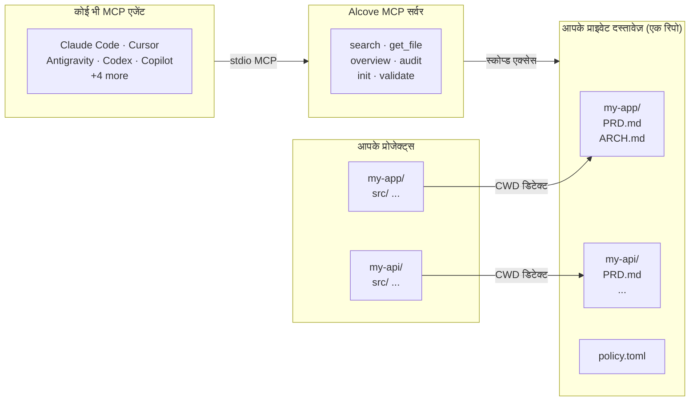

<p align="center">
  
</p>

<p align="center"><strong>आपका AI एजेंट आपका प्रोजेक्ट नहीं जानता। Alcove इसे ठीक करता है।</strong></p>

<p align="center">
  <a href="../README.md">English</a> ·
  <a href="README.ko.md">한국어</a> ·
  <a href="README.ja.md">日本語</a> ·
  <a href="README.zh-CN.md">简体中文</a> ·
  <a href="README.es.md">Español</a> ·
  <a href="README.hi.md">हिन्दी</a> ·
  <a href="README.pt-BR.md">Português</a> ·
  <a href="README.de.md">Deutsch</a> ·
  <a href="README.fr.md">Français</a> ·
  <a href="README.ru.md">Русский</a>
</p>

<p align="center">
  <a href="https://glama.ai/mcp/servers/epicsagas/alcove"></a>
  <a href="https://crates.io/crates/alcove"></a>
  <a href="https://crates.io/crates/alcove"></a>
  <a href="../LICENSE"></a>
  <a href="https://buymeacoffee.com/epicsaga"></a>
</p>

Alcove किसी भी AI कोडिंग एजेंट को आपके प्राइवेट प्रोजेक्ट दस्तावेज़ पढ़ने और प्रबंधित करने देता है — बिना उन्हें पब्लिक रिपॉज़िटरी में लीक किए।

PRDs, आर्किटेक्चर निर्णय, सीक्रेट्स मैप, और इंटरनल रनबुक एक जगह रखें। हर MCP-संगत एजेंट को समान टूल्स मिलता है, हर प्रोजेक्ट में, बिना किसी प्रति-प्रोजेक्ट कॉन्फ़िग के।

## समस्या

आपका AI एजेंट हर सेशन शून्य से शुरू करता है।

यह आपके आर्किटेक्चर को नहीं जानता। आपके पहले से लिए गए निर्णयों की बाधाओं को अनदेखा करता है। हर सेशन में एक ही चीज़ें समझाने को कहता है।

कंटेक्स्ट विंडो बाधा है। हर टोकन पैसा और ध्यान खर्च करता है। 10 आर्किटेक्चर दस्तावेज़ कंटेक्स्ट में लोड करने से हर रन पर 50K+ टोकन बर्बाद होते हैं — और Anthropic की अपनी डॉक्स भी चेतावनी देती हैं कि फूले हुए कॉन्फ़िग फ़ाइलें एजेंट्स को *आपके वास्तविक निर्देशों को अनदेखा करने* पर मजबूर करती हैं।

तो आपके पास तीन बुरे विकल्प हैं:

**सब कुछ एजेंट कॉन्फ़िग में भरें** — हर फ़ाइल हर रन पर कंटेक्स्ट में लोड होती है। 10 दस्तावेज़ = कंटेक्स्ट ब्लोट = धीमे, महंगे, कम सटीक उत्तर।

**हर चैट में कॉपी-पेस्ट करें** — एक बार काम करता है, एक सेशन से आगे स्केल नहीं होता।

**परेशान न हों** — आपका एजेंट वे आवश्यकताएं गढ़ता है जो आपने पहले ही दस्तावेज़ीकृत की हैं, आपके निर्णयों की बाधाओं को अनदेखा करता है, और हर सोमवार सुबह आप वही आर्किटेक्चर फिर से समझाते हैं।

5 प्रोजेक्ट और 3 एजेंट से गुणा करें। हर बार स्विच करने पर कंटेक्स्ट खो जाता है।

## Alcove इसे कैसे हल करता है

Alcove आपके सभी प्राइवेट दस्तावेज़ों को **एक साझा रिपॉज़िटरी** में रखता है, प्रोजेक्ट के अनुसार व्यवस्थित। कोई भी MCP-संगत एजेंट उन्हें एक ही तरीके से एक्सेस करता है — चाहे आप Claude Code में हों, Cursor में, Antigravity में, या Codex में।

```
~/projects/my-app $ claude "ऑथेंटिकेशन कैसे इम्प्लीमेंट किया गया है?"

  → Alcove प्रोजेक्ट डिटेक्ट करता है: my-app
  → ~/documents/my-app/ARCHITECTURE.md पढ़ता है
  → एजेंट वास्तविक प्रोजेक्ट संदर्भ के साथ जवाब देता है
```

```
~/projects/my-api $ codex "API डिज़ाइन की समीक्षा करें"

  → Alcove प्रोजेक्ट डिटेक्ट करता है: my-api
  → वही दस्तावेज़ संरचना, वही एक्सेस पैटर्न
  → अलग प्रोजेक्ट, वही वर्कफ़्लो
```

**कभी भी एजेंट बदलें। कभी भी प्रोजेक्ट बदलें। दस्तावेज़ परत मानकीकृत रहती है।**

## यह क्या करता है

- **एक डॉक-रिपो, कई प्रोजेक्ट** — प्राइवेट दस्तावेज़ प्रोजेक्ट के अनुसार व्यवस्थित, एक ही जगह से प्रबंधित
- **एक सेटअप, कोई भी एजेंट** — एक बार कॉन्फ़िगर करें, हर MCP-संगत एजेंट को समान टूल्स मिलता है
- **CWD से प्रोजेक्ट ऑटो-डिटेक्ट** — प्रति-प्रोजेक्ट कॉन्फ़िग अनावश्यक
- **स्कोप्ड एक्सेस** — हर प्रोजेक्ट केवल अपने दस्तावेज़ देखता है
- **स्मार्ट सर्च** — BM25 रैंकिंग सर्च और ऑटो-इंडेक्सिंग; सबसे प्रासंगिक दस्तावेज़ पहले दिखाता है, ज़रूरत पड़ने पर grep पर फ़ॉलबैक
- **क्रॉस-प्रोजेक्ट सर्च** — `scope: "global"` से सभी प्रोजेक्ट्स में एक साथ खोजें — व्यक्तिगत ज्ञान आधार के रूप में उपयोग करें
- **प्राइवेट दस्तावेज़ प्राइवेट रहते हैं** — संवेदनशील दस्तावेज़ (सीक्रेट्स मैप, इंटरनल निर्णय, टेक डेट) आपके पब्लिक रिपो को कभी नहीं छूते
- **मानकीकृत दस्तावेज़ संरचना** — `policy.toml` सभी प्रोजेक्ट्स और टीमों में एकसमान दस्तावेज़ लागू करता है
- **क्रॉस-रिपो ऑडिट** — प्रोजेक्ट रिपो में गलत जगह रखे इंटरनल दस्तावेज़ खोजता है, सुधार सुझाता है
- **दस्तावेज़ सत्यापन** — गुम फ़ाइलों, अधूरे टेम्पलेट्स, आवश्यक सेक्शनों की जांच करता है
- **सिमेंटिक लिंट** — टूटे हुए विकिलिंक, अनाथ फ़ाइलें, पुराने WIP/DRAFT मार्कर और 2+ साल पुराने दिनांक उल्लेख स्वचालित रूप से खोजता है
- **बाहरी वॉल्ट से लाना** — Obsidian या किसी भी vault के नोट को एक कमांड से doc-repo में लाएँ; प्रोजेक्ट रूटिंग स्वचालित
- **9+ एजेंट्स के साथ काम करता है** — Claude Code, Cursor, Claude Desktop, Cline, OpenCode, Codex, Copilot, Antigravity

## Alcove क्यों

| Alcove के बिना | Alcove के साथ |
|----------------|---------------|
| इंटरनल दस्तावेज़ Notion, Google Docs, लोकल फ़ाइलों में बिखरे हुए | एक डॉक-रिपो, प्रोजेक्ट के अनुसार संरचित |
| हर AI एजेंट अलग से दस्तावेज़ एक्सेस के लिए कॉन्फ़िगर | एक सेटअप, सभी एजेंट्स समान टूल्स साझा करते हैं |
| प्रोजेक्ट बदलने पर दस्तावेज़ संदर्भ खो जाता है | CWD ऑटो-डिटेक्शन, तुरंत प्रोजेक्ट स्विच |
| एजेंट सर्च रैंडम मैचिंग लाइनें लौटाता है | BM25 रैंकिंग सर्च — सर्वश्रेष्ठ मैच पहले, ऑटो-इंडेक्सिंग |
| "ऑथेंटिकेशन पर मेरे सभी नोट्स खोजें" — असंभव | ग्लोबल सर्च से सभी प्रोजेक्ट्स एक क्वेरी में |
| संवेदनशील दस्तावेज़ पब्लिक रिपो में लीक होने का खतरा | प्राइवेट दस्तावेज़ प्रोजेक्ट रिपो से भौतिक रूप से अलग |
| दस्तावेज़ संरचना हर प्रोजेक्ट और टीम सदस्य में भिन्न | `policy.toml` सभी प्रोजेक्ट्स में मानक लागू करता है |
| दस्तावेज़ पूरे हैं या नहीं, जांचने का कोई तरीका नहीं | `validate` गुम फ़ाइलें, खाली टेम्पलेट्स, गायब सेक्शन पकड़ता है |
| पुराने लिंक या WIP मार्कर छूट जाते हैं | `lint` टूटे लिंक, अनाथ फ़ाइलें और पुराने मार्कर स्वचालित रूप से पहचानता है |
| Obsidian जैसे बाहरी टूल के नोट अलग-थलग रहते हैं | `promote` से बाहरी नोट एक कमांड में doc-repo में आ जाते हैं |

## क्विक स्टार्ट

### Claude Code (अनुशंसित)

```
/plugin marketplace add epicsagas/plugins
/plugin install alcove@epicsagas
```

स्वचालित रूप से बाइनरी इंस्टॉल करता है और अगले सेशन शुरू होने पर MCP सर्वर रजिस्टर करता है।

> **आवश्यक**: इंस्टॉलेशन के बाद एक बार `alcove setup` चलाएं ताकि आपके डॉक्स रूट कॉन्फ़िगर हो और पूरी कार्यक्षमता सक्षम हो। प्लगइन MCP कनेक्शन स्वचालित रूप से सीड करता है, लेकिन `setup` चलाए बिना Alcove दस्तावेज़ खोज या इंडेक्स नहीं कर सकता।

```bash
alcove setup   # प्लगइन इंस्टॉल के बाद एक बार चलाएं
```

`claude plugin update epicsagas/alcove` से अपडेट करें।

### Codex CLI

```bash
codex plugin marketplace add epicsagas/plugins
```

स्किल्स तुरंत उपलब्ध हैं — कोई अतिरिक्त कदम आवश्यक नहीं।

### Antigravity

```bash
antigravity plugin marketplace add epicsagas/plugins
```

स्किल्स तुरंत उपलब्ध हैं — कोई अतिरिक्त कदम आवश्यक नहीं।

> **नोट**: Antigravity अभी सब-एजेंट को सपोर्ट नहीं करता। Alcove MCP सर्वर `~/.gemini/config/mcp_config.json` पर पंजीकृत है।

### macOS (केवल Apple Silicon)

```bash
brew install epicsagas/tap/alcove
```

Homebrew नहीं है? इंस्टॉलर स्क्रिप्ट का उपयोग करें:

```bash
curl --proto '=https' --tlsv1.2 -LsSf \
  https://github.com/epicsagas/alcove/releases/latest/download/alcove-installer.sh | sh
```

> **नोट**: प्रीबिल्ट बाइनरी केवल macOS Apple Silicon के लिए उपलब्ध हैं। Linux और Windows उपयोगकर्ता ऊपर दिए गए वन-लाइन इंस्टॉलर का उपयोग कर सकते हैं।

### Linux (x86_64 / ARM64)

```bash
curl --proto '=https' --tlsv1.2 -LsSf \
  https://github.com/epicsagas/alcove/releases/latest/download/install.sh | sh
```

### Windows (x86_64 / ARM64)

```powershell
irm https://github.com/epicsagas/alcove/releases/latest/download/install.ps1 | iex
```

### Rust टूलचेन

```bash
cargo binstall alcove   # प्रीबिल्ट बाइनरी (तेज़)
cargo install alcove    # सोर्स से बिल्ड
```

फिर setup चलाएं:

```bash
alcove setup
alcove --version
alcove doctor
```

**वैकल्पिक निर्भरताएं**

| टूल | उद्देश्य | इंस्टॉल |
|---|---|---|
| `pdftotext` (poppler) | पूर्ण PDF टेक्स्ट निष्कर्षण — PDF खोज के लिए आवश्यक | macOS: `brew install poppler` · Debian/Ubuntu: `apt install poppler-utils` · Fedora: `dnf install poppler-utils` · Windows: [poppler for Windows](https://github.com/oschwartz10612/poppler-windows/releases) |

`pdftotext` के बिना, Alcove बिल्ट-इन PDF पार्सर पर फ़ॉलबैक करता है जो कुछ फ़ाइलों पर विफल हो सकता है। अपनी इंस्टॉलेशन जांचने के लिए `alcove doctor` चलाएं।

> **नोट**: प्रीबिल्ट बाइनरी Linux (x86\_64), macOS (Apple Silicon और Intel), और Windows के लिए उपलब्ध हैं।

`setup` इंटरैक्टिव तरीके से सब कुछ गाइड करता है:

1. आपके दस्तावेज़ कहां हैं
2. कौन सी दस्तावेज़ कैटेगरी ट्रैक करनी है
3. पसंदीदा डायग्राम फ़ॉर्मेट
4. हाइब्रिड सर्च के लिए एम्बेडिंग मॉडल
5. **बैकग्राउंड सर्वर** — हर सेशन के कोल्ड-स्टार्ट को समाप्त करें (macOS लॉगिन आइटम)
6. कौन से AI एजेंट्स कॉन्फ़िगर करने हैं (MCP + स्किल फ़ाइलें)

सेटिंग्स बदलने के लिए कभी भी `alcove setup` फिर से चलाएं। यह आपकी पिछली पसंद याद रखता है।

## उपयोग

### CLI खोज

अपने दस्तावेज़ों को सीधे टर्मिनल से खोजें। डिफ़ॉल्ट रूप से, यह **सभी प्रोजेक्ट्स** (ग्लोबल स्कोप) में खोजता है।

```bash
# बुनियादी खोज (ग्लोबल स्कोप)
alcove search "authentication"

# खोज को वर्तमान प्रोजेक्ट तक सीमित करें (CWD के माध्यम से ऑटो-डिटेक्ट)
alcove search "auth flow" --scope project

# grep मोड फ़ोर्स करें (सटीक सबस्ट्रिंग मैच)
alcove search "TODO" --mode grep

# रैंक्ड मोड फ़ोर्स करें (BM25/हाइब्रिड)
alcove search "data model" --mode ranked

# परिणाम सीमा समायोजित करें
alcove search "deployment" --limit 5
```

### कोडिंग एजेंट्स (MCP)

AI कोडिंग एजेंट्स **MCP टूल्स** के माध्यम से Alcove का उपयोग करते हैं। आपको आमतौर पर इन्हें खुद कॉल करने की आवश्यकता नहीं होती है; जब आप अपने प्रोजेक्ट के बारे में प्रश्न पूछते हैं, तो एजेंट उन्हें कॉल करेगा।

| लक्ष्य | एजेंट टूल | विवरण |
|------|------------|-------------|
| **एक्सप्लोर** | `get_project_docs_overview` | संरचना को समझने के लिए वर्तमान प्रोजेक्ट की सभी फ़ाइलों को सूचीबद्ध करें। |
| **सर्च** | `search_project_docs` | विशिष्ट कीवर्ड या अवधारणाओं को खोजें। `scope: "global"` को सपोर्ट करता है। |
| **पढ़ें** | `get_doc_file` | खोज के दौरान मिली किसी विशिष्ट फ़ाइल की सामग्री पढ़ें। |
| **ऑडिट** | `audit_project` | गुम दस्तावेज़ों या कोड और दस्तावेज़ों के बीच विसंगतियों की जाँच करें। |

**एजेंट इंटरैक्शन उदाहरण:**
> **यूज़र:** "मैं एक नया API एंडपॉइंट कैसे जोड़ूँ?"
> **एजेंट:** (`search_project_docs(query="add api endpoint")` कॉल करता है)
> **एजेंट:** (`get_doc_file` के माध्यम से सबसे प्रासंगिक डॉक पढ़ता है)
> **एजेंट:** "`ARCHITECTURE.md` के अनुसार, आपको..."

---

## कैसे काम करता है



आपके दस्तावेज़ एक अलग डायरेक्टरी (`DOCS_ROOT`) में व्यवस्थित होते हैं, प्रति प्रोजेक्ट एक फ़ोल्डर। Alcove वहां से प्रबंधित करता है और stdio के माध्यम से किसी भी MCP-संगत AI एजेंट को सर्व करता है। आपका एजेंट `get_doc_file("PRD.md")` जैसे टूल्स कॉल करता है और प्रोजेक्ट-विशिष्ट उत्तर प्राप्त करता है — चाहे आप किसी भी एजेंट का उपयोग कर रहे हों।

## दस्तावेज़ वर्गीकरण

Alcove दस्तावेज़ों को निम्न प्रकार से वर्गीकृत करता है:

| वर्गीकरण | स्थान | उदाहरण |
|-----------|--------|--------|
| **doc-repo-required** | Alcove (प्राइवेट) | PRD, Architecture, Decisions, Conventions |
| **doc-repo-supplementary** | Alcove (प्राइवेट) | Deployment, Onboarding, Testing, Runbook |
| **reference** | Alcove `reports/` फ़ोल्डर | ऑडिट रिपोर्ट, बेंचमार्क, विश्लेषण |
| **project-repo** | आपका GitHub रिपो (पब्लिक) | README, CHANGELOG, CONTRIBUTING |

`audit` टूल डॉक-रिपो और लोकल प्रोजेक्ट डायरेक्टरी दोनों को स्कैन करता है और कार्रवाई सुझाता है — जैसे प्राइवेट PRD से पब्लिक README जनरेट करना, या गलत जगह रखी रिपोर्ट्स को alcove में वापस लाना।

## MCP टूल्स

| टूल | कार्य |
|------|-------|
| `get_project_docs_overview` | वर्गीकरण और साइज़ के साथ सभी दस्तावेज़ सूचीबद्ध करें |
| `search_project_docs` | स्मार्ट सर्च — BM25 रैंक्ड या grep ऑटो-सेलेक्ट, `scope: "global"` से क्रॉस-प्रोजेक्ट सर्च सपोर्ट |
| `get_doc_file` | पाथ से विशिष्ट दस्तावेज़ पढ़ें (बड़ी फ़ाइलों के लिए `offset`/`limit` सपोर्ट) |
| `list_projects` | डॉक्स रिपो में सभी प्रोजेक्ट दिखाएं |
| `audit_project` | क्रॉस-रिपो ऑडिट — डॉक-रिपो और लोकल प्रोजेक्ट रिपो स्कैन करके कार्रवाई सुझाएं |
| `init_project` | नए प्रोजेक्ट के दस्तावेज़ स्कैफ़ोल्ड करें (इंटरनल+एक्सटर्नल दस्तावेज़, चयनात्मक फ़ाइल निर्माण) |
| `validate_docs` | टीम पॉलिसी (`policy.toml`) के विरुद्ध दस्तावेज़ सत्यापित करें |
| `rebuild_index` | फ़ुल-टेक्स्ट सर्च इंडेक्स रीबिल्ड करें (आमतौर पर ऑटोमैटिक) |
| `check_doc_changes` | अंतिम इंडेक्स बिल्ड के बाद जोड़े, बदले या हटाए गए दस्तावेज़ पहचानें |
| `lint_project` | सिमेंटिक लिंट — टूटे लिंक, अनाथ फ़ाइलें, पुराने मार्कर और दिनांक उल्लेख |
| `promote_document` | किसी बाहरी vault की फ़ाइल को alcove doc-repo में कॉपी या मूव करें |
| `index_code_structure` | tree-sitter से सोर्स कोड पार्स करके प्रति-प्रोजेक्ट `CODE_INDEX.md` जनरेट करें |

## CLI

```
alcove              MCP सर्वर शुरू करें (एजेंट्स इसे कॉल करते हैं)
alcove setup        इंटरैक्टिव सेटअप — कभी भी री-कॉन्फ़िगर करने के लिए फिर चलाएं
alcove doctor       Alcove इंस्टॉलेशन की स्थिति जांचें
alcove validate     पॉलिसी के विरुद्ध दस्तावेज़ सत्यापित करें (--format json, --exit-code)
alcove lint         सिमेंटिक लिंट — टूटे लिंक, अनाथ फ़ाइलें, पुराने मार्कर (--format json)
alcove promote      बाहरी vault के नोट को doc-repo में लाएँ
alcove index        सर्च इंडेक्स अपडेट करें (इंक्रीमेंटल — केवल बदली हुई फ़ाइलें)
alcove rebuild      सर्च इंडेक्स शुरू से रीबिल्ड करें (स्कीमा बदलने के बाद उपयोग करें)
alcove search       टर्मिनल से दस्तावेज़ खोजें
alcove index-code   सोर्स कोड से कोड संरचना इंडेक्स जनरेट करें [--language LANG] [--source PATH]
alcove token        बैकग्राउंड सर्वर प्रमाणीकरण के लिए बेयरर टोकन प्रिंट करें
alcove uninstall    स्किल्स, कॉन्फ़िग और लेगेसी फ़ाइलें हटाएं

alcove mcp <CMD>      बैकग्राउंड MCP सर्वर लाइफसाइकिल प्रबंधित करें (start, stop, status, enable, disable)

alcove vault create   एक नया नॉलेज बेस वॉल्ट बनाएं
alcove vault link     एक बाहरी डायरेक्टरी को वॉल्ट के रूप में लिंक करें (जैसे, Obsidian)
alcove vault list     दस्तावेज़ गणना के साथ सभी वॉल्ट सूचीबद्ध करें
alcove vault remove   एक वॉल्ट निकालें (सिमलिंक: केवल लिंक निकालें)
alcove vault add      एक वॉल्ट में दस्तावेज़ जोड़ें
alcove vault index    वॉल्ट के लिए सर्च इंडेक्स बनाएं
alcove vault rebuild  शुरू से वॉल्ट सर्च इंडेक्स रीबिल्ड करें
```

### कोड इंडेक्सिंग

tree-sitter से सोर्स फ़ाइलें पार्स करके `CODE_INDEX.md` जनरेट करता है—कोडबेस का मॉड्यूल-स्तरीय Markdown सारांश, जो Tantivy सर्च पाइपलाइन के साथ एकीकृत है।

```bash
# वर्तमान प्रोजेक्ट इंडेक्स करें (सभी भाषाएं स्वचालित रूप से डिटेक्ट होती हैं)
alcove index-code --source ./src

# मोनोरेपो: एक साथ कई भाषाओं वाली डायरेक्टरी इंडेक्स करें
alcove index-code --source ./

# एकल भाषा तक सीमित करें
alcove index-code --source ./src --language typescript
alcove index-code --source ./src --language rust
```

**समर्थित भाषाएं:**

| भाषा | फ़ीचर फ़्लैग | फ़ाइल एक्सटेंशन |
|------|------------|----------------|
| Rust | `lang-rust` | `.rs` |
| Python | `lang-python` | `.py`, `.pyi` |
| TypeScript | `lang-typescript` | `.ts`, `.tsx` |
| JavaScript | `lang-javascript` | `.js`, `.jsx`, `.mjs` |
| Go | `lang-go` | `.go` |
| Java | `lang-java` | `.java` |
| Kotlin | `lang-kotlin` | `.kt`, `.kts` |
| C | `lang-c` | `.c`, `.h` |
| C++ | `lang-cpp` | `.cpp`, `.cc`, `.cxx`, `.hpp`, `.hxx`, `.h` |
| Swift | `lang-swift` | `.swift` |
| Ruby | `lang-ruby` | `.rb` |
| C# | `lang-csharp` | `.cs` |

आधिकारिक बायनेरी सभी 12 पार्सर सक्षम करती हैं (`lang-all`)। `--language` फ़्लैग के बिना, **सभी पहचानी गई एक्सटेंशन स्वचालित रूप से इंडेक्स होती हैं**—मोनोरेपो के लिए सुरक्षित।

`--language` संक्षिप्त नाम भी स्वीकार करता है: `ts` → TypeScript, `cpp` → C++, `csharp` → C#, `py` → Python, `js` → JavaScript, `kt` → Kotlin, `rb` → Ruby।

### लिंट (Lint)

```bash
# वर्तमान प्रोजेक्ट की जाँच (CWD से स्वचालित पहचान)
alcove lint

# प्रोजेक्ट का नाम देकर जाँच
alcove lint --project my-app

# CI के लिए मशीन-रीडेबल आउटपुट
alcove lint --format json
```

लिंट चार चीज़ें जाँचता है:

| जाँच | क्या पकड़ता है |
|------|--------------|
| `broken-link` | गायब फ़ाइलों की ओर इशारा करने वाले `[[विकिलिंक]]` या `[टेक्स्ट](पाथ)` |
| `orphan` | वे फ़ाइलें जिन्हें कोई अन्य दस्तावेज़ लिंक नहीं करता |
| `stale-marker` | WIP / TODO / FIXME / DRAFT / DEPRECATED मार्कर |
| `stale-date` | 2+ साल पुराने दिनांक उल्लेख (जैसे "as of 2022") |

### प्रोमोट (Promote)

```bash
# Obsidian नोट को doc-repo में कॉपी करें (प्रोजेक्ट स्वचालित रूटिंग)
alcove promote ~/my-brain/Projects/auth-notes.md

# विशिष्ट प्रोजेक्ट में डालें
alcove promote ~/my-brain/Projects/auth-notes.md --project my-app

# कॉपी की जगह मूव करें
alcove promote ~/my-brain/Projects/auth-notes.md --mv
```

जिन फ़ाइलों का कोई मेल नहीं मिलता वे `inbox/` में मैनुअल रिव्यू के लिए जमा होती हैं।

## सर्च

Alcove स्वचालित रूप से सर्वश्रेष्ठ सर्च रणनीति चुनता है। जब सर्च इंडेक्स मौजूद है, तो **BM25 रैंकिंग सर्च** ([tantivy](https://github.com/quickwit-oss/tantivy) द्वारा संचालित) का उपयोग करता है जो प्रासंगिकता स्कोर के अनुसार परिणाम देता है। जब इंडेक्स नहीं है, तो grep पर फ़ॉलबैक करता है। आपको इसके बारे में सोचने की ज़रूरत नहीं।

```bash
# वर्तमान प्रोजेक्ट खोजें (CWD से ऑटो-डिटेक्ट)
alcove search "authentication flow"

# सभी प्रोजेक्ट्स में खोजें — आपका व्यक्तिगत ज्ञान आधार
alcove search "OAuth token refresh" --scope global

# सटीक सबस्ट्रिंग मैचिंग के लिए grep मोड फ़ोर्स करें
alcove search "FR-023" --mode grep
```

इंडेक्स MCP सर्वर शुरू होने पर बैकग्राउंड में ऑटोमैटिक बिल्ड होता है, और फ़ाइल बदलाव डिटेक्ट होने पर ऑटोमैटिक रीबिल्ड होता है। कोई क्रॉन जॉब नहीं, कोई मैनुअल स्टेप्स नहीं।

**एजेंट्स के लिए कैसे काम करता है:** एजेंट्स बस क्वेरी के साथ `search_project_docs` कॉल करते हैं। Alcove बाकी सब संभालता है — रैंकिंग, डीडुप्लीकेशन (प्रति फ़ाइल एक परिणाम), क्रॉस-प्रोजेक्ट सर्च, और फ़ॉलबैक। एजेंट को कभी सर्च मोड चुनने की ज़रूरत नहीं।

## प्रोजेक्ट डिटेक्शन

डिफ़ॉल्ट रूप से, Alcove आपके टर्मिनल की वर्किंग डायरेक्टरी (CWD) से वर्तमान प्रोजेक्ट का पता लगाता है। आप `MCP_PROJECT_NAME` एनवायरनमेंट वेरिएबल से ओवरराइड कर सकते हैं:

```bash
MCP_PROJECT_NAME=my-api alcove
```

यह तब उपयोगी है जब आपका CWD डॉक्स रिपो में प्रोजेक्ट नाम से मेल नहीं खाता।

## दस्तावेज़ पॉलिसी

अपने डॉक्स रिपो में `policy.toml` के साथ टीम-व्यापी दस्तावेज़ीकरण मानक परिभाषित करें:

```toml
[policy]
enforce = "strict"    # strict | warn

[[policy.required]]
name = "PRD.md"
aliases = ["prd.md", "product-requirements.md"]

[[policy.required]]
name = "ARCHITECTURE.md"

  [[policy.required.sections]]
  heading = "## Overview"
  required = true

  [[policy.required.sections]]
  heading = "## Components"
  required = true
  min_items = 2
```

पॉलिसी फ़ाइलें प्राथमिकता के अनुसार हल होती हैं: **प्रोजेक्ट** (`<project>/.alcove/policy.toml`) > **टीम** (`DOCS_ROOT/.alcove/policy.toml`) > **बिल्ट-इन डिफ़ॉल्ट** (config.toml की core फ़ाइल सूची)। यह प्रति-प्रोजेक्ट ओवरराइड की अनुमति देते हुए सभी प्रोजेक्ट्स में एकसमान दस्तावेज़ गुणवत्ता सुनिश्चित करता है।

## कॉन्फ़िगरेशन

कॉन्फ़िग `~/.config/alcove/config.toml` पर स्थित है:

```toml
docs_root = "/Users/you/documents"

[core]
files = ["PRD.md", "ARCHITECTURE.md", "PROGRESS.md", "DECISIONS.md", "CONVENTIONS.md", "SECRETS_MAP.md", "DEBT.md"]

[team]
files = ["ENV_SETUP.md", "ONBOARDING.md", "DEPLOYMENT.md", "TESTING.md", ...]

[public]
files = ["README.md", "CHANGELOG.md", "CONTRIBUTING.md", "SECURITY.md", ...]

[diagram]
format = "mermaid"
```

सभी सेटिंग्स `alcove setup` के माध्यम से इंटरैक्टिव तरीके से की जा सकती हैं। आप फ़ाइल को सीधे भी संपादित कर सकते हैं।

## समर्थित एजेंट्स

| एजेंट | MCP | स्किल |
|--------|-----|-------|
| Claude Code | `~/.claude.json` | `~/.claude/skills/alcove/` |
| Cursor | `~/.cursor/mcp.json` | `~/.cursor/skills/alcove/` |
| Claude Desktop | प्लेटफ़ॉर्म कॉन्फ़िग | — |
| Cline (VS Code) | VS Code globalStorage | `~/.cline/skills/alcove/` |
| OpenCode | `~/.config/opencode/opencode.json` | `~/.opencode/skills/alcove/` |
| Codex CLI | `~/.codex/config.toml` | `~/.codex/skills/alcove/` |
| Copilot CLI | `~/.copilot/mcp-config.json` | `~/.copilot/skills/alcove/` |
| Antigravity | `~/.gemini/config/mcp_config.json` | — |

## समर्थित भाषाएं

CLI स्वचालित रूप से आपके सिस्टम लोकेल का पता लगाता है। आप `ALCOVE_LANG` एनवायरनमेंट वेरिएबल से भी ओवरराइड कर सकते हैं।

| भाषा | कोड |
|------|------|
| English | `en` |
| 한국어 | `ko` |
| 简体中文 | `zh-CN` |
| 日本語 | `ja` |
| Español | `es` |
| हिन्दी | `hi` |
| Português (Brasil) | `pt-BR` |
| Deutsch | `de` |
| Français | `fr` |
| Русский | `ru` |

```bash
# भाषा ओवरराइड
ALCOVE_LANG=hi alcove setup
```

## अपडेट

| विधि | कमांड |
|------|-------|
| Homebrew | `brew upgrade alcove` |
| curl इंस्टॉलर | ऊपर दिया गया इंस्टॉल स्क्रिप्ट फिर से चलाएं |
| cargo binstall | `cargo binstall alcove@latest` |
| cargo install | `cargo install alcove@latest` |
| Claude Code Plugin | `claude plugin update epicsagas/alcove` |

```bash
alcove --version
```

## अनइंस्टॉल

```bash
alcove uninstall          # स्किल्स और कॉन्फ़िग हटाएं
cargo uninstall alcove    # बाइनरी हटाएं
```

## नॉलेज बेस वॉल्ट

प्रोजेक्ट दस्तावेज़ीकरण के अलावा, Alcove अनुसंधान नोट्स, संदर्भ सामग्री और क्यूरेटेड ज्ञान के लिए **स्वतंत्र नॉलेज बेस वॉल्ट** का समर्थन करता है जिन्हें LLMs खोज सकते हैं।

```bash
# AI अनुसंधान नोट्स के लिए एक वॉल्ट बनाएं
alcove vault create ai-research

# एक मौजूदा Obsidian वॉल्ट लिंक करें (कोई कॉपी नहीं — उसी स्थान पर इंडेक्सिंग)
alcove vault link my-obsidian ~/Obsidian/research

# एक दस्तावेज़ जोड़ें
alcove vault add ai-research ~/Downloads/transformer-survey.md

# वॉल्ट के लिए सर्च इंडेक्स बनाएं
alcove vault index

# सभी वॉल्ट सूचीबद्ध करें
alcove vault list
#   areas (8 docs) → (linked)
#   resources (71 docs) → (linked)
#   zettelkasten (17 docs) → (linked)

# CLI से खोजें
alcove search "attention mechanism" --vault ai-research

# एजेंट्स MCP के माध्यम से खोजते हैं
search_vault(query="attention mechanism", vault="ai-research")

# सभी वॉल्ट एक साथ खोजें
search_vault(query="transformer", vault="*")
```

वॉल्ट प्रोजेक्ट दस्तावेज़ों से **पूरी तरह से अलग** हैं — अलग इंडेक्स, अलग कैश, अलग सर्च। आपके कोडिंग एजेंट की प्रोजेक्ट डॉक सर्च कभी भी वॉल्ट गतिविधि से प्रभावित नहीं होती है।

| विशेषता | प्रोजेक्ट दस्तावेज़ | वॉल्ट |
|---------|-------------|--------|
| उद्देश्य | प्रति-प्रोजेक्ट दस्तावेज़ीकरण | सामान्य ज्ञान आधार |
| स्टोरेज | `~/.alcove/docs/` | `~/.alcove/vaults/` |
| इंडेक्स | साझा प्रोजेक्ट इंडेक्स | प्रति-वॉल्ट स्वतंत्र इंडेक्स |
| कैश | `PROJECT_READER_CACHE` | `VAULT_READER_CACHE` |
| सर्च | `search_project_docs` | `search_vault` |
| सिमलिंक | नहीं | हाँ (बाहरी डायरेक्टरी लिंक करें) |

### वॉल्ट कॉन्फ़िगरेशन

डिफ़ॉल्ट रूप से, वॉल्ट `~/.alcove/vaults/` में स्टोर किए जाते हैं। आप इसे अपने `config.toml` में बदल सकते हैं:

```toml
[vaults]
root = "/path/to/your/vaults"
```

`config.toml` पर अधिक विवरण के लिए [कॉन्फ़िगरेशन](#कॉन्फ़िगरेशन) सेक्शन देखें।

## इकोसिस्टम

### [obsidian-forge](https://github.com/epicsagas/obsidian-forge)

Alcove स्वाभाविक रूप से **obsidian-forge** के साथ जुड़ता है, जो एक Obsidian वॉल्ट जनरेटर और ऑटोमेशन डेमॉन है। सर्वोत्तम एकीकरण के लिए, आपके Alcove का **`docs_root`** obsidian-forge प्रोजेक्ट आर्काइव की ओर संकेत करना चाहिए।

**1. दस्तावेज़ रूट सेट करें**
अपने प्राथमिक दस्तावेज़ों को obsidian-forge प्रोजेक्ट डायरेक्टरी पर इंगित करें (सीधे या सिमलिंक के माध्यम से):
```bash
# alcove सेटअप के दौरान, docs_root को इस पर सेट करें:
~/Obsidian/SecondBrain/99-Archives/projects
```

**2. ज्ञान क्षेत्रों को वॉल्ट के रूप में लिंक करें**
अन्य तीन obsidian-forge श्रेणियों को स्वतंत्र Alcove वॉल्ट के रूप में लिंक करें। यह `~/.alcove/vaults/` में सिमलिंक बनाता है:
```bash
# obsidian-forge श्रेणियों को लिंक करें
alcove vault link areas ~/Obsidian/SecondBrain/02-Areas
alcove vault link resources ~/Obsidian/SecondBrain/03-Resources
alcove vault link zettelkasten ~/Obsidian/SecondBrain/10-Zettelkasten
```

अब आपके एजेंटों के पास संरचित पहुंच है:
- **`search_project_docs`**: आर्काइव किए गए प्रोजेक्ट ज्ञान (PRD आदि) को खोजता है
- **`search_vault`**: आपके व्यापक ज्ञान क्षेत्रों और अनुसंधान नोट्स को खोजता है।

आप `~/.alcove/vaults/` में सिमलिंक की जाँच करके भौतिक स्टोरेज मैपिंग को सत्यापित कर सकते हैं।

## रोडमैप

- **बहु-उपयोगकर्ता रिमोट एक्सेस** — LAN/VPN पर टीम डॉक शेयरिंग के लिए REST API (बेयरर टोकन प्रमाणीकरण, रेट लिमिटिंग पहले से लागू)। आवश्यक: लेखन API, समवर्ती इंडेक्स समन्वय, प्रोजेक्ट जीवनचक्र प्रबंधन।

## योगदान

बग रिपोर्ट, फ़ीचर रिक्वेस्ट और पुल रिक्वेस्ट का स्वागत है। चर्चा शुरू करने के लिए [GitHub](https://github.com/epicsagas/alcove/issues) पर एक इश्यू खोलें।

## लाइसेंस

Apache-2.0
