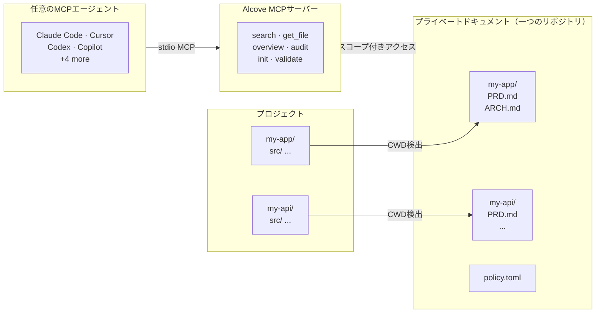

<p align="center">
  
</p>

<p align="center"><strong>AIエージェントはあなたのプロジェクトを知らない。Alcoveが解決します。</strong></p>

<p align="center">
  <a href="../README.md">English</a> ·
  <a href="README.ko.md">한국어</a> ·
  <a href="README.ja.md">日本語</a> ·
  <a href="README.zh-CN.md">简体中文</a> ·
  <a href="README.es.md">Español</a> ·
  <a href="README.hi.md">हिन्दी</a> ·
  <a href="README.pt-BR.md">Português</a> ·
  <a href="README.de.md">Deutsch</a> ·
  <a href="README.fr.md">Français</a> ·
  <a href="README.ru.md">Русский</a>
</p>

<p align="center">
  <a href="https://glama.ai/mcp/servers/epicsagas/alcove"></a>
  <a href="https://crates.io/crates/alcove"></a>
  <a href="https://crates.io/crates/alcove"></a>
  <a href="../LICENSE"></a>
  <a href="https://buymeacoffee.com/epicsaga"></a>
</p>

Alcoveは、AIコーディングエージェントが必要に応じてプライベートなプロジェクトドキュメントにアクセスできるようにするMCPサーバーです — **BM25 + ベクターハイブリッド検索**で精度の高い検索、**tree-sitterコードインデックス**でエージェントがコードベース構造を理解、**ポリシー強制**でドキュメントの一貫性を維持。コンテキストの肥大化なし、パブリックリポジトリへの漏洩なし、エージェントごとのプロジェクト設定なし。

PRD、アーキテクチャ決定、シークレットマップ、内部ランブックを一箇所に保管。すべてのMCP互換エージェントが同じツールを取得し、すべてのプロジェクトで動作し、プロジェクトごとの設定は不要です。

## 課題

AIエージェントは毎回ゼロからセッションを開始します。

アーキテクチャを知りません。すでに決定した制約を無視します。毎セッション同じことを説明するよう求めてきます。

コンテキストウィンドウがボトルネックです。すべてのトークンにお金と注意力がかかります。10個のアーキテクチャドキュメントをコンテキストに読み込むと、毎回50K+トークンが無駄になります — しかもAnthropicの公式ドキュメントも、肥大化した設定ファイルがエージェントに*実際の指示を無視させる*と警告しています。

つまり、3つの悪い選択肢があります：

**エージェント設定にすべて詰め込む** — すべてのファイルが毎回コンテキストに読み込まれます。10ドキュメント = コンテキスト肥大 = 遅く、高価で、精度の低い応答。

**毎回のチャットにコピペする** — 一度は機能しますが、1セッション以上はスケールしません。

**諦める** — エージェントがすでに文書化した要件を作り上げ、すでに決定した制約を無視し、毎週月曜の朝に同じアーキテクチャを再説明することになります。

5つのプロジェクトと3つのエージェントで掛け算してください。切り替えるたびにコンテキストが失われます。

## Alcoveの解決方法

Alcoveはすべてのプライベートドキュメントを**一つの共有リポジトリ**に、プロジェクトごとに整理して保管します。MCP互換のエージェントであれば、Claude Code、Cursor、Codexのいずれでも同じ方法でアクセスできます。

```
~/projects/my-app $ claude "/alcove 認証はどう実装されている？"

  → Alcoveがプロジェクトを検出: my-app
  → ~/documents/my-app/ARCHITECTURE.md を読み込み
  → エージェントが実際のプロジェクトコンテキストに基づいて回答
```

```
~/projects/my-api $ codex "/alcove APIデザインをレビューして"

  → Alcoveがプロジェクトを検出: my-api
  → 同じドキュメント構造、同じアクセスパターン
  → 別のプロジェクト、同じワークフロー
```

**エージェントをいつでも切り替え。プロジェクトをいつでも切り替え。ドキュメントレイヤーは標準化されたまま。**

## 機能

- **一つのドキュメントリポジトリ、複数プロジェクト** — プライベートドキュメントをプロジェクトごとに整理し、一箇所で管理
- **一度の設定で、あらゆるエージェント** — 一度設定すれば、すべてのMCP互換エージェントが同じアクセスを取得
- **CWDからプロジェクトを自動検出** — プロジェクトごとの設定不要
- **スコープ付きアクセス** — 各プロジェクトは自分のドキュメントのみ参照可能
- **スマート検索** — BM25ランキング検索と自動インデクシング。最も関連性の高いドキュメントを最初に表示し、必要に応じてgrepにフォールバック
- **クロスプロジェクト検索** — `scope: "global"`で全プロジェクトを一括検索 — パーソナルナレッジベースとして活用
- **プライベートドキュメントはプライベートのまま** — 機密ドキュメント（シークレットマップ、内部決定事項、技術的負債）がパブリックリポジトリに触れることはない
- **標準化されたドキュメント構造** — `policy.toml`がすべてのプロジェクトとチームに一貫したドキュメントを強制
- **クロスリポジトリ監査** — プロジェクトリポジトリに誤って配置された内部ドキュメントを発見し、修正を提案
- **ドキュメント検証** — 不足ファイル、未記入テンプレート、必須セクションをチェック
- **セマンティックLint** — 壊れたウィキリンク、孤立ファイル、古いWIP/DRAFTマーカー、2年以上前の日付表現を自動検出
- **外部ボルトへの取り込み** — Obsidianなど外部ツールのノートをdoc-repoにワンコマンドで追加；ファイル名・内容に基づくプロジェクト自動ルーティング
- **9つ以上のエージェントに対応** — Claude Code、Cursor、Claude Desktop、Cline、OpenCode、Codex、Copilot

## なぜAlcoveなのか

| Alcoveなし | Alcoveあり |
|------------|-----------|
| 内部ドキュメントがNotion、Google Docs、ローカルファイルに散在 | 一つのドキュメントリポジトリ、プロジェクトごとに構造化 |
| 各AIエージェントごとにドキュメントアクセスを個別設定 | 一度の設定で、すべてのエージェントが同じアクセスを共有 |
| プロジェクト切り替え時にドキュメントコンテキストが失われる | CWD自動検出で、即座にプロジェクト切り替え |
| エージェント検索がランダムなマッチ行を返す | ハイブリッド検索（BM25 + RAG） — エージェントが必要なものだけを関連度順に取得 |
| エージェントはテキストドキュメントしか見えず、コード構造を理解しない | Tree-sitterコードインデックス — エージェントが12言語のモジュール、関数、型を理解 |
| 「認証に関するノートをすべて検索」— 不可能 | グローバル検索で全プロジェクトを一括クエリ |
| 機密ドキュメントがパブリックリポジトリに漏洩するリスク | プライベートドキュメントをプロジェクトリポジトリから物理的に分離 |
| ドキュメント構造がプロジェクトやチームメンバーごとに異なる | `policy.toml`がすべてのプロジェクトに標準を強制 |
| ドキュメントが完全かどうか確認する方法がない | `validate`が不足ファイル、空テンプレート、不足セクションを検出 |
| 古いリンクやWIPマーカーが見落とされやすい | `lint`が壊れたリンク、孤立ファイル、古いマーカーを自動検出 |
| ObsidianなどのノートがサイロになっているNote | `promote`で外部ノートをワンコマンドでdoc-repoに統合 |

## クイックスタート

> **必須**: インストール後に `alcove setup` を一度実行して、ドキュメントルートを設定し、全機能を有効にしてください。プラグインはMCP接続を自動的にシードしますが、`setup` が実行されないとAlcoveはドキュメントを検索・インデックスできません。
>
> **Obsidianをお使いですか？** 推奨ドキュメント構成とボールト設定については、[エコシステム](#ecosystem)セクションをご参照ください。

### Claude Code

```
/plugin marketplace add epicsagas/plugins
/plugin install alcove@epicsagas
```

バイナリを自動インストールし、次回セッション開始時にMCPサーバーを登録します。

```bash
alcove setup   # プラグインインストール後に一度実行
```

`claude plugin update epicsagas/alcove` でアップデートします。

### Codex CLI

```bash
codex plugin marketplace add epicsagas/plugins
```

スキルを自動インストールし、MCPサーバーを登録します。すぐに利用可能です — 追加手順は不要です。

`codex plugin update alcove@epicsagas` でアップデートします。

### macOS（Apple Silicon のみ）

```bash
brew install epicsagas/tap/alcove
```

Homebrewをお持ちでない場合は、インストールスクリプトを使用してください:

```bash
curl --proto '=https' --tlsv1.2 -LsSf \
  https://github.com/epicsagas/alcove/releases/latest/download/alcove-installer.sh | sh
```

> **注意**: 事前ビルドバイナリは macOS Apple Silicon のみ対応です。Linux および Windows ユーザーは上記のワンラインインストーラーを使用してください。

### Linux (x86_64 / ARM64)

```bash
curl --proto '=https' --tlsv1.2 -LsSf \
  https://github.com/epicsagas/alcove/releases/latest/download/install.sh | sh
```

### Windows (x86_64 / ARM64)

```powershell
irm https://github.com/epicsagas/alcove/releases/latest/download/install.ps1 | iex
```

### Rustツールチェーン

```bash
cargo binstall alcove   # ビルド済みバイナリ（高速）
cargo install alcove    # ソースからビルド
```

> **注意**: 事前ビルドバイナリはLinux（x86\_64）、macOS（Apple SiliconおよびIntel）、Windowsに提供されています。

### 初回セットアップ（必須）

上記のいずれかの方法でインストール後、以下を実行してください:

```bash
alcove setup
alcove --version
alcove doctor
```

`setup`は以下を対話的にガイドします:

1. ドキュメントの保存場所
2. 追跡するドキュメントカテゴリ
3. 希望する図表フォーマット
4. ハイブリッド検索用の埋め込みモデル
5. **バックグラウンドサーバー** — 毎セッションのコールドスタート遅延を排除（macOSログイン項目）
6. 設定するAIエージェント（MCP + スキルファイル — Claude CodeとCodexはプラグインシステムで処理されます）

設定を変更したいときはいつでも `alcove setup` を再実行できます。以前の選択内容を記憶しています。

**任意の依存関係**

| ツール | 目的 | インストール |
|---|---|---|
| `pdftotext` (poppler) | PDF全文テキスト抽出 — PDF検索に必要 | macOS: `brew install poppler` · Debian/Ubuntu: `apt install poppler-utils` · Fedora: `dnf install poppler-utils` · Windows: [poppler for Windows](https://github.com/oschwartz10612/poppler-windows/releases) |

`pdftotext` がない場合、Alcoveは内蔵PDFパーサーにフォールバックしますが、一部のファイルでは失敗する可能性があります。`alcove doctor` でインストール状態を確認してください。

## 使い方

### CLI検索

ターミナルから直接ドキュメントを検索できます。デフォルトでは、**すべてのプロジェクト**が検索対象（グローバルスコープ）となります。

```bash
# 基本検索（グローバルスコープ）
alcove search "authentication"

# 現在のプロジェクトに限定（CWDから自動検出）
alcove search "auth flow" --scope project

# grepモードを強制（正確な部分一致）
alcove search "TODO" --mode grep

# ランキングモードを強制（BM25/ハイブリッド）
alcove search "data model" --mode ranked

# 結果件数を調整
alcove search "deployment" --limit 5
```

### コーディングエージェント (MCP)

AIコーディングエージェントは、**MCPツール**を介してAlcoveを使用します。通常、これらを自分で呼び出す必要はありません。エージェントがプロジェクトに関する質問を受けた際に、自動的に呼び出します。

| 目的 | エージェントツール | 説明 |
|------|------------|-------------|
| **探索** | `get_project_docs_overview` | プロジェクト内の全ファイルを一覧表示し、構造を把握します。 |
| **検索** | `search_project_docs` | 特定のキーワードや概念を検索します。`scope: "global"` に対応しています。 |
| **読み取り** | `get_doc_file` | 検索で見つかった特定のファイルの内容を読み取ります。 |
| **監査** | `audit_project` | ドキュメントの不足や、コードとドキュメントの不一致をチェックします。 |

**エージェントとのやり取り例:**
> **ユーザー:** "/alcove 新しいAPIエンドポイントを追加するにはどうすればいいですか？"
> **エージェント:** (`search_project_docs(query="add api endpoint")` を呼び出し)
> **エージェント:** (`get_doc_file` を使用して最も関連性の高いドキュメントを読み取り)
> **エージェント:** "`ARCHITECTURE.md` によると、以下のように追加する必要があります..."

---

## 仕組み



ドキュメントは別ディレクトリ（`DOCS_ROOT`）にプロジェクトごとのフォルダで整理されています。Alcoveはそこからドキュメントを管理し、提供します — stdioを通じて任意のMCP互換AIエージェントに。

## ドキュメント分類

Alcoveはドキュメントを以下のように分類します:

| 分類 | 保存場所 | 例 |
|------|----------|-----|
| **doc-repo-required** | Alcove（プライベート） | PRD、アーキテクチャ、決定事項、コンベンション |
| **doc-repo-supplementary** | Alcove（プライベート） | デプロイ、オンボーディング、テスト、ランブック |
| **reference** | Alcove `reports/` フォルダ | 監査レポート、ベンチマーク、分析 |
| **project-repo** | GitHubリポジトリ（パブリック） | README、CHANGELOG、CONTRIBUTING |

`audit`ツールはドキュメントリポジトリとローカルプロジェクトディレクトリの両方をスキャンし、アクションを提案します — プライベートPRDからパブリックREADMEの生成や、誤って配置されたレポートのAlcoveへの移動など。

## MCPツール

| ツール | 機能 |
|--------|------|
| `get_project_docs_overview` | すべてのドキュメントを分類とサイズ付きで一覧表示 |
| `search_project_docs` | スマート検索 — BM25ランキングまたはgrepを自動選択、`scope: "global"`でクロスプロジェクト検索対応 |
| `get_doc_file` | パスを指定して特定のドキュメントを読み取り（大きなファイルは`offset`/`limit`対応） |
| `list_projects` | ドキュメントリポジトリ内のすべてのプロジェクトを表示 |
| `audit_project` | クロスリポジトリ監査 — ドキュメントリポジトリとローカルプロジェクトをスキャンしてアクション提案 |
| `init_project` | 新規プロジェクトのドキュメントをスキャフォールド（内部+外部ドキュメント、選択的ファイル作成） |
| `validate_docs` | チームポリシー（`policy.toml`）に対してドキュメントを検証 |
| `rebuild_index` | 全文検索インデックスの再構築（通常は自動） |
| `check_doc_changes` | 前回のインデックスビルド以降に追加・変更・削除されたドキュメントを検出 |
| `lint_project` | セマンティックLint — 壊れたリンク、孤立ファイル、古いマーカー、古い日付表現 |
| `promote_document` | 外部ボルトのファイルをalcove doc-repoにコピーまたは移動 |
| `index_code_structure` | tree-sitterでソースコードを解析し、プロジェクトごとに`CODE_INDEX.md`を生成（`full`プリセットに含まれる） |

## CLI

```
alcove              MCPサーバーを起動（エージェントがこれを呼び出す）
alcove setup        対話的セットアップ — いつでも再実行して再設定可能
alcove doctor       インストール状態を診断
alcove validate     ポリシーに対してドキュメントを検証（--format json, --exit-code）
alcove lint         セマンティックLint — 壊れたリンク、孤立ファイル、古いマーカー (--format json)
alcove promote      外部ボルトのノートをdoc-repoに取り込む
alcove index        検索インデックスの増分更新（変更されたファイルのみ）
alcove rebuild      検索インデックスをゼロから再構築（スキーマ変更後に使用）
alcove search       ターミナルからドキュメントを検索
alcove index-code   ソースコードからコード構造インデックスを生成 [--language LANG] [--source PATH]
alcove token        バックグラウンドサーバー認証用のベアラートークンを表示
alcove uninstall    スキル、設定、レガシーファイルを削除

alcove mcp <CMD>      バックグラウンドMCPサーバーのライフサイクルを管理 (start, stop, status, enable, disable)

alcove vault create   新しいナレッジベースボルトを作成
alcove vault link     外部ディレクトリをボルトとしてリンク (例: Obsidian)
alcove vault list     すべてのボルトをドキュメント数とともに一覧表示
alcove vault remove   ボルトを削除 (シンボリックリンクの場合：リンクのみ削除)
alcove vault add      ドキュメントをボルトに追加
alcove vault index    ボルトの検索インデックスを構築
alcove vault rebuild  ボルトの検索インデックスをゼロから再構築
```

### コードインデックス

tree-sitterでソースファイルをパースし、`CODE_INDEX.md`を生成します。コードベースのモジュール別マークダウン要約で、Tantivy検索パイプラインと統合されます。

```bash
# 現在のプロジェクトをインデックス（全言語自動検出）
alcove index-code --source ./src

# モノレポ：複数言語が混在するディレクトリを一括インデックス
alcove index-code --source ./

# 単一言語のみインデックス
alcove index-code --source ./src --language typescript
alcove index-code --source ./src --language rust
```

**対応言語:**

| 言語 | フィーチャーフラグ | ファイル拡張子 |
|------|-----------------|--------------|
| Rust | `lang-rust` | `.rs` |
| Python | `lang-python` | `.py`, `.pyi` |
| TypeScript | `lang-typescript` | `.ts`, `.tsx` |
| JavaScript | `lang-javascript` | `.js`, `.jsx`, `.mjs` |
| Go | `lang-go` | `.go` |
| Java | `lang-java` | `.java` |
| Kotlin | `lang-kotlin` | `.kt`, `.kts` |
| C | `lang-c` | `.c`, `.h` |
| C++ | `lang-cpp` | `.cpp`, `.cc`, `.cxx`, `.hpp`, `.hxx`, `.h` |
| Swift | `lang-swift` | `.swift` |
| Ruby | `lang-ruby` | `.rb` |
| C# | `lang-csharp` | `.cs` |

公式バイナリは12のパーサー全てを有効化（`lang-all`）しています。`--language`フラグなしで実行すると、**認識された全拡張子を自動インデックス**するためモノレポでも安全です。

`--language`フラグは略称も使用可能: `ts` → TypeScript、`cpp` → C++、`csharp` → C#、`py` → Python、`js` → JavaScript、`kt` → Kotlin、`rb` → Ruby。

### Lint

```bash
# 現在のプロジェクトをLint（CWDから自動検出）
alcove lint

# プロジェクトを指定
alcove lint --project my-app

# CI向けのマシンリーダブル出力
alcove lint --format json
```

Lintは4つの項目を検査します：

| 検査項目 | 検出内容 |
|---------|---------|
| `broken-link` | 存在しないファイルを指す `[[ウィキリンク]]` または `[テキスト](パス)` |
| `orphan` | 他のドキュメントからリンクされていないファイル |
| `stale-marker` | WIP / TODO / FIXME / DRAFT / DEPRECATED マーカー |
| `stale-date` | 2年以上前の日付表現（例："as of 2022"） |

### Promote

```bash
# ObsidianのノートをDoc-repoにコピー（プロジェクトを自動ルーティング）
alcove promote ~/my-brain/Projects/auth-notes.md

# プロジェクトを指定
alcove promote ~/my-brain/Projects/auth-notes.md --project my-app

# コピーの代わりに移動
alcove promote ~/my-brain/Projects/auth-notes.md --mv
```

一致するプロジェクトがないファイルは手動確認のため`inbox/`に保存されます。

### バックグラウンドサーバー

バックグラウンドで永続的なサーバーを実行すると、新しいエージェントセッションごとのコールドスタート遅延を排除できます。**`alcove setup` でデフォルトで有効になります**（macOSログイン項目）。

```bash
alcove mcp enable --now     # 有効化して起動（再起動後も保持）
alcove mcp stop / start / restart / status
alcove mcp disable          # 無効化してログイン項目を削除
```

バックグラウンドサーバーが実行中の場合、stdioプロセスは軽量プロキシとして動作します — 毎セッション検索エンジンをロードする代わりに、実行中のサーバーにリクエストを転送します。起動時、stdioプロセスは `GET /health` を確認し、自動的にプロキシモードに移行します。

## 検索

Alcoveは自動的に最適な検索戦略を選択します。検索インデックスが存在する場合、**BM25ランキング検索**（[tantivy](https://github.com/quickwit-oss/tantivy)搭載）で関連度スコア付きの結果を返します。インデックスがない場合はgrepにフォールバックします。ユーザーが気にする必要はありません。

```bash
# 現在のプロジェクトを検索（CWDから自動検出）
alcove search "authentication flow"

# すべてのプロジェクトを一括検索 — パーソナルナレッジベース
alcove search "OAuth token refresh" --scope global

# 完全一致の部分文字列マッチングが必要な場合はgrepモードを強制
alcove search "FR-023" --mode grep
```

インデックスはMCPサーバー起動時にバックグラウンドで自動的にビルドされ、ファイルの変更を検出すると自動的にリビルドします。cronジョブも手動操作も不要です。

**エージェントでの使い方:** エージェントはクエリで`search_project_docs`を呼び出すだけです。Alcoveがランキング、重複排除（ファイルごとに1結果）、クロスプロジェクト検索、フォールバックをすべて処理します。エージェントが検索モードを選択する必要はありません。

## プロジェクト検出

デフォルトでは、Alcoveはターミナルの作業ディレクトリ（CWD）から現在のプロジェクトを検出します。`MCP_PROJECT_NAME`環境変数でオーバーライドできます:

```bash
MCP_PROJECT_NAME=my-api alcove
```

CWDがドキュメントリポジトリのプロジェクト名と一致しない場合に便利です。

## ドキュメントポリシー

ドキュメントリポジトリの`policy.toml`でチーム全体のドキュメント標準を定義します:

```toml
[policy]
enforce = "strict"    # strict | warn

[[policy.required]]
name = "PRD.md"
aliases = ["prd.md", "product-requirements.md"]

[[policy.required]]
name = "ARCHITECTURE.md"

  [[policy.required.sections]]
  heading = "## Overview"
  required = true

  [[policy.required.sections]]
  heading = "## Components"
  required = true
  min_items = 2
```

ポリシーファイルは**プロジェクト**（`<project>/.alcove/policy.toml`）> **チーム**（`DOCS_ROOT/.alcove/policy.toml`）> **組み込みデフォルト**（config.tomlのcoreファイルリスト）の優先順位で解決されます。プロジェクトごとのオーバーライドを許可しつつ、すべてのプロジェクトで一貫したドキュメント品質を確保します。

## 設定

設定ファイルは`~/.config/alcove/config.toml`にあります:

```toml
docs_root = "/Users/you/documents"

[core]
files = ["PRD.md", "ARCHITECTURE.md", "PROGRESS.md", "DECISIONS.md", "CONVENTIONS.md", "SECRETS_MAP.md", "DEBT.md"]

[team]
files = ["ENV_SETUP.md", "ONBOARDING.md", "DEPLOYMENT.md", "TESTING.md", ...]

[public]
files = ["README.md", "CHANGELOG.md", "CONTRIBUTING.md", "SECURITY.md", ...]

[diagram]
format = "mermaid"
```

すべて`alcove setup`で対話的に設定できます。ファイルを直接編集することも可能です。

## 対応エージェント

| エージェント | MCP | スキル |
|-------------|-----|--------|
| Claude Code | `~/.claude.json` | `~/.claude/skills/alcove/` |
| Cursor | `~/.cursor/mcp.json` | `~/.cursor/skills/alcove/` |
| Claude Desktop | プラットフォーム設定 | — |
| Cline (VS Code) | VS Code globalStorage | `~/.cline/skills/alcove/` |
| OpenCode | `~/.config/opencode/opencode.json` | `~/.opencode/skills/alcove/` |
| Codex CLI | `~/.codex/config.toml` | `~/.codex/skills/alcove/` |
| Copilot CLI | `~/.copilot/mcp-config.json` | `~/.copilot/skills/alcove/` |

## 対応言語

CLIはシステムロケールを自動検出します。`ALCOVE_LANG`環境変数で手動設定することもできます。

| 言語 | コード |
|------|--------|
| English | `en` |
| 한국어 | `ko` |
| 简体中文 | `zh-CN` |
| 日本語 | `ja` |
| Español | `es` |
| हिन्दी | `hi` |
| Português (Brasil) | `pt-BR` |
| Deutsch | `de` |
| Français | `fr` |
| Русский | `ru` |

```bash
# 言語を上書き
ALCOVE_LANG=ja alcove setup
```

## アップデート

| 方法 | コマンド |
|------|---------|
| Homebrew | `brew upgrade alcove` |
| curl インストーラー | 上記のインストールスクリプトを再実行 |
| cargo binstall | `cargo binstall alcove@latest` |
| cargo install | `cargo install alcove@latest` |
| Claude Code プラグイン | `claude plugin update epicsagas/alcove` |

```bash
alcove --version
```

## アンインストール

```bash
alcove uninstall          # スキルと設定を削除
cargo uninstall alcove    # バイナリを削除
```

## ナレッジベースボルト

プロジェクトドキュメントに加えて、Alcoveは研究ノート、参考資料、LLMが検索可能なキュレーションされた知識のための**独立したナレッジベースボルト**をサポートしています。

```bash
# AI研究ノート用のボルトを作成
alcove vault create ai-research

# 既存のObsidianボルトをリンク（コピーなし — その場でインデックス作成）
alcove vault link my-obsidian ~/Obsidian/research

# ドキュメントを追加
alcove vault add ai-research ~/Downloads/transformer-survey.md

# ボルトの検索インデックスを構築
alcove vault index

# すべてのボルトを一覧表示
alcove vault list
#   areas (8 docs) → (linked)
#   resources (71 docs) → (linked)
#   zettelkasten (17 docs) → (linked)

# CLIから検索
alcove search "attention mechanism" --vault ai-research

# エージェントがMCP経由で検索
search_vault(query="attention mechanism", vault="ai-research")

# すべてのボルトを一度に検索
search_vault(query="transformer", vault="*")
```

ボルトはプロジェクトドキュメントから**完全に分離**されています — 別々のインデックス、別々のキャッシュ、別々の検索。コーディングエージェントのプロジェクトドキュメント検索がボルトの活動に影響されることはありません。

| 機能 | プロジェクトドキュメント | ボルト |
|---------|-------------|--------|
| 目的 | プロジェクトごとのドキュメント化 | 一般的なナレッジベース |
| 保存場所 | `~/.alcove/docs/` | `~/.alcove/vaults/` |
| インデックス | 共有プロジェクトインデックス | ボルトごとの独立インデックス |
| キャッシュ | `PROJECT_READER_CACHE` | `VAULT_READER_CACHE` |
| 検索 | `search_project_docs` | `search_vault` |
| シンボリックリンク | なし | あり（外部ディレクトリをリンク） |

### ボルト設定

デフォルトでは、ボルトは `~/.alcove/vaults/` に保存されます。`config.toml` でこれを変更できます：

```toml
[vaults]
root = "/path/to/your/vaults"
```

詳細については、[設定](#設定)セクションを参照してください。

## エコシステム

### [obsidian-forge](https://github.com/epicsagas/obsidian-forge)

Alcoveは、Obsidianボルトの生成および自動化デーモンである **obsidian-forge** と自然に連携します。最適な統合のために、Alcoveの **`docs_root`** が obsidian-forge のプロジェクトアーカイブを指すように設定することをお勧めします。

**1. ドキュメントルートの設定**
プライマリドキュメントのパスを obsidian-forge のプロジェクトディレクトリに設定します（直接指定またはシンボリックリンク経由）：
```bash
# alcove setup の際、docs_root を以下に設定します：
~/Obsidian/SecondBrain/99-Archives/projects
```

**2. 知識領域をボルトとしてリンク**
他の3つの obsidian-forge カテゴリを独立した Alcove ボルトとしてリンクします。これにより、`~/.alcove/vaults/` 内にシンボリックリンクが作成されます：
```bash
# obsidian-forge カテゴリをリンク
alcove vault link areas ~/Obsidian/SecondBrain/02-Areas
alcove vault link resources ~/Obsidian/SecondBrain/03-Resources
alcove vault link zettelkasten ~/Obsidian/SecondBrain/10-Zettelkasten
```

これで、エージェントが構造化されたアクセスを行えるようになります：
- **`search_project_docs`**: アーカイブされたプロジェクトの知識（PRDなど）を検索
- **`search_vault`**: より広範な知識領域や研究ノートを検索

`~/.alcove/vaults/` 内のシンボリックリンクを確認することで、物理的なストレージマッピングを検証できます。

## ロードマップ

- **マルチユーザーリモートアクセス** — LAN/VPN経由でのチームドキュメント共有用REST API（ベアラートークン認証、レート制限は実装済み）。必要: 書き込みAPI、同時インデックス調整、プロジェクトライフサイクル管理。

## コントリビュート

バグレポート、機能リクエスト、プルリクエストを歓迎します。議論を始めるには[GitHub](https://github.com/epicsagas/alcove/issues)でIssueを開いてください。

## ライセンス

Apache-2.0
