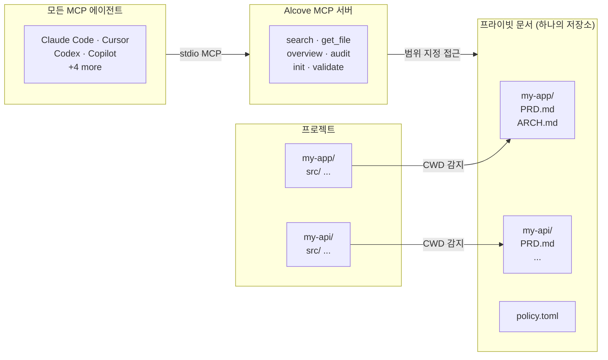

<p align="center">
  
</p>

<p align="center"><strong>당신의 AI 에이전트는 프로젝트를 모릅니다. Alcove가 해결합니다.</strong></p>

<p align="center">
  <a href="../README.md">English</a> ·
  <a href="README.ko.md">한국어</a> ·
  <a href="README.ja.md">日本語</a> ·
  <a href="README.zh-CN.md">简体中文</a> ·
  <a href="README.es.md">Español</a> ·
  <a href="README.hi.md">हिन्दी</a> ·
  <a href="README.pt-BR.md">Português</a> ·
  <a href="README.de.md">Deutsch</a> ·
  <a href="README.fr.md">Français</a> ·
  <a href="README.ru.md">Русский</a>
</p>

<p align="center">
  <a href="https://glama.ai/mcp/servers/epicsagas/alcove"></a>
  <a href="https://crates.io/crates/alcove"></a>
  <a href="https://crates.io/crates/alcove"></a>
  <a href="../LICENSE"></a>
  <a href="https://buymeacoffee.com/epicsaga"></a>
</p>

Alcove는 AI 코딩 에이전트가 필요할 때 프라이빗 프로젝트 문서에 접근할 수 있게 해주는 MCP 서버입니다 — **BM25 + 벡터 하이브리드 검색**으로 정밀 검색, **tree-sitter 코드 인덱싱**으로 에이전트가 코드베이스 구조를 이해, **정책 강제**로 문서 일관성 유지. 컨텍스트 팽창 없이, 공개 저장소 유출 없이, 에이전트별 프로젝트 설정 없이.

PRD, 아키텍처 결정, 시크릿 맵, 내부 런북을 한 곳에 보관하세요. 모든 MCP 호환 에이전트가 같은 도구를 얻고, 모든 프로젝트에서 동작하며, 프로젝트별 설정이 필요 없습니다.

## 문제

AI 에이전트는 매 세션을 처음부터 시작합니다.

아키텍처를 모릅니다. 이미 내린 결정의 제약을 무시합니다. 매 세션마다 같은 것을 설명해야 합니다.

컨텍스트 창이 병목입니다. 모든 토큰은 비용과 주의력을 소모합니다. 10개의 아키텍처 문서를 컨텍스트에 로드하면 매 실행마다 50K+ 토큰이 낭비됩니다 — 그리고 Anthropic의 공식 문서도 과도한 설정 파일이 에이전트의 *실제 명령을 무시하게 만든다고* 경고합니다.

그래서 세 가지 나쁜 선택지가 있습니다:

**에이전트 설정에 모든 것을 집어넣기** — 모든 파일이 매 실행마다 컨텍스트에 로드됩니다. 10개 문서 = 컨텍스트 팽창 = 느리고, 비싸고, 덜 정확한 응답.

**매 채팅마다 복사-붙여넣기** — 한 번은 통하지만, 한 세션 이상으로 확장되지 않습니다.

**그냥 포기하기** — 에이전트가 이미 문서화한 요구사항을 지어내고, 이미 내린 결정의 제약을 무시하며, 매 월요일 아침 같은 아키텍처를 다시 설명하게 됩니다.

이것을 5개 프로젝트와 3개 에이전트에 곱해보세요. 전환할 때마다 컨텍스트를 잃습니다.

## Alcove가 해결하는 방법

Alcove는 모든 프라이빗 문서를 프로젝트별로 정리된 **하나의 공유 저장소**에 보관합니다. MCP 호환 에이전트라면 동일한 방식으로 접근할 수 있습니다 — Claude Code, Cursor, Codex 어디서든 상관없습니다.

```
~/projects/my-app $ claude "/alcove 인증은 어떻게 구현되어 있나요?"

  → Alcove가 프로젝트 감지: my-app
  → ~/documents/my-app/ARCHITECTURE.md 읽기
  → 에이전트가 실제 프로젝트 컨텍스트로 답변
```

```
~/projects/my-api $ codex "/alcove API 설계를 검토해줘"

  → Alcove가 프로젝트 감지: my-api
  → 동일한 문서 구조, 동일한 접근 패턴
  → 다른 프로젝트, 같은 워크플로우
```

**에이전트를 언제든 전환하세요. 프로젝트를 언제든 전환하세요. 문서 레이어는 표준화되어 있습니다.**

## 주요 기능

- **하나의 문서 저장소, 여러 프로젝트** — 프라이빗 문서를 프로젝트별로 정리하고 한 곳에서 관리
- **한 번 설정, 모든 에이전트** — 한 번 설정하면 모든 MCP 호환 에이전트가 동일한 접근 권한을 얻음
- **CWD 기반 프로젝트 자동 감지** — 프로젝트별 설정 불필요
- **범위 지정 접근** — 각 프로젝트는 자신의 문서만 볼 수 있음
- **스마트 검색** — BM25 랭킹 검색과 자동 인덱싱; 가장 관련성 높은 문서를 먼저 찾고, 필요 시 grep으로 폴백
- **크로스 프로젝트 검색** — `scope: "global"`로 모든 프로젝트를 한 번에 검색 — 개인 지식 베이스로 활용
- **프라이빗 문서는 프라이빗으로 유지** — 민감한 문서(시크릿 맵, 내부 결정, 기술 부채)가 공개 저장소에 들어가지 않음
- **표준화된 문서 구조** — `policy.toml`로 모든 프로젝트와 팀에 일관된 문서를 적용
- **크로스 레포 감사** — 프로젝트 저장소에 잘못 배치된 내부 문서를 찾아 수정 제안
- **문서 검증** — 누락된 파일, 미작성 템플릿, 필수 섹션 확인
- **시맨틱 린트** — 깨진 위키링크, 고아 파일, 오래된 WIP/DRAFT 마커, 2년 이상 지난 날짜 표현 자동 감지
- **외부 볼트 가져오기** — Obsidian 등의 노트를 한 명령으로 doc-repo에 추가; 파일명·내용 기반 프로젝트 자동 라우팅
- **9개 이상 에이전트 지원** — Claude Code, Cursor, Claude Desktop, Cline, OpenCode, Codex, Copilot

## Alcove를 사용하는 이유

| Alcove 없이 | Alcove와 함께 |
|-------------|--------------|
| 내부 문서가 Notion, Google Docs, 로컬 파일에 흩어져 있음 | 하나의 문서 저장소, 프로젝트별로 구조화 |
| 각 AI 에이전트마다 문서 접근을 별도로 설정 | 한 번 설정, 모든 에이전트가 동일한 접근 공유 |
| 프로젝트를 전환하면 문서 컨텍스트를 잃음 | CWD 자동 감지, 즉시 프로젝트 전환 |
| 에이전트 검색이 무작위 매칭 줄을 반환 | 하이브리드 검색 (BM25 + RAG) — 에이전트가 필요한 것만 관련도 순으로 가져옴 |
| 에이전트는 텍스트 문서만 보고 코드 구조를 모름 | Tree-sitter 코드 인덱싱 — 에이전트가 12개 언어의 모듈, 함수, 타입을 이해 |
| "인증 관련 노트 전부 검색" — 불가능 | 글로벌 검색으로 모든 프로젝트를 한 번에 쿼리 |
| 민감한 문서가 프로젝트 저장소에 섞여 있거나 여기저기 흩어져 있음 | 프라이빗 문서는 프로젝트 저장소와 물리적으로 분리 |
| 프로젝트와 팀원마다 문서 구조가 다름 | `policy.toml`로 모든 프로젝트에 표준 적용 |
| 문서가 완성되었는지 확인할 방법이 없음 | `validate`가 누락된 파일, 빈 템플릿, 누락된 섹션을 감지 |
| 오래된 링크나 WIP 마커를 놓치기 쉬움 | `lint`가 깨진 링크, 고아 파일, 오래된 마커를 자동 감지 |
| Obsidian 등 외부 노트가 고립된 상태로 남아 있음 | `promote`로 외부 노트를 한 명령으로 doc-repo에 통합 |

## 빠른 시작

> **필수**: 설치 후 `alcove setup`을 한 번 실행하여 문서 루트를 설정하고 전체 기능을 활성화하세요. 플러그인은 MCP 연결을 자동으로 시드하지만, `setup`이 실행되지 않으면 Alcove가 문서를 검색하거나 인덱싱할 수 없습니다.
>
> **Obsidian을 사용하시나요?** 권장 문서 구조와 볼트 설정은 [생태계](#ecosystem) 섹션을 참조하세요.

### Claude Code

```
/plugin marketplace add epicsagas/plugins
/plugin install alcove@epicsagas
```

바이너리를 자동 설치하고 다음 세션 시작 시 MCP 서버를 등록합니다.

```bash
alcove setup   # 플러그인 설치 후 한 번 실행
```

`claude plugin update epicsagas/alcove`로 업데이트합니다.

### Codex CLI

```bash
codex plugin marketplace add epicsagas/plugins
```

스킬을 자동 설치하고 MCP 서버를 등록합니다. 즉시 사용 가능 — 추가 단계 불필요.

`codex plugin update alcove@epicsagas`로 업데이트합니다.

### macOS (Apple Silicon 전용)

```bash
brew install epicsagas/tap/alcove
```

Homebrew가 없으신가요? 설치 스크립트를 사용하세요:

```bash
curl --proto '=https' --tlsv1.2 -LsSf \
  https://github.com/epicsagas/alcove/releases/latest/download/alcove-installer.sh | sh
```

> **참고**: 사전 빌드 바이너리는 macOS Apple Silicon 전용입니다. Linux 및 Windows 사용자는 아래 원라인 인스톨러를 사용하세요.

### Linux (x86_64 / ARM64)

```bash
curl --proto '=https' --tlsv1.2 -LsSf \
  https://github.com/epicsagas/alcove/releases/latest/download/install.sh | sh
```

### Windows (x86_64 / ARM64)

```powershell
irm https://github.com/epicsagas/alcove/releases/latest/download/install.ps1 | iex
```

### Rust 툴체인

```bash
cargo binstall alcove   # 사전 빌드 바이너리 (빠름)
cargo install alcove    # 소스에서 빌드
```

> **참고**: 사전 빌드 바이너리는 Linux(x86\_64), macOS(Apple Silicon 및 Intel), Windows에 제공됩니다.

### 최초 설정 (필수)

위 방법 중 하나로 설치한 후, 다음을 실행하세요:

```bash
alcove setup
alcove --version
alcove doctor
```

`setup`은 다음을 대화형으로 안내합니다:

1. 문서가 어디에 있는지
2. 어떤 문서 카테고리를 추적할지
3. 선호하는 다이어그램 형식
4. 하이브리드 검색용 임베딩 모델
5. **백그라운드 서버** — 매 세션의 콜드 스타트 제거 (macOS 로그인 항목)
6. 어떤 AI 에이전트를 설정할지 (MCP + 스킬 파일 — Claude Code와 Codex는 플러그인 시스템으로 처리됩니다)

설정을 변경하려면 언제든 `alcove setup`을 다시 실행하세요. 이전 선택을 기억합니다.

**선택적 의존성**

| 도구 | 목적 | 설치 |
|---|---|---|
| `pdftotext` (poppler) | PDF 전문 텍스트 추출 — PDF 검색에 필요 | macOS: `brew install poppler` · Debian/Ubuntu: `apt install poppler-utils` · Fedora: `dnf install poppler-utils` · Windows: [poppler for Windows](https://github.com/oschwartz10612/poppler-windows/releases) |

`pdftotext`가 없으면 Alcove는 내장 PDF 파서로 폴백하지만, 일부 파일에서는 실패할 수 있습니다. `alcove doctor`로 설치 상태를 확인하세요.

## 사용법

### CLI 검색

터미널에서 직접 문서를 검색할 수 있습니다. 기본적으로 **모든 프로젝트**를 대상으로 검색합니다(글로벌 범위).

```bash
# 기본 검색 (글로벌 범위)
alcove search "인증"

# 현재 프로젝트로 제한 (CWD 기반 자동 감지)
alcove search "auth flow" --scope project

# grep 모드 강제 (정확한 부분 문자열 일치)
alcove search "TODO" --mode grep

# 랭킹 모드 강제 (BM25/하이브리드)
alcove search "데이터 모델" --mode ranked

# 결과 개수 조정
alcove search "배포" --limit 5
```

### 코딩 에이전트 (MCP)

AI 코딩 에이전트는 **MCP 도구**를 통해 Alcove를 사용합니다. 사용자가 직접 이 도구들을 호출할 필요는 없으며, 에이전트가 프로젝트에 대해 질문을 받으면 자동으로 호출합니다.

| 목적 | 에이전트 도구 | 설명 |
|------|------------|-------------|
| **탐색** | `get_project_docs_overview` | 현재 프로젝트의 모든 파일 목록을 나열하여 구조를 파악합니다. |
| **검색** | `search_project_docs` | 특정 키워드나 개념을 검색합니다. `scope: "global"`을 지원합니다. |
| **읽기** | `get_doc_file` | 검색을 통해 찾은 특정 파일의 내용을 읽습니다. |
| **감사** | `audit_project` | 누락된 문서나 코드와 문서 간의 불일치를 확인합니다. |

**에이전트 상호작용 예시:**
> **사용자:** "/alcove 새로운 API 엔드포인트를 어떻게 추가하나요?"
> **에이전트:** (`search_project_docs(query="add api endpoint")` 호출)
> **에이전트:** (검색된 가장 관련성 높은 문서를 `get_doc_file`로 읽음)
> **에이전트:** "`ARCHITECTURE.md`에 따르면, 다음과 같이 추가해야 합니다..."

---

## 작동 방식



문서는 별도 디렉토리(`DOCS_ROOT`)에 프로젝트별 폴더로 정리됩니다. Alcove는 stdio를 통해 MCP 호환 AI 에이전트에게 문서를 제공합니다.

## 문서 분류

Alcove는 문서를 다음과 같이 분류합니다:

| 분류 | 위치 | 예시 |
|------|------|------|
| **doc-repo-required** | Alcove (프라이빗) | PRD, Architecture, Decisions, Conventions |
| **doc-repo-supplementary** | Alcove (프라이빗) | Deployment, Onboarding, Testing, Runbook |
| **reference** | Alcove `reports/` 폴더 | 감사 보고서, 벤치마크, 분석 |
| **project-repo** | GitHub 저장소 (공개) | README, CHANGELOG, CONTRIBUTING |

`audit` 도구는 doc-repo와 로컬 프로젝트 디렉토리를 양쪽 모두 스캔하고 조치를 제안합니다 — 프라이빗 PRD에서 공개 README를 생성하거나, 잘못 배치된 리포트를 alcove로 가져오는 등.

## MCP 도구

| 도구 | 기능 |
|------|------|
| `get_project_docs_overview` | 분류 및 크기와 함께 모든 문서 목록 표시 |
| `search_project_docs` | 스마트 검색 — BM25 랭킹 또는 grep 자동 선택, `scope: "global"`로 크로스 프로젝트 검색 지원 |
| `get_doc_file` | 경로로 특정 문서 읽기 (대용량 파일은 `offset`/`limit` 지원) |
| `list_projects` | 문서 저장소의 모든 프로젝트 표시 |
| `audit_project` | 크로스 레포 감사 — doc-repo와 로컬 프로젝트 디렉토리를 스캔하고 조치 제안 |
| `init_project` | 새 프로젝트 문서 스캐폴딩 (내부+외부 문서, 선택적 파일 생성) |
| `validate_docs` | 팀 정책(`policy.toml`)에 따라 문서 검증 |
| `rebuild_index` | 전문 검색 인덱스 재빌드 (보통 자동) |
| `check_doc_changes` | 마지막 인덱스 빌드 이후 추가·수정·삭제된 문서 감지 |
| `lint_project` | 시맨틱 린트 — 깨진 링크, 고아 파일, 오래된 마커, 오래된 날짜 표현 |
| `promote_document` | 외부 볼트의 파일을 alcove doc-repo에 복사 또는 이동 |
| `index_code_structure` | tree-sitter로 소스코드를 파싱하여 프로젝트별 `CODE_INDEX.md` 생성 |

## CLI

```
alcove              MCP 서버 시작 (에이전트가 호출)
alcove setup        대화형 설정 — 언제든 다시 실행하여 재설정
alcove doctor       설치 상태 진단
alcove validate     정책에 따라 문서 검증 (--format json, --exit-code)
alcove lint         시맨틱 린트 — 깨진 링크, 고아 파일, 오래된 마커 (--format json)
alcove promote      외부 볼트의 노트를 doc-repo에 가져오기
alcove index        검색 인덱스 업데이트 (증분 — 변경된 파일만)
alcove rebuild      검색 인덱스 전체 재구축 (스키마 변경 후 사용)
alcove search       터미널에서 문서 검색
alcove index-code   소스코드에서 코드 구조 인덱스 생성 [--language LANG] [--source PATH]
alcove token        백그라운드 서버 인증용 베어러 토큰 출력
alcove uninstall    스킬, 설정 및 레거시 파일 제거

alcove mcp <CMD>      백그라운드 MCP 서버 관리 (start, stop, status, enable, disable)
```

### 코드 인덱싱

tree-sitter로 소스 파일을 파싱하여 `CODE_INDEX.md`를 생성합니다. 코드베이스의 모듈별 마크다운 요약으로, Tantivy 검색 파이프라인과 통합됩니다.

```bash
# 현재 프로젝트 소스 인덱싱 (모든 언어 자동 감지)
alcove index-code --source ./src

# 모노레포: 여러 언어가 섞인 디렉토리 한 번에 인덱싱
alcove index-code --source ./

# 단일 언어만 인덱싱
alcove index-code --source ./src --language typescript
alcove index-code --source ./src --language rust
```

**지원 언어:**

| 언어 | 피처 플래그 | 파일 확장자 |
|------|------------|------------|
| Rust | `lang-rust` | `.rs` |
| Python | `lang-python` | `.py`, `.pyi` |
| TypeScript | `lang-typescript` | `.ts`, `.tsx` |
| JavaScript | `lang-javascript` | `.js`, `.jsx`, `.mjs` |
| Go | `lang-go` | `.go` |
| Java | `lang-java` | `.java` |
| Kotlin | `lang-kotlin` | `.kt`, `.kts` |
| C | `lang-c` | `.c`, `.h` |
| C++ | `lang-cpp` | `.cpp`, `.cc`, `.cxx`, `.hpp`, `.hxx`, `.h` |
| Swift | `lang-swift` | `.swift` |
| Ruby | `lang-ruby` | `.rb` |
| C# | `lang-csharp` | `.cs` |

공식 바이너리는 12개 파서 전부 활성화(`lang-all`)되어 있습니다. `--language` 플래그 없이 실행하면 **인식된 모든 확장자를 자동으로 인덱싱**하므로 모노레포에서도 안전하게 사용할 수 있습니다.

`--language` 플래그는 약칭도 지원합니다: `ts` → TypeScript, `cpp` → C++, `csharp` → C#, `py` → Python, `js` → JavaScript, `kt` → Kotlin, `rb` → Ruby.

### 린트

```bash
# 현재 프로젝트 린트 (CWD에서 자동 감지)
alcove lint

# 특정 프로젝트 지정
alcove lint --project my-app

# CI용 머신 리더블 출력
alcove lint --format json
```

린트는 네 가지를 검사합니다:

| 검사 항목 | 감지 내용 |
|-----------|-----------|
| `broken-link` | 존재하지 않는 파일을 가리키는 `[[위키링크]]` 또는 `[텍스트](경로)` |
| `orphan` | 다른 문서에서 링크되지 않는 파일 |
| `stale-marker` | WIP / TODO / FIXME / DRAFT / DEPRECATED 마커 |
| `stale-date` | 2년 이상 지난 날짜 표현 (예: "as of 2022") |

### 프로모트

```bash
# Obsidian 노트를 doc-repo에 복사 (자동으로 프로젝트 라우팅)
alcove promote ~/my-brain/Projects/auth-notes.md

# 특정 프로젝트 지정
alcove promote ~/my-brain/Projects/auth-notes.md --project my-app

# 복사 대신 이동
alcove promote ~/my-brain/Projects/auth-notes.md --mv
```

일치하는 프로젝트가 없는 파일은 수동 검토를 위해 `inbox/`에 저장됩니다.

### 백그라운드 서버

백그라운드에 상시 서버를 실행하면 매 새 에이전트 세션의 콜드 스타트 지연을 제거할 수 있습니다. **`alcove setup`에서 기본값으로 활성화됩니다** (macOS 로그인 항목).

```bash
alcove mcp enable --now     # 활성화 및 시작 (재부팅 후에도 유지)
alcove mcp stop / start / restart / status
alcove mcp disable          # 비활성화 및 로그인 항목 제거
```

백그라운드 서버가 실행 중이면 stdio 프로세스가 경량 프록시로 동작합니다 — 매 세션마다 검색 엔진을 로드하는 대신, 실행 중인 서버로 요청을 전달합니다. 시작 시 stdio 프로세스가 `GET /health`를 확인하고 자동으로 프록시 모드로 진입합니다.

## 검색

Alcove는 자동으로 최적의 검색 전략을 선택합니다. 검색 인덱스가 존재하면 **BM25 랭킹 검색** ([tantivy](https://github.com/quickwit-oss/tantivy) 기반)을 사용하여 관련도 점수로 정렬된 결과를 반환합니다. 인덱스가 없으면 grep으로 폴백합니다. 사용자가 신경 쓸 필요 없습니다.

### 하이브리드 검색 (RAG)

Alcove는 BM25와 **벡터 유사도 검색** ([fastembed](https://github.com/ankane/fastembed-rs) 기반)을 결합한 **하이브리드 검색**을 지원합니다.

`alcove setup` 과정에서 임베딩 모델을 선택하고 즉시 다운로드할 수 있습니다. 모델을 수동으로 관리할 수도 있습니다:

```bash
# 임베딩 모델 설정 및 다운로드
alcove model set MultilingualE5Small
alcove model download

# 모델 상태 확인
alcove model status
```

#### 모델 선택

| 모델 | 디스크 | 차원 | 언어 지원 | 추천 용도 |
|------|--------|------|-----------|-----------|
| `AllMiniLML6V2` | 90 MB | 384 | 영어 | 최소 풋프린트, 빠른 영어 전용 인덱싱 |
| **`MultilingualE5Small`** | **235 MB** | **384** | **100+ 언어** | **기본값 — 다국어·혼합 언어 프로젝트** |
| `MultilingualE5Base` | 555 MB | 768 | 100+ 언어 | 다국어 품질 향상 |
| `MultilingualE5Large` | 2.2 GB | 1024 | 100+ 언어 | 최고 다국어 품질 |
| `BGEM3` | 2.3 GB | 1024 | 100+ 언어 | 최첨단 다국어 |
| `ArcticEmbedXS` | 90 MB | 384 | English | Snowflake — 384 차원에서 최고 품질 |
| `ArcticEmbedS` | 130 MB | 384 | English | Snowflake — 소형 크기에서 향상된 검색 |
| `ArcticEmbedM` | 430 MB | 768 | English | Snowflake — 실무급 검색 품질 |
| `ArcticEmbedL` | 1.3 GB | 1024 | English | Snowflake — 클로즈드 소스 API와 경쟁하는 품질 |

모델이 준비되면 Alcove는 CLI 검색과 에이전트 기반 MCP 도구 모두에서 자동으로 하이브리드 검색을 사용합니다. 이는 다국어 프로젝트나 복잡한 의미론적 쿼리에 특히 효과적입니다.

```bash
# 현재 프로젝트 검색 (CWD에서 자동 감지)
alcove search "authentication flow"

# 정확한 부분 문자열 매칭이 필요하면 grep 모드 강제
alcove search "FR-023" --mode grep
```

인덱스는 MCP 서버 시작 시 백그라운드에서 자동으로 빌드되며, 파일 변경을 감지하면 자동으로 재빌드합니다. 크론 잡도, 수동 작업도 필요 없습니다.

**에이전트 사용법:** 에이전트는 쿼리로 `search_project_docs`를 호출하기만 하면 됩니다. Alcove가 랭킹, 중복 제거(파일당 하나의 결과), 크로스 프로젝트 검색, 폴백을 모두 처리합니다. 에이전트가 검색 모드를 선택할 필요가 없습니다.

#### 인덱스 생명주기

`alcove index`와 `alcove rebuild`의 차이:

| 명령어 | 동작 | 사용 시점 |
|--------|------|-----------|
| `alcove index` | 증분 업데이트 — 새 파일·변경 파일만 처리 | 기본: 문서 추가·수정 후 |
| `alcove rebuild` | 전체 재구축 — 모든 인덱스 데이터 삭제 후 재생성 | 모델 변경 후, 인덱스 손상 시 |

**최초 설정:**

```bash
# 1단계: 설정 직후 BM25 검색 즉시 사용 가능
alcove index            # 전문 검색 인덱스 빌드 (모델 불필요)

# 2단계: 하이브리드 검색 활성화 (선택 사항이지만 권장)
alcove model set MultilingualE5Small
alcove model download   # ~235 MB 다운로드

# 3단계: 기존 문서 전체 벡터 인덱스 빌드
alcove rebuild          # 최초 1회 전체 재빌드
                        # ⚠ 피크 RAM = 모델 크기 + corpus 벡터 (아래 참고)

# 이후: 증분 업데이트만으로 충분
alcove index            # 빠름 — 변경 파일만 재임베딩
```

**모델 변경:**

```bash
alcove model set BGEM3                     # 모델 변경
alcove rebuild                            # 필수: 벡터는 모델별로 호환 불가
```

**rebuild 시 메모리:**  
피크 RAM = 모델 크기 + HNSW 그래프 구성을 위해 RAM에 올라가는 모든 문서 벡터. `MultilingualE5Small` 기준 ~3,500개 문서 기준 피크 약 700 MB. 구조적으로 불가피하며, rebuild 완료 후 `[memory]` 설정에 따라 평상시 50–200 MB로 감소합니다.

## 프로젝트 감지

기본적으로 Alcove는 터미널의 작업 디렉토리(CWD)에서 현재 프로젝트를 감지합니다. `MCP_PROJECT_NAME` 환경 변수로 오버라이드할 수 있습니다:

```bash
MCP_PROJECT_NAME=my-api alcove
```

CWD가 문서 저장소의 프로젝트 이름과 일치하지 않을 때 유용합니다.

## 문서 정책

문서 저장소의 `policy.toml`로 팀 전체 문서 표준을 정의합니다:

```toml
[policy]
enforce = "strict"    # strict | warn

[[policy.required]]
name = "PRD.md"
aliases = ["prd.md", "product-requirements.md"]

[[policy.required]]
name = "ARCHITECTURE.md"

  [[policy.required.sections]]
  heading = "## Overview"
  required = true

  [[policy.required.sections]]
  heading = "## Components"
  required = true
  min_items = 2
```

정책 파일은 **프로젝트** (`<project>/.alcove/policy.toml`) > **팀** (`DOCS_ROOT/.alcove/policy.toml`) > **내장 기본값** (config.toml의 core 파일 목록) 우선순위로 적용됩니다. 이를 통해 모든 프로젝트에 일관된 문서 품질을 보장하면서 프로젝트별 오버라이드를 허용합니다.

## 설정

설정 파일 위치: `~/.config/alcove/config.toml`:

```toml
docs_root = "/Users/you/documents"

[core]
files = ["PRD.md", "ARCHITECTURE.md", "PROGRESS.md", "DECISIONS.md", "CONVENTIONS.md", "SECRETS_MAP.md", "DEBT.md"]

[team]
files = ["ENV_SETUP.md", "ONBOARDING.md", "DEPLOYMENT.md", "TESTING.md", ...]

[public]
files = ["README.md", "CHANGELOG.md", "CONTRIBUTING.md", "SECURITY.md", ...]

[diagram]
format = "mermaid"

[server]
host = "127.0.0.1"          # 바인드 주소 (모든 인터페이스: 0.0.0.0)
port = 57384                  # 수신 포트
token = "alcove-a3f7b2..."   # 자동 생성된 베어러 토큰

[memory]
reader_ttl_secs   = 300   # N초 후 유휴 IndexReader 해제 (0 = 해제 안 함)
max_cached_readers = 1    # RAM에 동시에 유지할 최대 IndexReader 수
model_unload_secs  = 600  # N초 동안 임베딩 미사용 시 모델 언로드 (0 = 언로드 안 함)
max_hnsw_cache     = 3    # 동시에 메모리에 유지할 최대 HNSW 그래프 수
```

모든 설정은 `alcove setup`으로 대화형으로 진행됩니다. 파일을 직접 편집할 수도 있습니다.

**메모리 사용 참고:** 최초 인덱싱 또는 전체 rebuild 시, Alcove는 임베딩 모델(~235–500MB)을 로드하고 HNSW 그래프 구성을 위해 모든 문서 벡터를 RAM에 올립니다. 이 시점의 피크 메모리는 corpus 크기에 비례하며 구조적으로 불가피합니다. 위 `[memory]` 설정은 인덱싱 완료 후 *평상시* 메모리를 제어합니다.

## 지원 에이전트

| 에이전트 | MCP | 스킬 |
|----------|-----|------|
| Claude Code | `~/.claude.json` | `~/.claude/skills/alcove/` |
| Cursor | `~/.cursor/mcp.json` | `~/.cursor/skills/alcove/` |
| Claude Desktop | 플랫폼 설정 | — |
| Cline (VS Code) | VS Code globalStorage | `~/.cline/skills/alcove/` |
| OpenCode | `~/.config/opencode/opencode.json` | `~/.opencode/skills/alcove/` |
| Codex CLI | `~/.codex/config.toml` | `~/.codex/skills/alcove/` |
| Copilot CLI | `~/.copilot/mcp-config.json` | `~/.copilot/skills/alcove/` |

## 지원 언어

CLI는 시스템 로케일을 자동 감지합니다. `ALCOVE_LANG` 환경 변수로 오버라이드할 수도 있습니다.

| 언어 | 코드 |
|------|------|
| English | `en` |
| 한국어 | `ko` |
| 简体中文 | `zh-CN` |
| 日本語 | `ja` |
| Español | `es` |
| हिन्दी | `hi` |
| Português (Brasil) | `pt-BR` |
| Deutsch | `de` |
| Français | `fr` |
| Русский | `ru` |

```bash
# 언어 오버라이드
ALCOVE_LANG=ko alcove setup
```

## 업데이트

| 방법 | 명령어 |
|------|--------|
| Homebrew | `brew upgrade alcove` |
| curl 설치 스크립트 | 위 설치 스크립트를 다시 실행 |
| cargo binstall | `cargo binstall alcove@latest` |
| cargo install | `cargo install alcove@latest` |
| Claude Code 플러그인 | `claude plugin update epicsagas/alcove` |

```bash
alcove --version
```

## 삭제

```bash
alcove uninstall          # 스킬 & 설정 제거
cargo uninstall alcove    # 바이너리 제거
```

## 지식 베이스 볼트

프로젝트 문서 외에도 Alcove는 연구 노트, 참고 자료 및 LLM이 검색할 수 있는 큐레이션된 지식을 위한 **독립적인 지식 베이스 볼트**를 지원합니다.

```bash
# AI 연구 노트를 위한 볼트 생성
alcove vault create ai-research

# 기존 Obsidian 볼트 연결 (복사 없음 — 제자리에서 인덱싱)
alcove vault link my-obsidian ~/Obsidian/research

# 문서 추가
alcove vault add ai-research ~/Downloads/transformer-survey.md

# 볼트 검색 인덱스 빌드
alcove vault index

# 모든 볼트 목록 확인
alcove vault list
#   areas (8 docs) → (linked)
#   resources (71 docs) → (linked)
#   zettelkasten (17 docs) → (linked)

# CLI에서 검색
alcove search "attention mechanism" --vault ai-research

# 에이전트가 MCP를 통해 검색
search_vault(query="attention mechanism", vault="ai-research")

# 모든 볼트를 한 번에 검색
search_vault(query="transformer", vault="*")
```

볼트는 프로젝트 문서와 **완전히 격리**되어 있습니다 — 별도의 인덱스, 캐시 및 검색을 사용합니다. 코딩 에이전트의 프로젝트 문서 검색은 볼트 활동의 영향을 받지 않습니다.

| 기능 | 프로젝트 문서 | 볼트 |
|---------|-------------|--------|
| 목적 | 프로젝트별 문서화 | 일반 지식 베이스 |
| 저장소 | `~/.alcove/docs/` | `~/.alcove/vaults/` |
| 인덱스 | 공유 프로젝트 인덱스 | 볼트별 독립 인덱스 |
| 캐시 | `PROJECT_READER_CACHE` | `VAULT_READER_CACHE` |
| 검색 | `search_project_docs` | `search_vault` |
| 심볼릭 링크 | 아니요 | 예 (외부 디렉토리 연결) |

### 볼트 설정

기본적으로 볼트는 `~/.alcove/vaults/`에 저장됩니다. `config.toml`에서 이를 변경할 수 있습니다:

```toml
[vaults]
root = "/path/to/your/vaults"
```

자세한 내용은 [설정](#설정) 섹션을 참조하세요.

## 에코시스템

### [obsidian-forge](https://github.com/epicsagas/obsidian-forge)

Alcove는 **obsidian-forge**와 자연스럽게 연동됩니다. obsidian-forge는 Obsidian 볼트 생성기이자 자동화 데몬입니다. 최적의 연동을 위해, alcove의 **`docs_root`**가 obsidian-forge의 프로젝트 아카이브를 가리키도록 설정하는 것이 권장됩니다.

**1. 문서 루트 설정**
기본 문서 경로를 obsidian-forge 프로젝트 디렉토리로 설정하세요 (직접 지정 또는 심볼릭 링크):
```bash
# alcove setup 실행 시, docs_root를 다음으로 설정:
~/Obsidian/SecondBrain/99-Archives/projects
```

**2. 지식 영역을 볼트로 연결**
나머지 세 가지 obsidian-forge 카테고리를 독립적인 alcove 볼트로 연결하세요. 이 명령은 `~/.alcove/vaults/`에 심볼릭 링크를 생성합니다:
```bash
# obsidian-forge 카테고리 연결
alcove vault link areas ~/Obsidian/SecondBrain/02-Areas
alcove vault link resources ~/Obsidian/SecondBrain/03-Resources
alcove vault link zettelkasten ~/Obsidian/SecondBrain/10-Zettelkasten
```

이제 에이전트가 체계적으로 문서에 접근할 수 있습니다:
- **`search_project_docs`**: 아카이브된 프로젝트 지식(PRD 등) 검색
- **`search_vault`**: 더 넓은 지식 영역 및 연구 노트 검색

`~/.alcove/vaults/` 내부의 심볼릭 링크를 확인하여 물리적인 저장소 매핑 상태를 검증할 수 있습니다.

## FAQ

### ripgrep을 MCP 도구로 그냥 쓰면 되지 않나요?

ripgrep은 파일 전체를 반환합니다. 에이전트가 "auth"를 검색해서 평균 200줄짜리 파일 5개가 걸리면, 약 10K 토큰이 컨텍스트에 주입됩니다 — 대부분 관련 없는 내용입니다. Alcove는 문서를 청크 단위로 나누고, 관련도 순으로 정렬하여 가장 관련성 높은 구절만 반환합니다. 또한 ripgrep이 제공할 수 없는 시맨틱 검색(벡터 임베딩)도 제공합니다 — "배포 파이프라인은 어떻게 구성되어 있나요" 같은 쿼리는 DEPLOYMENT.md의 어떤 키워드와도 일치하지 않지만, Alcove의 벡터 검색은 찾아냅니다.

### CLAUDE.md / AGENTS.md를 대체하나요?

아니요 — 용도가 다릅니다. 에이전트 설정 파일(CLAUDE.md, AGENTS.md)은 **행동 규칙**을 정의합니다: 커밋 스타일, 언어 설정, 안전 제약 등. Alcove는 **조직 지식**을 관리합니다: 아키텍처 결정, 진행 상황, 코딩 컨벤션, 코드 구조 등. 에이전트 설정은 *에이전트가 어떻게 행동해야 하는지*를 위한 것입니다. Alcove는 *에이전트가 무엇을 알아야 하는지*를 위한 것입니다.

### 왜 Rust인가요?

단일 바이너리, 런타임 의존성 없음. Tantivy는 최고 수준의 BM25 구현입니다. candle-transformers 덕분에 ONNX나 Python 없이 로컬 벡터 임베딩을 사용할 수 있습니다. `cargo install` 하나나 curl 한 번이면 됩니다 — Docker도, Node.js도, virtualenv도 필요 없습니다.

### 컨텍스트 윈도우가 더 커지면 어떻게 되나요?

윈도우가 커진다고 관련성 문제가 해결되지 않습니다. 관련 없는 문서로 채워진 200K 토큰 윈도우도 에이전트 출력 품질을 저하시킵니다 — Anthropic 공식 문서에서도 과도한 설정 파일이 에이전트가 실제 명령을 무시하게 만든다고 경고합니다. 목표는 더 많은 컨텍스트가 아니라, **적절한 시점에 올바른 컨텍스트**를 제공하는 것입니다.

## 로드맵

- **다중 사용자 원격 접근** — LAN/VPN을 통한 팀 문서 공유를 위한 REST API (베어러 토큰 인증, 속도 제한 이미 구현됨). 필요: 쓰기 API, 동시 인덱스 조정, 프로젝트 생명주기 관리.

## 기여

버그 리포트, 기능 요청, 풀 리퀘스트를 환영합니다. 논의를 시작하려면 [GitHub](https://github.com/epicsagas/alcove/issues)에 이슈를 열어주세요.

## 라이선스

Apache-2.0
