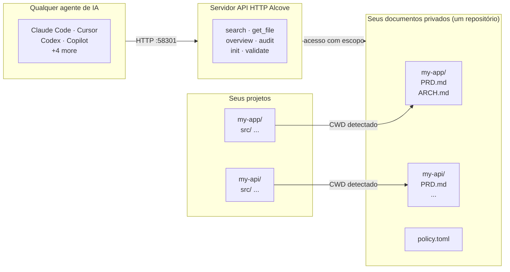

<p align="center">
  
</p>

<p align="center"><strong>Seu agente de IA não conhece seu projeto. O Alcove resolve.</strong></p>

<p align="center">
  <a href="../README.md">English</a> ·
  <a href="README.ko.md">한국어</a> ·
  <a href="README.ja.md">日本語</a> ·
  <a href="README.zh-CN.md">简体中文</a> ·
  <a href="README.es.md">Español</a> ·
  <a href="README.hi.md">हिन्दी</a> ·
  <a href="README.pt-BR.md">Português</a> ·
  <a href="README.de.md">Deutsch</a> ·
  <a href="README.fr.md">Français</a> ·
  <a href="README.ru.md">Русский</a>
</p>

<p align="center">
  <a href="https://glama.ai/mcp/servers/epicsagas/alcove"></a>
  <a href="https://crates.io/crates/alcove"></a>
  <a href="https://crates.io/crates/alcove"></a>
  <a href="../LICENSE"></a>
  <a href="https://buymeacoffee.com/epicsaga"></a>
</p>

O Alcove é um servidor de API HTTP que dá a agentes de codificação com IA acesso sob demanda à documentação privada do seu projeto — **busca híbrida BM25 + vetorial** para recuperação precisa, **indexação de código com tree-sitter** para que os agentes entendam a estrutura da sua base de código, e **aplicação de políticas** para consistência da documentação. Sem inchar o contexto, sem vazar documentos em repositórios públicos, sem configuração por projeto para cada agente.

Mantenha PRDs, decisões de arquitetura, mapas de segredos e runbooks internos em um só lugar. Todos os agentes recebem as mesmas ferramentas, em todos os projetos, sem configuração por projeto.

## Demonstração


> *Claude, Codex — busca · troca de projeto · busca global · validar e gerar. Uma única configuração.*

<details>
<summary>Demo CLI</summary>


> *`alcove search` · troca de projeto · `--scope global` · `alcove validate`*

</details>

## O problema

Seu agente de IA começa cada sessão do zero.

Ele não conhece sua arquitetura. Ignora restrições de decisões que você já tomou. Pede para você explicar as mesmas coisas em cada sessão.

A janela de contexto é o gargalo. Cada token custa dinheiro e atenção. Carregar 10 documentos de arquitetura no contexto desperdiça mais de 50K tokens em cada execução — e a própria documentação da Anthropic alerta que arquivos de configuração inchados fazem os agentes *ignorarem suas instruções reais*.

Então você tem três opções ruins:

**Enfiar tudo na configuração do agente** — cada arquivo é carregado no contexto em cada execução. 10 documentos = inchaço de contexto = respostas mais lentas, caras e imprecisas.

**Copiar e colar em cada chat** — funciona uma vez, não escala além de uma sessão.

**Não se preocupe** — seu agente inventa requisitos que você já documentou, ignora restrições de decisões que você já tomou, e você reexplica a mesma arquitetura toda segunda de manhã.

Multiplique por 5 projetos e 3 agentes. Toda vez que você troca, perde o contexto.

## Como o Alcove resolve isso

O Alcove mantém todos os seus documentos privados em **um único repositório compartilhado**, organizado por projeto. Todos os agentes os acessam da mesma forma via API HTTP — seja no Claude Code, Cursor, Antigravity ou Codex.

```
~/projects/my-app $ claude "/alcove como a autenticação é implementada?"

  → Alcove detecta o projeto: my-app
  → Lê ~/documents/my-app/ARCHITECTURE.md
  → Agente responde com o contexto real do projeto
```

```
~/projects/my-api $ codex "/alcove revise o design da API"

  → Alcove detecta o projeto: my-api
  → Mesma estrutura de documentos, mesmo padrão de acesso
  → Projeto diferente, mesmo fluxo de trabalho
```

**Troque de agente a qualquer momento. Troque de projeto a qualquer momento. A camada de documentos permanece padronizada.**

## O que ele faz

- **Um repositório de documentos, vários projetos** — documentos privados organizados por projeto, gerenciados em um único lugar
- **Uma configuração, qualquer agente** — configure uma vez, todo agente de IA recebe o mesmo acesso
- **Detecta automaticamente seu projeto** a partir do CWD — sem necessidade de configuração por projeto
- **Acesso com escopo** — cada projeto vê apenas seus próprios documentos
- **Busca inteligente** — busca BM25 com ranking e indexação automática; encontra os documentos mais relevantes primeiro, recorre ao grep quando necessário
- **Busca entre projetos** — busque em todos os projetos de uma vez com `scope: "global"` — use como base de conhecimento pessoal
- **Documentos privados permanecem privados** — documentos sensíveis (mapa de segredos, decisões internas, dívida técnica) nunca tocam seu repositório público
- **Estrutura de documentos padronizada** — `policy.toml` garante documentos consistentes em todos os projetos e equipes
- **Auditoria entre repositórios** — encontra documentos internos mal posicionados no repositório do projeto, sugere correções
- **Validação de documentos** — verifica arquivos ausentes, templates não preenchidos, seções obrigatórias
- **Lint semântico** — detecta wikilinks quebrados, arquivos órfãos, marcadores WIP/DRAFT obsoletos e referências de datas com mais de 2 anos
- **Importação de vault externo** — traz uma nota do Obsidian (ou qualquer vault) para o doc-repo com um único comando; roteamento automático para o projeto correto
- **Funciona com mais de 9 agentes** — Claude Code, Cursor, Claude Desktop, Cline, OpenCode, Codex, Copilot, Antigravity

## Por que Alcove

| Sem Alcove | Com Alcove |
|------------|------------|
| Documentos internos espalhados entre Notion, Google Docs, arquivos locais | Um repositório de documentos, estruturado por projeto |
| Cada agente de IA configurado separadamente para acesso a documentos | Uma configuração, todos os agentes compartilham o mesmo acesso |
| Trocar de projeto significa perder o contexto dos documentos | Detecção automática por CWD, troca instantânea de projeto |
| Buscas do agente retornam linhas aleatórias | Busca híbrida (BM25 + RAG) — os agentes extraem apenas o que precisam, ordenado por relevância |
| O agente só vê documentos de texto, não a estrutura do código | Indexação de código com tree-sitter — os agentes entendem módulos, funções e tipos em 12 linguagens |
| "Buscar todas as minhas notas sobre autenticação" — impossível | Busca global em todos os projetos em uma única consulta |
| Documentos sensíveis com risco de vazar em repositórios públicos | Documentos privados fisicamente separados dos repositórios de projeto |
| Estrutura de documentos varia por projeto e membro da equipe | `policy.toml` garante padrões em todos os projetos |
| Sem como verificar se os documentos estão completos | `validate` detecta arquivos ausentes, templates vazios, seções faltando |
| Links quebrados ou marcadores WIP passam despercebidos | `lint` detecta automaticamente links quebrados, órfãos e marcadores obsoletos |
| Notas do Obsidian ou outras ferramentas ficam isoladas | `promote` integra notas externas ao doc-repo com um único comando |

## Início rápido

> **Obrigatório**: Execute `alcove setup` uma vez após a instalação para configurar o diretório de documentos e ativar todas as funcionalidades. Os plugins iniciam o servidor API automaticamente, mas o Alcove não pode pesquisar ou indexar documentos até que `setup` seja executado.
>
> **Usa Obsidian?** Veja a seção [Ecossistema](#ecosystem) para a estrutura de documentos recomendada e configuração de cofres.

### Claude Code

```
/plugin marketplace add epicsagas/plugins
/plugin install alcove@epicsagas
```

Instala automaticamente o binário e inicia o servidor API na próxima inicialização de sessão.

> **Obrigatório**: Execute `alcove setup` uma vez após a instalação para configurar sua raiz de documentos e habilitar a funcionalidade completa. O plugin inicia o servidor API automaticamente, mas o Alcove não pode pesquisar ou indexar documentos até que o `setup` tenha sido executado.

```bash
alcove setup   # execute uma vez após a instalação do plugin
```

Atualizações com `claude plugin update epicsagas/alcove`.

### Codex CLI

```bash
codex plugin marketplace add epicsagas/plugins
```

Instala automaticamente a skill e inicia o servidor API. As skills estão disponíveis imediatamente — nenhum passo adicional necessário.

Atualizações com `codex plugin update alcove@epicsagas`.

### macOS (somente Apple Silicon)

```bash
brew install epicsagas/tap/alcove
```

Não tem Homebrew? Use o script de instalação:

```bash
curl --proto '=https' --tlsv1.2 -LsSf \
  https://github.com/epicsagas/alcove/releases/latest/download/alcove-installer.sh | sh
```

### Linux (x86_64 / ARM64)

```bash
curl --proto '=https' --tlsv1.2 -LsSf \
  https://github.com/epicsagas/alcove/releases/latest/download/install.sh | sh
```

### Windows (x86_64 / ARM64)

```powershell
irm https://github.com/epicsagas/alcove/releases/latest/download/install.ps1 | iex
```

### Antigravity (Gemini CLI)

```bash
agy plugins install https://github.com/epicsagas/alcove
```

Instala automaticamente o plugin (servidor API, skill, hooks) e o inicia no próximo início de sessão.

```bash
alcove setup   # run once after plugin install
```

### Via cadeia de ferramentas Rust

```bash
cargo binstall alcove   # binário pré-compilado, inclui busca híbrida
cargo install alcove --features full-macos   # compilar do fonte (macOS)
cargo install alcove --features full-cross   # compilar do fonte (Linux/Windows)
```

> **Nota**: `cargo binstall` baixa um binário pré-compilado com busca híbrida (vetorial + BM25). Ao compilar do fonte, `--features full-macos` ou `--features full-cross` é necessário para busca híbrida. Sem features, apenas busca BM25 (por palavras-chave) está disponível.

### Configuração inicial (obrigatória)

Após instalar por qualquer método acima, execute:

```bash
alcove setup
alcove --version
alcove doctor
```

`setup` guia você por tudo interativamente:

1. Onde seus documentos ficam
2. Quais categorias de documentos rastrear
3. Formato de diagrama preferido
4. Modelo de embeddings para busca híbrida
5. **Servidor em segundo plano** — eliminar o cold-start em cada sessão (item de login do macOS)
6. Quais agentes de IA configurar (arquivos de habilidades — Claude Code e Codex são gerenciados por seus sistemas de plugins)

Execute `alcove setup` novamente a qualquer momento para alterar as configurações. Ele lembra das suas escolhas anteriores.

**Dependências opcionais**

| Ferramenta | Finalidade | Instalação |
|---|---|---|
| `pdftotext` (poppler) | Extração completa de texto PDF — necessária para busca em PDF | macOS: `brew install poppler` · Debian/Ubuntu: `apt install poppler-utils` · Fedora: `dnf install poppler-utils` · Windows: [poppler for Windows](https://github.com/oschwartz10612/poppler-windows/releases) |

Sem `pdftotext`, o Alcove recorre a um parser PDF integrado que pode falhar em alguns arquivos. Execute `alcove doctor` para verificar sua instalação.

### Solução de problemas

**O agente não encontra as ferramentas do Alcove**
Execute `alcove setup` novamente — ele reconfigura o servidor API para todos os agentes configurados. Depois inicie uma nova sessão do agente (as mudanças entram em vigor no próximo início de sessão).

**A busca não retorna resultados**
O índice pode ainda não ter sido construído. Execute `alcove index` para construí-lo e tente novamente.

**403 Unauthorized do servidor em segundo plano**
`ALCOVE_TOKEN` não está definido no seu shell. Execute `alcove token` para exibi-lo, adicione `export ALCOVE_TOKEN="..."` ao seu perfil de shell e recarregue.

**`alcove doctor` relata problemas**
Siga as sugestões exibidas por `doctor` — ele verifica a localização do binário, estado do servidor API, estado do índice e dependências opcionais como `pdftotext`.

## Uso

### Busca via CLI

Busque em seus documentos diretamente pelo terminal. Por padrão, ele busca em **todos os projetos** (escopo global).

```bash
# Busca básica (escopo global)
alcove search "authentication"

# Limitar a busca ao projeto atual (detectado automaticamente via CWD)
alcove search "auth flow" --scope project

# Forçar modo grep (correspondência exata de substring)
alcove search "TODO" --mode grep

# Forçar modo ranqueado (BM25/Híbrido)
alcove search "data model" --mode ranked

# Ajustar limite de resultados
alcove search "deployment" --limit 5
```

### Agentes de Codificação (API HTTP)

Os agentes de codificação de IA usam o Alcove por meio de uma **API HTTP local** na porta 58301. As skills chamam `curl http://localhost:58301/...` internamente. Geralmente, você não precisa chamá-las manualmente; o agente as invocará quando você fizer perguntas sobre seu projeto.

| Endpoint | Método | Descrição |
|----------|--------|-----------|
| `/health` | GET | Health check |
| `/search?q=...` | GET | Buscar documentação |
| `/v1/search` | POST | Buscar com corpo JSON |
| `/projects` | GET | Listar todos os projetos |
| `/projects` | POST | Inicializar um novo projeto |
| `/projects/{name}/docs` | GET | Listar documentos de um projeto |
| `/projects/{name}/audit` | GET | Auditar integridade dos documentos |
| `/projects/{name}/validate` | GET | Validar documentos contra a política |
| `/projects/{name}/config` | PUT | Atualizar configurações do projeto |
| `/docs/{path}` | GET | Ler um arquivo de documento |
| `/rebuild` | POST | Reconstruir índice de busca |
| `/changes` | GET | Verificar arquivos alterados |
| `/lint` | GET | Lint nos documentos |
| `/vaults` | GET | Listar vaults |
| `/vaults/search?q=...` | GET | Buscar nos vaults |
| `/vaults/backup` | POST | Backup do vault |
| `/promote` | POST | Importar arquivo para o doc-repo |
| `/index-code` | POST | Indexar estrutura de código |
| `/mcp` | POST | Proxy JSON-RPC (MCP legado) |

> **Nota**: MCP continua disponível para configuração manual — consulte `registry/mcp.json` para acesso via stdio.

**Exemplo de interação com o agente:**
> **Usuário:** "/alcove Como adiciono um novo endpoint de API?"
> **Agente:** (chama `POST /v1/search` com `query="add api endpoint"`)
> **Agente:** (lê o documento mais relevante via `GET /docs/{path}?project=...`)
> **Agente:** "De acordo com o `ARCHITECTURE.md`, você precisa..."

---

## Como funciona



Seus documentos são organizados em um diretório separado (`DOCS_ROOT`), uma pasta por projeto. O Alcove gerencia os documentos e os serve para qualquer agente de IA via HTTP na porta 58301.

## Classificação de documentos

O Alcove classifica documentos nos seguintes níveis:

| Classificação | Onde fica | Exemplos |
|---------------|-----------|----------|
| **doc-repo-required** | Alcove (privado) | PRD, Arquitetura, Decisões, Convenções |
| **doc-repo-supplementary** | Alcove (privado) | Implantação, Integração, Testes, Runbook |
| **reference** | Alcove pasta `reports/` | Relatórios de auditoria, benchmarks, análises |
| **project-repo** | Seu repositório GitHub (público) | README, CHANGELOG, CONTRIBUTING |

A ferramenta `audit` escaneia o repositório de documentos e o diretório local do projeto, e sugere ações — como gerar um README público a partir do seu PRD privado, ou mover relatórios mal posicionados de volta para o alcove.

## Endpoints de API

| Endpoint | Método | O que faz |
|----------|--------|-----------|
| `/health` | GET | Health check |
| `/search?q=...` | GET | Buscar documentação |
| `/v1/search` | POST | Buscar com corpo JSON |
| `/projects` | GET | Listar todos os projetos |
| `/projects` | POST | Inicializar um novo projeto |
| `/projects/{name}/docs` | GET | Listar documentos de um projeto |
| `/projects/{name}/audit` | GET | Auditar integridade dos documentos |
| `/projects/{name}/validate` | GET | Validar documentos contra a política |
| `/projects/{name}/config` | PUT | Atualizar configurações do projeto |
| `/docs/{path}` | GET | Ler um arquivo de documento |
| `/rebuild` | POST | Reconstruir índice de busca |
| `/changes` | GET | Verificar arquivos alterados |
| `/lint` | GET | Lint nos documentos |
| `/vaults` | GET | Listar vaults |
| `/vaults/search?q=...` | GET | Buscar nos vaults |
| `/vaults/backup` | POST | Backup do vault |
| `/promote` | POST | Importar arquivo para o doc-repo |
| `/index-code` | POST | Indexar estrutura de código |
| `/mcp` | POST | Proxy JSON-RPC (MCP legado) |

> **Nota**: MCP continua disponível para configuração manual — consulte `registry/mcp.json` para acesso via stdio.

## CLI

```
alcove              Inicia o servidor MCP (agentes chamam isso)
alcove setup        Configuração interativa — execute novamente a qualquer momento para reconfigurar
alcove doctor       Verificar a integridade da instalação do Alcove
alcove validate     Valida documentos contra a política (--format json, --exit-code)
alcove lint         Lint semântico — links quebrados, órfãos, marcadores obsoletos (--format json)
alcove promote      Importar notas de um vault externo para o doc-repo
alcove index        Atualizar o índice de busca (incremental — apenas arquivos alterados)
alcove rebuild      Reconstruir o índice de busca do zero (usar após mudanças de esquema)
alcove search       Busca documentos pelo terminal
alcove bench        Benchmark de qualidade de busca [--corpus] (precisão, latência, detecção de regressão)
alcove index-code   Gera índice de estrutura de código do fonte [--language LANG] [--source PATH]
alcove token        Exibir o bearer token (para autenticação do servidor em segundo plano)
alcove uninstall    Remove habilidades, configuração e arquivos legados

alcove mcp <CMD>      Gerencie o ciclo de vida do servidor MCP em segundo plano (start, stop, status, enable, disable)

alcove vault link     Vincular um diretório externo como um vault (ex: Obsidian)
alcove vault list     Listar todos os vaults com contagem de documentos
alcove vault index    Construir o índice de busca para os vaults
```

### Indexação de código

Analisa arquivos fonte com tree-sitter e gera `CODE_INDEX.md`—um resumo Markdown em nível de módulo da sua base de código, integrado ao pipeline de busca Tantivy.

```bash
# Indexar o projeto atual (detecta todos os idiomas automaticamente)
alcove index-code --source ./src

# Monorepo: indexar um diretório com múltiplas linguagens de uma vez
alcove index-code --source ./

# Restringir a uma única linguagem
alcove index-code --source ./src --language typescript
alcove index-code --source ./src --language rust
```

**Linguagens suportadas:**

| Linguagem | Feature flag | Extensões de arquivo |
|-----------|-------------|---------------------|
| Rust | `lang-rust` | `.rs` |
| Python | `lang-python` | `.py`, `.pyi` |
| TypeScript | `lang-typescript` | `.ts`, `.tsx` |
| JavaScript | `lang-javascript` | `.js`, `.jsx`, `.mjs` |
| Go | `lang-go` | `.go` |
| Java | `lang-java` | `.java` |
| Kotlin | `lang-kotlin` | `.kt`, `.kts` |
| C | `lang-c` | `.c`, `.h` |
| C++ | `lang-cpp` | `.cpp`, `.cc`, `.cxx`, `.hpp`, `.hxx`, `.h` |
| Swift | `lang-swift` | `.swift` |
| Ruby | `lang-ruby` | `.rb` |
| C# | `lang-csharp` | `.cs` |

Os binários oficiais habilitam todos os 12 parsers (`lang-all`). Sem `--language`, **todas as extensões reconhecidas são indexadas automaticamente**—seguro para monorepos.

`--language` aceita abreviações: `ts` → TypeScript, `cpp` → C++, `csharp` → C#, `py` → Python, `js` → JavaScript, `kt` → Kotlin, `rb` → Ruby.

### Lint

```bash
# Lint do projeto atual (detectado automaticamente pelo CWD)
alcove lint

# Especificar projeto
alcove lint --project my-app

# Saída legível por máquina para CI
alcove lint --format json
```

O lint verifica quatro coisas:

| Verificação | O que detecta |
|-------------|--------------|
| `broken-link` | `[[wikilinks]]` ou `[texto](caminho)` apontando para arquivos inexistentes |
| `orphan` | Arquivos para os quais nenhum outro documento aponta |
| `stale-marker` | Marcadores WIP / TODO / FIXME / DRAFT / DEPRECATED |
| `stale-date` | Referências de data com mais de 2 anos (ex.: "as of 2022") |

### Promote

```bash
# Copiar uma nota do Obsidian para o doc-repo (roteamento automático)
alcove promote ~/my-brain/Projects/auth-notes.md

# Rotear para um projeto específico
alcove promote ~/my-brain/Projects/auth-notes.md --project my-app

# Mover em vez de copiar
alcove promote ~/my-brain/Projects/auth-notes.md --mv
```

Arquivos sem projeto correspondente são salvos em `inbox/` para revisão manual.

### Benchmark

**Modo de corpus isolado** (`--corpus`) usa um conjunto de dados de teste autônomo (19 documentos sintéticos, 25 consultas) para benchmarks de CI rápidos e reprodutíveis — sem necessidade de documentos reais, conclui em menos de 60 segundos.

```bash
# Executar com o corpus de avaliação integrado (recomendado para CI)
alcove bench --corpus --baseline benches/corpus/baseline.json

# Atualizar o baseline do corpus após mudanças intencionais
alcove bench --corpus --save-baseline benches/corpus/baseline.json

# Executar com seus documentos reais (50 consultas em 10 categorias)
alcove bench --metrics precision

# Salvar como baseline para comparação futura
alcove bench --output json --save-baseline benches/baseline.json

# Comparar com baseline — detectar regressões no CI
alcove bench --baseline benches/baseline.json

# Relatório Markdown
alcove bench --output markdown --output-file bench-report.md
```

| Métrica | O que mede |
|---------|------------|
| Precision@K | Fração dos resultados top-K que são relevantes |
| Recall@K | Fração dos documentos relevantes encontrados no top-K |
| NDCG@K | Qualidade do ranking com desconto por posição |
| MAP@K | Precisão média entre todas as consultas |
| MRR | Rank recíproco do primeiro resultado relevante |
| Precisão de chunks | Se os chunks recuperados estão nas seções corretas |

**Limites de regressão**: precisão >5%, latência >20%, throughput >15%. Alerta na metade do limite.

## Servidor em Segundo Plano

Executar um servidor persistente em segundo plano elimina a latência de inicialização a frio em cada nova sessão do agente. **`alcove setup` ativa isso por padrão** (item de login no macOS).

```bash
alcove mcp enable --now     # Ativar e iniciar (persiste após reinicializações)
alcove mcp stop / start / restart / status
alcove mcp disable          # Desativar e remover item de login
```

Quando o servidor em segundo plano está em execução, o processo stdio atua como um proxy leve — em vez de carregar o motor de busca a cada sessão, ele encaminha as requisições para o servidor ativo. Na inicialização, o processo stdio verifica `GET /health` e entra automaticamente no modo proxy.

## Busca

O Alcove seleciona automaticamente a melhor estratégia de busca. Quando o índice de busca existe, usa **busca BM25 com ranking** (baseada em [tantivy](https://github.com/quickwit-oss/tantivy)) para resultados ordenados por relevância. Quando não existe, recorre ao grep. Você nunca precisa pensar nisso.

### Busca Híbrida (RAG)

O Alcove suporta **Busca Híbrida** que combina BM25 com **Busca de Similaridade Vetorial** (baseada em [fastembed](https://github.com/ankane/fastembed-rs)).

Durante `alcove setup`, você pode escolher um modelo de embeddings e baixá-lo imediatamente. Você também pode gerenciar modelos manualmente:

```bash
# Definir e baixar um modelo de embeddings
alcove model set MultilingualE5Small
alcove model download

# Verificar status do modelo
alcove model status
```

#### Escolha do modelo

| Modelo | Disco | Dim | Contexto | Idiomas | Recomendado para | RAM de pico |
|--------|-------|-----|----------|---------|-------------------|-------------|
| **`ArcticEmbedXS`** (padrão) | **90 MB** | **384** | **512** | **Multilíngue** | **Padrão — melhor custo-benefício** | **~400 MB** |
| `ArcticEmbedXSQ` | 90 MB | 384 | 512 | Multilíngue | Quantizado, download menor | ~400 MB |
| `MultilingualE5Small` | 470 MB | 384 | 512 | 100+ idiomas | Melhor suporte coreano/CJK | ~1.2 GB |
| `BGEM3` | 600 MB | 1024 | 8192 | 100+ idiomas | Premium — Dense+Sparse+ColBERT | ~2 GB |
| `ArcticEmbedMLong` | 430 MB | 768 | 8192 | Multilíngue | Documentos longos | ~1.5 GB |
| `JinaEmbeddingsV2BaseCode` | 550 MB | 768 | 8192 | Código+inglês | Otimizado para código | ~1.5 GB |

O modelo padrão é **ArcticEmbedXS** (90 MB, multilíngue). Oferece o melhor equilíbrio entre tamanho e qualidade para a maioria dos projetos.

Os modelos de embedding são baseados no [fastembed-rs](https://github.com/Anush008/fastembed-rs) (ONNX Runtime) e rodam inteiramente local. Para usar outro modelo, configure em `config.toml`:

```toml
[embedding]
model = "BGEM3"    # nome Variable da documentação de modelos
```

A lista completa de 40+ modelos suportados (dimensões, comprimento de contexto, idiomas) está em **[EMBEDDING_MODELS.md](../docs/EMBEDDING_MODELS.md)**.

Uma vez que um modelo está baixado e pronto, o Alcove usará automaticamente Busca Híbrida tanto para busca via CLI quanto para ferramentas MCP baseadas em agentes. Isso é particularmente eficaz para projetos multilíngues e consultas semânticas complexas.

```bash
# Buscar no projeto atual (auto-detectado pelo CWD)
alcove search "authentication flow"

# Buscar em TODOS os projetos — sua base de conhecimento pessoal
alcove search "OAuth token refresh" --scope global

# Forçar modo grep se precisar de correspondência exata de substrings
alcove search "FR-023" --mode grep
```

O índice é construído automaticamente em segundo plano quando o servidor MCP inicia, e reconstruído quando detecta mudanças nos arquivos. Sem cron jobs, sem etapas manuais.

**Como funciona para agentes:** agentes simplesmente chamam `search_project_docs` com uma consulta. O Alcove cuida do resto — ranking, deduplicação (um resultado por arquivo), busca entre projetos e fallback. O agente nunca precisa escolher um modo de busca.

**Memória durante rebuild:**
A RAM de pico varia por modelo — consulte a coluna "RAM de pico" na tabela acima. Modelos grandes (BGEM3, ArcticEmbedMLong) podem usar 1.5-2 GB durante rebuild. Após o rebuild, o estado estacionário cai para ~50-200 MB dependendo da sua configuração `[memory]`. Você pode reduzir ainda mais com `max_hnsw_cache` mais baixo e `model_unload_secs` mais curto.

## Detecção de projeto

Por padrão, o Alcove detecta o projeto atual a partir do diretório de trabalho do seu terminal (CWD). Você pode sobrescrever com a variável de ambiente `MCP_PROJECT_NAME`:

```bash
MCP_PROJECT_NAME=my-api alcove
```

Útil quando seu CWD não corresponde a um nome de projeto no seu repositório de documentos.

## Política de documentos

Defina padrões de documentação para toda a equipe com `policy.toml` no seu repositório de documentos:

```toml
[policy]
enforce = "strict"    # strict | warn

[[policy.required]]
name = "PRD.md"
aliases = ["prd.md", "product-requirements.md"]

[[policy.required]]
name = "ARCHITECTURE.md"

  [[policy.required.sections]]
  heading = "## Overview"
  required = true

  [[policy.required.sections]]
  heading = "## Components"
  required = true
  min_items = 2
```

Arquivos de política são resolvidos com prioridade: **projeto** (`<project>/.alcove/policy.toml`) > **equipe** (`DOCS_ROOT/.alcove/policy.toml`) > **padrão integrado** (lista de arquivos core do config.toml). Isso garante qualidade consistente dos documentos em todos os seus projetos, permitindo substituições por projeto.

## Configuração

A configuração fica em `~/.config/alcove/config.toml`:

```toml
docs_root = "/Users/you/documents"

[core]
files = ["PRD.md", "ARCHITECTURE.md", "PROGRESS.md", "DECISIONS.md", "CONVENTIONS.md", "SECRETS_MAP.md", "DEBT.md"]

[team]
files = ["ENV_SETUP.md", "ONBOARDING.md", "DEPLOYMENT.md", "TESTING.md", ...]

[public]
files = ["README.md", "CHANGELOG.md", "CONTRIBUTING.md", "SECURITY.md", ...]

[diagram]
format = "mermaid"
```

Tudo isso é configurado interativamente via `alcove setup`. Você também pode editar o arquivo diretamente.

## Agentes suportados

| Agente | MCP | Habilidade |
|--------|-----|------------|
| Claude Code | `~/.claude.json` | `~/.claude/skills/alcove/` |
| Cursor | `~/.cursor/mcp.json` | `~/.cursor/skills/alcove/` |
| Claude Desktop | configuração da plataforma | — |
| Cline (VS Code) | VS Code globalStorage | `~/.cline/skills/alcove/` |
| OpenCode | `~/.config/opencode/opencode.json` | `~/.opencode/skills/alcove/` |
| Codex CLI | `~/.codex/config.toml` | `~/.codex/skills/alcove/` |
| Copilot CLI | `~/.copilot/mcp-config.json` | `~/.copilot/skills/alcove/` |
| Antigravity | `agy plugins install` | — |

## Idiomas suportados

O CLI detecta automaticamente o locale do seu sistema. Você também pode substituí-lo com a variável de ambiente `ALCOVE_LANG`.

| Idioma | Código |
|--------|--------|
| English | `en` |
| 한국어 | `ko` |
| 简体中文 | `zh-CN` |
| 日本語 | `ja` |
| Español | `es` |
| हिन्दी | `hi` |
| Português (Brasil) | `pt-BR` |
| Deutsch | `de` |
| Français | `fr` |
| Русский | `ru` |

```bash
# Substituir idioma
ALCOVE_LANG=pt-BR alcove setup
```

## Atualizar

| Método | Comando |
|--------|---------|
| Homebrew | `brew upgrade alcove` |
| curl installer | Execute novamente o script de instalação acima |
| cargo binstall | `cargo binstall alcove@latest` |
| cargo install | `cargo install alcove@latest --features full-macos` |
| Claude Code Plugin | `claude plugin update epicsagas/alcove` |

```bash
alcove --version
```

## Desinstalar

```bash
alcove uninstall          # remove habilidades e configuração
cargo uninstall alcove    # remove o binário
```

## Vaults de Base de Conhecimento

Além da documentação do projeto, o Alcove suporta **vaults de base de conhecimento independentes** para notas de pesquisa, materiais de referência e conhecimento curado que LLMs podem buscar.

```bash
# Criar um vault para notas de pesquisa de IA
alcove vault create ai-research

# Vincular um vault Obsidian existente (sem cópia — indexa no local)
alcove vault link meu-obsidian ~/Obsidian/research

# Adicionar um documento
alcove vault add ai-research ~/Downloads/transformer-survey.md

# Construir o índice de busca do vault
alcove vault index

# Listar todos os vaults
alcove vault list
#   areas (8 docs) → (linked)
#   resources (71 docs) → (linked)
#   zettelkasten (17 docs) → (linked)

# Buscar pelo CLI
alcove search "attention mechanism" --vault ai-research

# Agentes buscam via MCP
search_vault(query="attention mechanism", vault="ai-research")

# Buscar em TODOS os vaults de uma vez
search_vault(query="transformer", vault="*")
```

Os vaults são **completamente isolados** dos docs do projeto — índices separados, caches separados, busca separada. A busca de documentos de projeto do seu agente de codificação nunca é afetada pela atividade do vault.

| Funcionalidade | Documentos do projeto | Vaults |
|---------|-------------|--------|
| Propósito | Documentação por projeto | Base de conhecimento geral |
| Armazenamento | `~/.alcove/docs/` | `~/.alcove/vaults/` |
| Índice | Índice de projeto compartilhado | Índice independente por vault |
| Cache | `PROJECT_READER_CACHE` | `VAULT_READER_CACHE` |
| Busca | `search_project_docs` | `search_vault` |
| Symlink | Não | Sim (vincular diretórios externos) |

### Configuração de Vault

Por padrão, os vaults são armazenados em `~/.alcove/vaults/`. Você pode alterar isso no seu `config.toml`:

```toml
[vaults]
root = "/caminho/para/seus/vaults"
```

Consulte a seção de [Configuração](#configuração) para mais detalhes sobre o `config.toml`.

## Ecossistema

### [obsidian-forge](https://github.com/epicsagas/obsidian-forge)

O Alcove combina perfeitamente com o **obsidian-forge**, um gerador de cofres Obsidian e daemon de automação. Para a melhor integração, o seu **`docs_root`** do Alcove deve apontar para os arquivos de projeto do obsidian-forge.

**1. Definir a Raiz de Documentos**
Aponte seus documentos principais para o diretório de projetos do obsidian-forge (diretamente ou via link simbólico):
```bash
# Durante a configuração do alcove, defina docs_root como:
~/Obsidian/SecondBrain/99-Archives/projects
```

**2. Vincular Áreas de Conhecimento como Vaults**
Vincule as outras três categorias do obsidian-forge como vaults independentes do Alcove. Isso cria links simbólicos em `~/.alcove/vaults/`:
```bash
# Vincular categorias do obsidian-forge
alcove vault link areas ~/Obsidian/SecondBrain/02-Areas
alcove vault link resources ~/Obsidian/SecondBrain/03-Resources
alcove vault link zettelkasten ~/Obsidian/SecondBrain/10-Zettelkasten
```

Agora seus agentes têm acesso estruturado:
- **`search_project_docs`**: Busca conhecimento de projetos arquivados (PRDs, etc.)
- **`search_vault`**: Busca em suas áreas de conhecimento mais amplas e notas de pesquisa.

Você pode verificar o mapeamento do armazenamento físico verificando os links simbólicos em `~/.alcove/vaults/`.

## FAQ

### Por que não usar apenas o ripgrep como ferramenta MCP?

O ripgrep retorna arquivos inteiros. Se o seu agente busca por "auth" e encontra 5 arquivos com uma média de 200 linhas cada, isso injeta cerca de 10K tokens no contexto — a maior parte irrelevante. O Alcove fragmenta os documentos, classifica os trechos e retorna apenas as passagens mais relevantes. Ele também oferece busca semântica (embeddings vetoriais) que o ripgrep não consegue — uma consulta como "como o pipeline de deploy é estruturado" não vai corresponder a nenhuma palavra-chave no seu DEPLOYMENT.md, mas a busca vetorial do Alcove vai encontrar.

### Isso substitui o CLAUDE.md / AGENTS.md?

Não — eles servem a propósitos diferentes. Arquivos de configuração do agente (CLAUDE.md, AGENTS.md) definem **regras comportamentais**: estilo de commit, preferências de idioma, restrições de segurança. O Alcove gerencia o **conhecimento institucional**: decisões de arquitetura, acompanhamento de progresso, convenções de codificação, estrutura do código. A configuração do agente serve para *como o agente deve agir*. O Alcove serve para *o que o agente deve saber*.

### Por que Rust?

Binário único, sem dependência de runtime. O Tantivy é o melhor BM25 da categoria. O fastembed (ONNX Runtime) nos oferece embeddings vetoriais locais sem Python. Um `cargo install` ou curl — sem Docker, sem Node.js, sem virtualenv.

### E as janelas de contexto cada vez maiores?

Janelas maiores não resolvem o problema de relevância. Mesmo uma janela de 200K tokens preenchida com documentos irrelevantes degrada a qualidade da saída do agente — a própria documentação da Anthropic alerta que arquivos de configuração inchados fazem os agentes ignorarem as instruções reais. O objetivo não é mais contexto, é o contexto certo no momento certo.

## Roteiro

- **Acesso remoto multi-usuário** — API REST para compartilhamento de documentos da equipe via LAN/VPN (autenticação por bearer token, limitação de taxa já implementada). Necessário: API de escrita, coordenação de índice concorrente, gerenciamento do ciclo de vida do projeto.

## Contribuindo

Relatórios de bugs, solicitações de funcionalidades e pull requests são bem-vindos. Abra um issue no [GitHub](https://github.com/epicsagas/alcove/issues) para iniciar uma discussão.

## Licença

Apache-2.0
