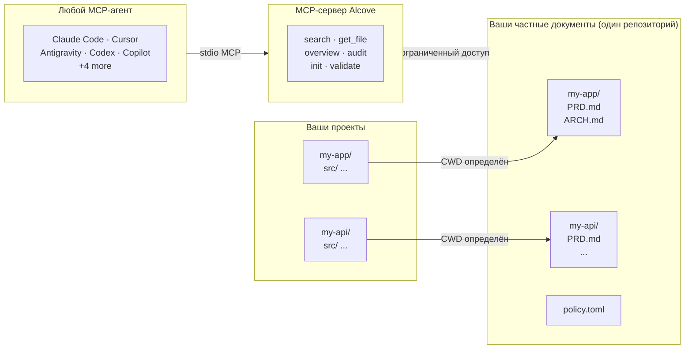

<p align="center">
  
</p>

<p align="center"><strong>Ваш ИИ-агент не знает ваш проект. Alcove это исправляет.</strong></p>

<p align="center">
  <a href="../README.md">English</a> ·
  <a href="README.ko.md">한국어</a> ·
  <a href="README.ja.md">日本語</a> ·
  <a href="README.zh-CN.md">简体中文</a> ·
  <a href="README.es.md">Español</a> ·
  <a href="README.hi.md">हिन्दी</a> ·
  <a href="README.pt-BR.md">Português</a> ·
  <a href="README.de.md">Deutsch</a> ·
  <a href="README.fr.md">Français</a> ·
  <a href="README.ru.md">Русский</a>
</p>

<p align="center">
  <a href="https://glama.ai/mcp/servers/epicsagas/alcove"></a>
  <a href="https://crates.io/crates/alcove"></a>
  <a href="https://crates.io/crates/alcove"></a>
  <a href="../LICENSE"></a>
  <a href="https://buymeacoffee.com/epicsaga"></a>
</p>

Alcove позволяет любому ИИ-агенту для кодирования читать и управлять документацией вашего частного проекта — без утечки в публичные репозитории.

Храните PRD, архитектурные решения, карты секретов и внутренние руководства в одном месте. Каждый MCP-совместимый агент получает одинаковые инструменты, во всех проектах, без настройки для каждого проекта.

## Проблема

Ваш ИИ-агент начинает каждую сессию с нуля.

Он не знает вашу архитектуру. Игнорирует ограничения из уже принятых вами решений. Просит объяснять одно и то же каждую сессию.

Контекстное окно — это узкое место. Каждый токен стоит денег и внимания. Загрузка 10 архитектурных документов в контекст тратит 50K+ токенов при каждом запуске — и собственная документация Anthropic предупреждает, что раздутые файлы конфигурации заставляют агентов *игнорировать ваши фактические инструкции*.

У вас есть три плохих варианта:

**Засунуть всё в конфиг агента** — каждый файл загружается в контекст при каждом запуске. 10 документов = раздутый контекст = медленные, дорогие, менее точные ответы.

**Копировать-вставлять в каждый чат** — работает один раз, не масштабируется за пределы одной сессии.

**Забить** — агент выдумывает требования, которые вы уже задокументировали, игнорирует ограничения из уже принятых решений, и вы повторно объясняете одну и ту же архитектуру каждый понедельник утром.

Умножьте на 5 проектов и 3 агента. При каждом переключении вы теряете контекст.

## Как Alcove решает эту проблему

Alcove хранит все ваши частные документы в **одном общем репозитории**, организованном по проектам. Любой MCP-совместимый агент обращается к ним одинаково — будь то Claude Code, Cursor, Antigravity или Codex.

```
~/projects/my-app $ claude "как реализована аутентификация?"

  → Alcove определяет проект: my-app
  → Читает ~/documents/my-app/ARCHITECTURE.md
  → Агент отвечает с реальным контекстом проекта
```

```
~/projects/my-api $ codex "проверь дизайн API"

  → Alcove определяет проект: my-api
  → Та же структура документов, тот же паттерн доступа
  → Другой проект, тот же рабочий процесс
```

**Меняйте агентов в любой момент. Меняйте проекты в любой момент. Документальный слой остаётся стандартизированным.**

## Основные возможности

- **Один репозиторий документов, несколько проектов** — частные документы организованы по проектам, управляются в одном месте
- **Одна настройка, любой агент** — настройте один раз, каждый MCP-совместимый агент получает одинаковый доступ
- **Автоопределение проекта** по CWD — без настройки для каждого проекта
- **Ограниченный доступ** — каждый проект видит только свои документы
- **Умный поиск** — BM25-ранжированный поиск с автоматической индексацией; находит наиболее релевантные документы первыми, при необходимости откатывается на grep
- **Кросс-проектный поиск** — ищите во всех проектах одновременно с `scope: "global"` — используйте как персональную базу знаний
- **Частные документы остаются частными** — конфиденциальные документы (карта секретов, внутренние решения, технический долг) никогда не попадают в публичный репозиторий
- **Стандартизированная структура документов** — `policy.toml` обеспечивает единообразие документов во всех проектах и командах
- **Кросс-репозиторный аудит** — находит неправильно размещённые внутренние документы в репозитории проекта, предлагает исправления
- **Валидация документов** — проверяет отсутствующие файлы, незаполненные шаблоны, обязательные разделы
- **Семантический линтинг** — автоматически обнаруживает сломанные вики-ссылки, файлы-сироты, устаревшие маркеры WIP/DRAFT и упоминания дат старше 2 лет
- **Импорт из внешнего хранилища** — перенесите заметку из Obsidian (или любого другого хранилища) в doc-repo одной командой; автоматическая маршрутизация в нужный проект
- **Работает с 9+ агентами** — Claude Code, Cursor, Claude Desktop, Cline, OpenCode, Codex, Copilot, Antigravity

## Почему Alcove

| Без Alcove | С Alcove |
|------------|----------|
| Внутренние документы разбросаны по Notion, Google Docs, локальным файлам | Один репозиторий документов, структурированный по проектам |
| Каждый ИИ-агент настраивается отдельно для доступа к документам | Одна настройка, все агенты разделяют одинаковый доступ |
| Смена проекта означает потерю документального контекста | Автоопределение по CWD, мгновенное переключение проекта |
| Поиск агента возвращает случайные совпадающие строки | BM25-ранжированный поиск — лучшие совпадения первыми, автоматическая индексация |
| "Найти все мои заметки об аутентификации" — невозможно | Глобальный поиск по всем проектам в одном запросе |
| Конфиденциальные документы рискуют утечь в публичные репозитории | Частные документы физически отделены от репозиториев проектов |
| Структура документов различается у каждого проекта и члена команды | `policy.toml` обеспечивает стандарты во всех проектах |
| Нет способа проверить, полны ли документы | `validate` обнаруживает отсутствующие файлы, пустые шаблоны, недостающие разделы |
| Устаревшие ссылки или маркеры WIP остаются незамеченными | `lint` автоматически обнаруживает сломанные ссылки, файлы-сироты и устаревшие маркеры |
| Заметки из Obsidian и других инструментов остаются изолированными | `promote` интегрирует внешние заметки в doc-repo одной командой |

## Быстрый старт

### Claude Code (рекомендуется)

```
/plugin marketplace add epicsagas/plugins
/plugin install alcove@epicsagas
```

Автоматически устанавливает бинарный файл и регистрирует MCP-сервер при следующем запуске сессии.

> **Обязательно**: Запустите `alcove setup` один раз после установки, чтобы настроить корень документов и включить полный функционал. Плагин автоматически инициализирует MCP-подключение, но Alcove не может искать или индексировать документы, пока не будет выполнен `setup`.

```bash
alcove setup   # запустить один раз после установки плагина
```

Обновления через `claude plugin update epicsagas/alcove`.

### Codex CLI

```bash
codex plugin marketplace add epicsagas/plugins
```

Навыки доступны сразу — дополнительные шаги не требуются.

### Antigravity

```bash
antigravity plugin marketplace add epicsagas/plugins
```

Навыки доступны сразу — дополнительные шаги не требуются.

> **Примечание**: Antigravity пока не поддерживает субагентов. MCP-сервер Alcove регистрируется в `~/.gemini/config/mcp_config.json`.

### macOS (только Apple Silicon)

```bash
brew install epicsagas/tap/alcove
```

Нет Homebrew? Используйте скрипт установки:

```bash
curl --proto '=https' --tlsv1.2 -LsSf \
  https://github.com/epicsagas/alcove/releases/latest/download/alcove-installer.sh | sh
```

> **Примечание**: Предварительно собранные бинарные файлы доступны только для macOS Apple Silicon. Пользователи Linux и Windows могут использовать однострочные установщики выше.

### Linux (x86_64 / ARM64)

```bash
curl --proto '=https' --tlsv1.2 -LsSf \
  https://github.com/epicsagas/alcove/releases/latest/download/install.sh | sh
```

### Windows (x86_64 / ARM64)

```powershell
irm https://github.com/epicsagas/alcove/releases/latest/download/install.ps1 | iex
```

### Через цепочку инструментов Rust

```bash
cargo binstall alcove   # готовый бинарник (быстро)
cargo install alcove    # сборка из исходного кода
```

Затем запустите setup:

```bash
alcove setup
alcove --version
alcove doctor
```

**Необязательные зависимости**

| Инструмент | Назначение | Установка |
|---|---|---|
| `pdftotext` (poppler) | Полное извлечение текста PDF — требуется для поиска по PDF | macOS: `brew install poppler` · Debian/Ubuntu: `apt install poppler-utils` · Fedora: `dnf install poppler-utils` · Windows: [poppler for Windows](https://github.com/oschwartz10612/poppler-windows/releases) |

Без `pdftotext` Alcove откатывается на встроенный PDF-парсер, который может не справиться с некоторыми файлами. Запустите `alcove doctor`, чтобы проверить установку.

> **Примечание**: Предварительно собранные бинарные файлы доступны для Linux (x86\_64), macOS (Apple Silicon и Intel) и Windows.

`setup` проведёт вас через всё интерактивно:

1. Где находятся ваши документы
2. Какие категории документов отслеживать
3. Предпочтительный формат диаграмм
4. Модель эмбеддингов для гибридного поиска
5. **Фоновый сервер** — устранить холодный старт при каждой сессии (элемент входа macOS)
6. Какие ИИ-агенты настроить (MCP + файлы навыков)

Перезапустите `alcove setup` в любое время для изменения настроек. Он запоминает ваши предыдущие выборы.

## Использование

### Поиск через CLI

Ищите по своим документам прямо из терминала. По умолчанию поиск ведется по **всем проектам** (глобальный охват).

```bash
# Базовый поиск (глобальный охват)
alcove search "authentication"

# Ограничить поиск текущим проектом (автоопределение через CWD)
alcove search "auth flow" --scope project

# Принудительный режим grep (точное совпадение подстроки)
alcove search "TODO" --mode grep

# Принудительный ранжированный режим (BM25/Гибридный)
alcove search "data model" --mode ranked

# Настроить лимит результатов
alcove search "deployment" --limit 5
```

### ИИ-агенты (MCP)

ИИ-агенты для кодирования используют Alcove через **инструменты MCP**. Обычно вам не нужно вызывать их самостоятельно; агент сам воспользуется ими, когда вы зададите вопросы о своем проекте.

| Цель | Инструмент агента | Описание |
|------|-------------------|----------|
| **Изучение** | `get_project_docs_overview` | Вывод списка всех файлов в текущем проекте для понимания структуры. |
| **Поиск** | `search_project_docs` | Поиск по конкретным ключевым словам или концепциям. Поддерживает `scope: "global"`. |
| **Чтение** | `get_doc_file` | Чтение содержимого конкретного файла, найденного в ходе поиска. |
| **Аудит** | `audit_project` | Проверка на отсутствие документов или несоответствия между кодом и документацией. |

**Пример взаимодействия с агентом:**
> **Пользователь:** "Как мне добавить новую конечную точку API?"
> **Агент:** (вызывает `search_project_docs(query="add api endpoint")`)
> **Агент:** (читает наиболее релевантный документ через `get_doc_file`)
> **Агент:** "Согласно `ARCHITECTURE.md`, вам необходимо..."

---

## Как это работает



Документы организованы в отдельном каталоге (`DOCS_ROOT`), по одной папке на проект. Alcove управляет документами и передаёт их любому MCP-совместимому ИИ-агенту через stdio.

## Классификация документов

Alcove классифицирует документы на следующие уровни:

| Классификация | Расположение | Примеры |
|--------------|-------------|---------|
| **doc-repo-required** | Alcove (частный) | PRD, Architecture, Decisions, Conventions |
| **doc-repo-supplementary** | Alcove (частный) | Deployment, Onboarding, Testing, Runbook |
| **reference** | Alcove папка `reports/` | Отчёты аудита, бенчмарки, анализы |
| **project-repo** | GitHub-репозиторий (публичный) | README, CHANGELOG, CONTRIBUTING |

Инструмент `audit` сканирует репозиторий документов и локальный каталог проекта, затем предлагает действия — например, создание публичного README из вашего частного PRD или перенос неправильно размещённых отчётов обратно в alcove.

## Инструменты MCP

| Инструмент | Функция |
|-----------|---------|
| `get_project_docs_overview` | Список всех документов с классификацией и размерами |
| `search_project_docs` | Умный поиск — автоматически выбирает BM25-ранжированный или grep, поддерживает `scope: "global"` для кросс-проектного поиска |
| `get_doc_file` | Чтение конкретного документа по пути (поддерживает `offset`/`limit` для больших файлов) |
| `list_projects` | Показать все проекты в хранилище документов |
| `audit_project` | Кросс-репозиторный аудит — сканирует хранилище документов и локальный проект, предлагает действия |
| `init_project` | Создание структуры документов для нового проекта (внутренние+внешние документы, выборочное создание файлов) |
| `validate_docs` | Валидация документов по командной политике (`policy.toml`) |
| `rebuild_index` | Перестроить полнотекстовый поисковый индекс (обычно автоматически) |
| `check_doc_changes` | Обнаружить добавленные, изменённые или удалённые документы с момента последней индексации |
| `lint_project` | Семантический линтинг — сломанные ссылки, файлы-сироты, устаревшие маркеры и даты |
| `promote_document` | Копировать или переместить файл из внешнего хранилища в alcove doc-repo |
| `index_code_structure` | Анализирует исходный код с помощью tree-sitter и генерирует `CODE_INDEX.md` для каждого проекта |

## CLI

```
alcove              Запустить MCP-сервер (агенты вызывают это)
alcove setup        Интерактивная настройка — перезапустите для переконфигурации
alcove doctor       Проверить состояние установки Alcove
alcove validate     Валидация документов по политике (--format json, --exit-code)
alcove lint         Семантический линтинг — сломанные ссылки, сироты, устаревшие маркеры (--format json)
alcove promote      Импорт заметок из внешнего хранилища в doc-repo
alcove index        Обновить поисковый индекс (инкрементально — только изменённые файлы)
alcove rebuild      Перестроить поисковый индекс с нуля (использовать после изменений схемы)
alcove search       Искать документы из терминала
alcove index-code   Генерирует индекс структуры кода из исходников [--language LANG] [--source PATH]
alcove token        Вывести bearer-токен (для аутентификации фонового сервера)
alcove uninstall    Удалить навыки, конфигурацию и устаревшие файлы

alcove mcp <CMD>      Управление жизненным циклом фонового MCP-сервера (start, stop, status, enable, disable)

alcove vault link     Связать внешний каталог как vault (например, Obsidian)
alcove vault list     Список всех vault с количеством документов
alcove vault index    Создать поисковый индекс для vault
```

### Индексация кода

Анализирует исходные файлы с помощью tree-sitter и генерирует `CODE_INDEX.md`—сводку кодовой базы на уровне модулей в формате Markdown, интегрированную с поисковым конвейером Tantivy.

```bash
# Индексировать текущий проект (автоматическое определение всех языков)
alcove index-code --source ./src

# Монорепо: индексировать директорию с несколькими языками
alcove index-code --source ./

# Ограничить одним языком
alcove index-code --source ./src --language typescript
alcove index-code --source ./src --language rust
```

**Поддерживаемые языки:**

| Язык | Feature-флаг | Расширения файлов |
|------|-------------|------------------|
| Rust | `lang-rust` | `.rs` |
| Python | `lang-python` | `.py`, `.pyi` |
| TypeScript | `lang-typescript` | `.ts`, `.tsx` |
| JavaScript | `lang-javascript` | `.js`, `.jsx`, `.mjs` |
| Go | `lang-go` | `.go` |
| Java | `lang-java` | `.java` |
| Kotlin | `lang-kotlin` | `.kt`, `.kts` |
| C | `lang-c` | `.c`, `.h` |
| C++ | `lang-cpp` | `.cpp`, `.cc`, `.cxx`, `.hpp`, `.hxx`, `.h` |
| Swift | `lang-swift` | `.swift` |
| Ruby | `lang-ruby` | `.rb` |
| C# | `lang-csharp` | `.cs` |

Официальные бинарные файлы активируют все 12 парсеров (`lang-all`). Без `--language` **автоматически индексируются все распознанные расширения**—безопасно для монорепо.

`--language` принимает сокращения: `ts` → TypeScript, `cpp` → C++, `csharp` → C#, `py` → Python, `js` → JavaScript, `kt` → Kotlin, `rb` → Ruby.

### Lint (Линтинг)

```bash
# Линтинг текущего проекта (автоматическое определение из CWD)
alcove lint

# Указать конкретный проект
alcove lint --project my-app

# Машиночитаемый вывод для CI
alcove lint --format json
```

Линтинг проверяет четыре вещи:

| Проверка | Что обнаруживается |
|---------|-------------------|
| `broken-link` | `[[вики-ссылки]]` или `[текст](путь)`, указывающие на несуществующие файлы |
| `orphan` | Файлы, на которые не ссылается ни один документ |
| `stale-marker` | Маркеры WIP / TODO / FIXME / DRAFT / DEPRECATED |
| `stale-date` | Упоминания дат старше 2 лет (например, «по состоянию на 2022») |

### Promote (Продвижение)

```bash
# Скопировать заметку из Obsidian в doc-repo (автоматическая маршрутизация)
alcove promote ~/my-brain/Projects/auth-notes.md

# Указать конкретный проект
alcove promote ~/my-brain/Projects/auth-notes.md --project my-app

# Переместить вместо копирования
alcove promote ~/my-brain/Projects/auth-notes.md --mv
```

Файлы без подходящего проекта сохраняются в `inbox/` для ручной проверки.

## Фоновый сервер

Запуск постоянного фонового сервера устраняет задержку при холодном старте при каждой новой сессии агента. **`alcove setup` включает это по умолчанию** (объект входа в систему macOS).

```bash
alcove mcp enable --now     # Включить и запустить (сохраняется после перезагрузки)
alcove mcp stop / start / restart / status
alcove mcp disable          # Отключить и удалить объект входа в систему
```

Когда фоновый сервер запущен, процесс stdio работает как лёгкий прокси — вместо загрузки поискового движка при каждой сессии, он перенаправляет запросы на активный сервер. При запуске процесс stdio проверяет `GET /health` и автоматически переходит в режим прокси.

## Поиск

Alcove автоматически выбирает лучшую стратегию поиска. Когда поисковый индекс существует, используется **BM25-ранжированный поиск** (на базе [tantivy](https://github.com/quickwit-oss/tantivy)) для результатов, отсортированных по релевантности. Без индекса откатывается на grep. Вам никогда не нужно об этом думать.

```bash
# Поиск в текущем проекте (автоопределение из CWD)
alcove search "authentication flow"

# Поиск во ВСЕХ проектах — ваша персональная база знаний
alcove search "OAuth token refresh" --scope global

# Принудительный режим grep для точного поиска подстрок
alcove search "FR-023" --mode grep
```

Индекс строится автоматически в фоновом режиме при запуске MCP-сервера и перестраивается при обнаружении изменений в файлах. Никаких cron-задач, никаких ручных действий.

**Как это работает для агентов:** агенты просто вызывают `search_project_docs` с запросом. Alcove обрабатывает всё остальное — ранжирование, дедупликацию (один результат на файл), кросс-проектный поиск и откат. Агенту никогда не нужно выбирать режим поиска.

## Определение проекта

По умолчанию Alcove определяет текущий проект по рабочему каталогу вашего терминала (CWD). Вы можете переопределить это переменной окружения `MCP_PROJECT_NAME`:

```bash
MCP_PROJECT_NAME=my-api alcove
```

Полезно, когда ваш CWD не совпадает с именем проекта в хранилище документов.

## Политика документов

Определите командные стандарты документации с помощью `policy.toml` в вашем хранилище документов:

```toml
[policy]
enforce = "strict"    # strict | warn

[[policy.required]]
name = "PRD.md"
aliases = ["prd.md", "product-requirements.md"]

[[policy.required]]
name = "ARCHITECTURE.md"

  [[policy.required.sections]]
  heading = "## Overview"
  required = true

  [[policy.required.sections]]
  heading = "## Components"
  required = true
  min_items = 2
```

Файлы политики разрешаются с приоритетом: **проект** (`<project>/.alcove/policy.toml`) > **команда** (`DOCS_ROOT/.alcove/policy.toml`) > **встроенный по умолчанию** (список core-файлов из config.toml). Это обеспечивает единообразное качество документов во всех проектах, позволяя при этом переопределения на уровне проекта.

## Конфигурация

Конфигурация находится в `~/.config/alcove/config.toml`:

```toml
docs_root = "/Users/you/documents"

[core]
files = ["PRD.md", "ARCHITECTURE.md", "PROGRESS.md", "DECISIONS.md", "CONVENTIONS.md", "SECRETS_MAP.md", "DEBT.md"]

[team]
files = ["ENV_SETUP.md", "ONBOARDING.md", "DEPLOYMENT.md", "TESTING.md", ...]

[public]
files = ["README.md", "CHANGELOG.md", "CONTRIBUTING.md", "SECURITY.md", ...]

[diagram]
format = "mermaid"
```

Все настройки выполняются интерактивно через `alcove setup`. Вы также можете редактировать файл напрямую.

## Поддерживаемые агенты

| Агент | MCP | Навык |
|-------|-----|-------|
| Claude Code | `~/.claude.json` | `~/.claude/skills/alcove/` |
| Cursor | `~/.cursor/mcp.json` | `~/.cursor/skills/alcove/` |
| Claude Desktop | конфигурация платформы | — |
| Cline (VS Code) | VS Code globalStorage | `~/.cline/skills/alcove/` |
| OpenCode | `~/.config/opencode/opencode.json` | `~/.opencode/skills/alcove/` |
| Codex CLI | `~/.codex/config.toml` | `~/.codex/skills/alcove/` |
| Copilot CLI | `~/.copilot/mcp-config.json` | `~/.copilot/skills/alcove/` |
| Antigravity | `~/.gemini/config/mcp_config.json` | — |

## Поддерживаемые языки

CLI автоматически определяет локаль вашей системы. Вы также можете переопределить её с помощью переменной окружения `ALCOVE_LANG`.

| Язык | Код |
|------|-----|
| English | `en` |
| 한국어 | `ko` |
| 简体中文 | `zh-CN` |
| 日本語 | `ja` |
| Español | `es` |
| हिन्दी | `hi` |
| Português (Brasil) | `pt-BR` |
| Deutsch | `de` |
| Français | `fr` |
| Русский | `ru` |

```bash
# Переопределить язык
ALCOVE_LANG=ru alcove setup
```

## Обновление

| Способ | Команда |
|--------|--------|
| Homebrew | `brew upgrade alcove` |
| curl installer | Повторно запустить скрипт установки выше |
| cargo binstall | `cargo binstall alcove@latest` |
| cargo install | `cargo install alcove@latest` |
| Claude Code Plugin | `claude plugin update epicsagas/alcove` |

```bash
alcove --version
```

## Удаление

```bash
alcove uninstall          # удалить навыки и конфигурацию
cargo uninstall alcove    # удалить бинарный файл
```

## Хранилища знаний (Vaults)

Помимо документации проекта, Alcove поддерживает **независимые хранилища знаний (vaults)** для исследовательских заметок, справочных материалов и курируемых знаний, по которым LLM могут осуществлять поиск.

```bash
# Создать vault для заметок об исследованиях ИИ
alcove vault create ai-research

# Связать существующий vault Obsidian (без копирования — индексация на месте)
alcove vault link my-obsidian ~/Obsidian/research

# Добавить документ
alcove vault add ai-research ~/Downloads/transformer-survey.md

# Создать поисковый индекс для vault
alcove vault index

# Список всех vault
alcove vault list
#   areas (8 docs) → (linked)
#   resources (71 docs) → (linked)
#   zettelkasten (17 docs) → (linked)

# Поиск через CLI
alcove search "attention mechanism" --vault ai-research

# Агенты ищут через MCP
search_vault(query="attention mechanism", vault="ai-research")

# Поиск по ВСЕМ vault одновременно
search_vault(query="transformer", vault="*")
```

Vaults **полностью изолированы** от документации проекта — отдельные индексы, отдельные кэши, отдельный поиск. Поиск документов проекта вашим агентом для кодирования никогда не затрагивается активностью в vault.

| Функция | Документация проекта | Хранилища (Vaults) |
|---------|-------------|--------|
| Цель | Документация по проектам | Общая база знаний |
| Хранение | `~/.alcove/docs/` | `~/.alcove/vaults/` |
| Индекс | Общий индекс проекта | Независимый индекс для каждого vault |
| Cache | `PROJECT_READER_CACHE` | `VAULT_READER_CACHE` |
| Поиск | `search_project_docs` | `search_vault` |
| Симлинк | Нет | Да (привязка внешних каталогов) |

### Конфигурация Vault

По умолчанию vault хранятся в `~/.alcove/vaults/`. Вы можете изменить это в своем `config.toml`:

```toml
[vaults]
root = "/path/to/your/vaults"
```

Дополнительные сведения о `config.toml` см. в разделе [Конфигурация](#конфигурация).

## Экосистема

### [obsidian-forge](https://github.com/epicsagas/obsidian-forge)

Alcove идеально сочетается с **obsidian-forge**, генератором хранилищ Obsidian и демоном автоматизации. Для наилучшей интеграции ваш Alcove **`docs_root`** должен указывать на архивы проектов obsidian-forge.

**1. Установка корня документов**
Укажите основной каталог документов на директорию проектов obsidian-forge (напрямую или через символьную ссылку):
```bash
# Во время настройки alcove установите docs_root в:
~/Obsidian/SecondBrain/99-Archives/projects
```

**2. Привязка областей знаний как хранилищ (vaults)**
Привяжите остальные три категории obsidian-forge как независимые хранилища Alcove. Это создаст символьные ссылки в `~/.alcove/vaults/`:
```bash
# Привязка категорий obsidian-forge
alcove vault link areas ~/Obsidian/SecondBrain/02-Areas
alcove vault link resources ~/Obsidian/SecondBrain/03-Resources
alcove vault link zettelkasten ~/Obsidian/SecondBrain/10-Zettelkasten
```

Теперь у ваших агентов есть структурированный доступ:
- **`search_project_docs`**: поиск по архивированным знаниям проекта (PRD и т. д.)
- **`search_vault`**: поиск по вашим более широким областям знаний и исследовательским заметкам.

Вы можете проверить сопоставление физического хранилища, просмотрев символьные ссылки в `~/.alcove/vaults/`.

## Дорожная карта

- **Многопользовательский удалённый доступ** — REST API для совместного доступа к документам команды через LAN/VPN (аутентификация по bearer-токену, ограничение скорости уже реализовано). Требуется: API записи, координация параллельных индексов, управление жизненным циклом проектов.

## Вклад в проект

Приветствуются сообщения об ошибках, запросы функций и pull request'ы. Откройте issue на [GitHub](https://github.com/epicsagas/alcove/issues), чтобы начать обсуждение.

## Лицензия

Apache-2.0
