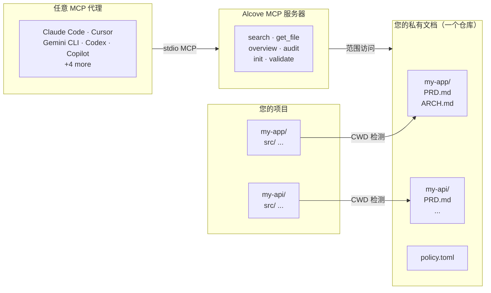

<p align="center">
  
</p>

<p align="center"><strong>你的 AI 代理不了解你的项目。Alcove 来解决。</strong></p>

<p align="center">
  <a href="../README.md">English</a> ·
  <a href="README.ko.md">한국어</a> ·
  <a href="README.ja.md">日本語</a> ·
  <a href="README.zh-CN.md">简体中文</a> ·
  <a href="README.es.md">Español</a> ·
  <a href="README.hi.md">हिन्दी</a> ·
  <a href="README.pt-BR.md">Português</a> ·
  <a href="README.de.md">Deutsch</a> ·
  <a href="README.fr.md">Français</a> ·
  <a href="README.ru.md">Русский</a>
</p>

<p align="center">
  <a href="https://glama.ai/mcp/servers/epicsagas/alcove"></a>
  <a href="https://crates.io/crates/alcove"></a>
  <a href="https://crates.io/crates/alcove"></a>
  <a href="../LICENSE"></a>
  <a href="https://buymeacoffee.com/epicsaga"></a>
</p>

Alcove 让任何 AI 编码代理都能读取和管理您的私有项目文档——不会将它们泄露到公共仓库中。

将 PRD、架构决策、密钥映射和内部运维手册集中保管。每个 MCP 兼容的代理都获得相同的访问权限，跨所有项目，无需每个项目单独配置。

## 问题所在

你面临两个糟糕的选择。

**选择 A：将文档放入 `CLAUDE.md` / `AGENTS.md`**
每次运行都会将所有文件注入上下文窗口。
对于简短的规范还行，但面对真正的项目文档就会失效。
10 个架构文件 = 上下文膨胀 = 更慢、更贵、更不准确的响应。

**选择 B：不放入文档**
代理会凭空编造你已经记录的需求。
忽略你已经做出的决定中的约束。
每次会话都要求你解释同样的事情。

两种方案都无法扩展。乘以 5 个项目和 3 个代理，每个配置不同。每次切换，你都失去上下文。

## Alcove 如何解决这个问题

Alcove 将所有私有文档保存在**一个共享仓库**中，按项目组织。任何兼容 MCP 的代理都以相同方式访问它们——无论您使用的是 Claude Code、Cursor、Gemini CLI 还是 Codex。

```
~/projects/my-app $ claude "认证是如何实现的？"

  → Alcove 检测项目：my-app
  → 读取 ~/documents/my-app/ARCHITECTURE.md
  → 代理使用实际项目上下文回答
```

```
~/projects/my-api $ codex "审查 API 设计"

  → Alcove 检测项目：my-api
  → 相同的文档结构，相同的工具模式
  → 不同的项目，相同的工作流
```

**随时切换代理。随时切换项目。文档层保持标准化。**

## 主要功能

- **一个文档仓库，多个项目** —— 私有文档按项目组织，集中管理
- **一次设置，任意代理** —— 配置一次，所有兼容 MCP 的代理获得相同的访问权限
- **基于 CWD 自动检测项目** —— 无需每个项目单独配置
- **范围化访问** —— 每个项目只能看到自己的文档
- **智能搜索** —— BM25 排名搜索与自动索引；优先找到最相关的文档，需要时回退到 grep
- **跨项目搜索** —— 使用 `scope: "global"` 一次搜索所有项目——用作个人知识库
- **私有文档保持私密** —— 敏感文档（密钥映射、内部决策、技术债务）永远不会进入公共仓库
- **标准化文档结构** —— `policy.toml` 在所有项目和团队中强制执行一致的文档规范
- **跨仓库审计** —— 发现项目仓库中错误放置的内部文档并建议修复
- **文档验证** —— 检查缺失文件、未填充模板、必需章节
- **语义检查** —— 自动检测失效的 Wiki 链接、孤立文件、过期 WIP/DRAFT 标记及 2 年以上的日期表述
- **外部仓库引入** —— 一条命令将 Obsidian 等工具的笔记带入 doc-repo；根据文件名和内容自动路由到对应项目
- **支持 9+ 个代理** —— Claude Code、Cursor、Claude Desktop、Cline、OpenCode、Codex、Copilot、Antigravity、Gemini CLI

## 为什么选择 Alcove

| 没有 Alcove | 使用 Alcove |
|-------------|-------------|
| 内部文档分散在 Notion、Google Docs、本地文件中 | 一个文档仓库，按项目结构化 |
| 每个 AI 代理需要单独配置文档访问 | 一次设置，所有代理共享相同的访问权限 |
| 切换项目意味着丢失文档上下文 | CWD 自动检测，即时切换项目 |
| 代理搜索返回随机匹配行 | BM25 排名搜索——最佳匹配优先，自动索引 |
| "搜索所有关于认证的笔记"——不可能 | 全局搜索一次查询所有项目 |
| 敏感文档有泄露到公共仓库的风险 | 私有文档与项目仓库物理隔离 |
| 文档结构因项目和团队成员而异 | `policy.toml` 在所有项目中强制执行标准 |
| 无法检查文档是否完整 | `validate` 捕获缺失文件、空模板、缺失章节 |
| 过期链接或 WIP 标记容易被忽视 | `lint` 自动检测失效链接、孤立文件及过期标记 |
| Obsidian 等外部工具的笔记处于孤立状态 | `promote` 一条命令将外部笔记整合到 doc-repo |

## 快速开始

```bash
# macOS
brew install epicsagas/tap/alcove

# Linux / Windows — 预构建二进制（快速，无需编译）
cargo install cargo-binstall
cargo binstall alcove

# 任意平台 — 从源码构建
cargo install alcove

# 克隆并构建
git clone https://github.com/epicsagas/alcove.git
cd alcove
make install

alcove setup
```

就这么简单。`setup` 以交互方式引导您完成所有设置：

1. 文档存放位置
2. 要跟踪的文档类别
3. 首选图表格式
4. 要配置的 AI 代理（MCP + 技能文件）

随时重新运行 `alcove setup` 来更改设置。它会记住您之前的选择。

## 工作原理



文档组织在单独的目录（`DOCS_ROOT`）中，每个项目一个文件夹。Alcove 管理文档并通过 stdio 提供给任何兼容 MCP 的 AI 代理。代理调用 `get_doc_file("PRD.md")` 等工具来获取项目特定的回答——无论您使用的是哪个代理。

## 文档分类

Alcove 将文档分为以下层级：

| 分类 | 位置 | 示例 |
|------|------|------|
| **doc-repo-required** | Alcove（私有） | PRD, Architecture, Decisions, Conventions |
| **doc-repo-supplementary** | Alcove（私有） | Deployment, Onboarding, Testing, Runbook |
| **reference** | Alcove `reports/` 文件夹 | 审计报告、基准测试、分析 |
| **project-repo** | GitHub 仓库（公开） | README, CHANGELOG, CONTRIBUTING |

`audit` 工具扫描文档仓库和本地项目目录，并建议操作——例如从私有 PRD 生成公开 README，或将错误放置的报告移回 alcove。

## MCP 工具

| 工具 | 功能 |
|------|------|
| `get_project_docs_overview` | 列出所有文档及其分类和大小 |
| `search_project_docs` | 智能搜索——自动选择 BM25 排名或 grep，支持 `scope: "global"` 跨项目搜索 |
| `get_doc_file` | 按路径读取特定文档（大文件支持 `offset`/`limit`） |
| `list_projects` | 显示文档仓库中的所有项目 |
| `audit_project` | 跨仓库审计——扫描文档仓库和本地项目仓库，建议操作 |
| `init_project` | 为新项目创建文档框架（内部+外部文档，选择性文件创建） |
| `validate_docs` | 根据团队策略（`policy.toml`）验证文档 |
| `rebuild_index` | 重建全文搜索索引（通常自动完成） |
| `check_doc_changes` | 检测自上次索引构建以来添加、修改或删除的文档 |
| `lint_project` | 语义检查 — 失效链接、孤立文件、过期标记及过期日期表述 |
| `promote_document` | 将外部仓库的文件复制或移动到 alcove doc-repo |

## CLI

```
alcove              启动 MCP 服务器（代理调用）
alcove setup        交互式设置——随时重新运行以重新配置
alcove doctor       检查安装健康状态
alcove validate     根据策略验证文档（--format json, --exit-code）
alcove lint         语义检查 — 失效链接、孤立文件、过期标记 (--format json)
alcove promote      将外部仓库笔记引入 doc-repo
alcove index        增量更新搜索索引（仅处理变更文件）
alcove rebuild      从头重建搜索索引（适用于模式变更后）
alcove search       从终端搜索文档
alcove token        打印用于团队共享的持有者令牌
alcove uninstall    移除技能、配置和遗留文件

alcove mcp <CMD>      管理后台 MCP 服务器生命周期 (start, stop, status, enable, disable)
alcove api <CMD>      管理后台 REST API 服务器生命周期 (start, stop, status, enable, disable)

alcove vault create   创建新的知识库 vault
alcove vault link     将外部目录链接为 vault (例如 Obsidian)
alcove vault list     列出所有 vault 及其文档数量
alcove vault remove   移除 vault (对于符号链接：仅移除链接)
alcove vault add      向 vault 添加文档
alcove vault index    构建 vault 搜索索引
alcove vault rebuild  从头重建 vault 搜索索引
```

### 检查（Lint）

```bash
# 检查当前项目（从 CWD 自动识别）
alcove lint

# 指定项目
alcove lint --project my-app

# 输出机器可读格式（适合 CI）
alcove lint --format json
```

检查涵盖四个方面：

| 检查项 | 检测内容 |
|--------|---------|
| `broken-link` | 指向不存在文件的 `[[wiki链接]]` 或 `[文字](路径)` |
| `orphan` | 没有任何文档链接的孤立文件 |
| `stale-marker` | WIP / TODO / FIXME / DRAFT / DEPRECATED 标记 |
| `stale-date` | 2 年以上的日期表述（如 "截至 2022 年"） |

### 引入（Promote）

```bash
# 将 Obsidian 笔记复制到 doc-repo（自动路由到匹配项目）
alcove promote ~/my-brain/Projects/auth-notes.md

# 指定项目
alcove promote ~/my-brain/Projects/auth-notes.md --project my-app

# 移动而非复制
alcove promote ~/my-brain/Projects/auth-notes.md --mv
```

没有匹配项目的文件将保存在 `inbox/` 中等待人工审查。

### 后台服务器

运行持久化后台服务器可以消除每次新代理会话的冷启动延迟（ONNX 模型加载需要 2-5 秒）。**`alcove setup` 默认启用此功能**（macOS 登录项）。

```bash
# 启用并启动（在重启后保持——macOS）
alcove mcp enable --now

# 生命周期
alcove mcp stop / start / restart / status

# 禁用并移除登录项
alcove mcp disable
```

您还可以运行一个独立的 REST API 服务器：

```bash
# 在后台启动 API 服务器
alcove api start
```

服务器使用持有者令牌进行身份验证——在 `alcove setup` 期间自动生成并存储在 `config.toml` 中。您现有的 MCP 配置（`command: alcove`）保持不变；stdio 进程会自动检测正在运行的服务器并进行代理。

```bash
# 检查或共享令牌
alcove token

# 在 shell 配置文件中设置（setup 会自动完成此操作）
export ALCOVE_TOKEN="alcove-..."
```

令牌优先级： `--token` 标志 > `ALCOVE_TOKEN` 环境变量 > `config.toml`。

日志写入 `~/.alcove/logs/`。启动后，运行 `alcove doctor` 验证服务器是否可达。

## 搜索

Alcove 自动选择最佳搜索策略。当搜索索引存在时，使用 **BM25 排名搜索**（基于 [tantivy](https://github.com/quickwit-oss/tantivy)）返回按相关度评分排序的结果。当索引不存在时，回退到 grep。您无需关心这些。

```bash
# 搜索当前项目（从 CWD 自动检测）
alcove search "authentication flow"

# 搜索所有项目——您的个人知识库
alcove search "OAuth token refresh" --scope global

# 需要精确子串匹配时强制使用 grep 模式
alcove search "FR-023" --mode grep
```

索引在 MCP 服务器启动时在后台自动构建，检测到文件变化时自动重建。无需 cron 任务，无需手动操作。

**代理使用方式：** 代理只需用查询调用 `search_project_docs`。Alcove 处理其余一切——排名、去重（每个文件一个结果）、跨项目搜索和回退。代理永远不需要选择搜索模式。

## 项目检测

默认情况下，Alcove 从终端的工作目录（CWD）检测当前项目。您可以使用 `MCP_PROJECT_NAME` 环境变量覆盖：

```bash
MCP_PROJECT_NAME=my-api alcove
```

当您的 CWD 与文档仓库中的项目名称不匹配时很有用。

## 文档策略

在文档仓库的 `policy.toml` 中定义团队级文档标准：

```toml
[policy]
enforce = "strict"    # strict | warn

[[policy.required]]
name = "PRD.md"
aliases = ["prd.md", "product-requirements.md"]

[[policy.required]]
name = "ARCHITECTURE.md"

  [[policy.required.sections]]
  heading = "## Overview"
  required = true

  [[policy.required.sections]]
  heading = "## Components"
  required = true
  min_items = 2
```

策略文件按优先级解析：**项目**（`<project>/.alcove/policy.toml`）> **团队**（`DOCS_ROOT/.alcove/policy.toml`）> **内置默认值**（config.toml 的 core 文件列表）。这确保了所有项目具有一致的文档质量，同时允许按项目进行覆盖。

## 配置

配置文件位于 `~/.config/alcove/config.toml`：

```toml
docs_root = "/Users/you/documents"

[core]
files = ["PRD.md", "ARCHITECTURE.md", "PROGRESS.md", "DECISIONS.md", "CONVENTIONS.md", "SECRETS_MAP.md", "DEBT.md"]

[team]
files = ["ENV_SETUP.md", "ONBOARDING.md", "DEPLOYMENT.md", "TESTING.md", ...]

[public]
files = ["README.md", "CHANGELOG.md", "CONTRIBUTING.md", "SECURITY.md", ...]

[diagram]
format = "mermaid"
```

所有设置都可通过 `alcove setup` 交互式完成。您也可以直接编辑文件。

## 支持的代理

| 代理 | MCP | 技能 |
|------|-----|------|
| Claude Code | `~/.claude.json` | `~/.claude/skills/alcove/` |
| Cursor | `~/.cursor/mcp.json` | `~/.cursor/skills/alcove/` |
| Claude Desktop | 平台配置 | — |
| Cline (VS Code) | VS Code globalStorage | `~/.cline/skills/alcove/` |
| OpenCode | `~/.config/opencode/opencode.json` | `~/.opencode/skills/alcove/` |
| Codex CLI | `~/.codex/config.toml` | `~/.codex/skills/alcove/` |
| Copilot CLI | `~/.copilot/mcp-config.json` | `~/.copilot/skills/alcove/` |
| Antigravity | `~/.gemini/antigravity/mcp_config.json` | — |
| Gemini CLI | `~/.gemini/settings.json` | `~/.gemini/skills/alcove/` |

## 支持的语言

CLI 会自动检测系统区域设置。您也可以使用 `ALCOVE_LANG` 环境变量覆盖。

| 语言 | 代码 |
|------|------|
| English | `en` |
| 한국어 | `ko` |
| 简体中文 | `zh-CN` |
| 日本語 | `ja` |
| Español | `es` |
| हिन्दी | `hi` |
| Português (Brasil) | `pt-BR` |
| Deutsch | `de` |
| Français | `fr` |
| Русский | `ru` |

```bash
# 覆盖语言
ALCOVE_LANG=zh-CN alcove setup
```

## 更新

```bash
# Homebrew
brew upgrade epicsagas/tap/alcove

# cargo-binstall
cargo binstall alcove

# 从源码
cargo install alcove
```

## 卸载

```bash
alcove uninstall          # 移除技能和配置
cargo uninstall alcove    # 移除二进制文件
```

## 知识库 Vault

除了项目文档，Alcove 还支持**独立的知识库 Vault**，用于存放研究笔记、参考资料以及供 LLM 搜索的精选知识。

```bash
# 为 AI 研究笔记创建一个 vault
alcove vault create ai-research

# 链接一个现有的 Obsidian vault（不复制 —— 就地索引）
alcove vault link my-obsidian ~/Obsidian/research

# 添加文档
alcove vault add ai-research ~/Downloads/transformer-survey.md

# 构建 vault 搜索索引
alcove vault index

# 列出所有 vault
alcove vault list
#   areas (8 docs) → (linked)
#   resources (71 docs) → (linked)
#   zettelkasten (17 docs) → (linked)

# 从终端搜索
alcove search "attention mechanism" --vault ai-research

# 代理通过 MCP 搜索
search_vault(query="attention mechanism", vault="ai-research")

# 一次性搜索所有 vault
search_vault(query="transformer", vault="*")
```

Vault 与项目文档**完全隔离** —— 独立的索引、独立的缓存、独立的搜索。您的编码代理对项目文档的搜索不会受到 vault 活动的影响。

| 功能 | 项目文档 | Vault |
|---------|-------------|--------|
| 用途 | 按项目的文档化 | 通用知识库 |
| 存储 | `~/.alcove/docs/` | `~/.alcove/vaults/` |
| 索引 | 共享的项目索引 | 每个 vault 独立的索引 |
| 缓存 | `PROJECT_READER_CACHE` | `VAULT_READER_CACHE` |
| 搜索 | `search_project_docs` | `search_vault` |
| 符号链接 | 不支持 | 支持（链接外部目录） |

### Vault 配置

默认情况下，vault 存储在 `~/.alcove/vaults/`。您可以在 `config.toml` 中进行更改：

```toml
[vaults]
root = "/path/to/your/vaults"
```

有关 `config.toml` 的更多详细信息，请参阅[配置](#配置)部分。

## 生态系统

### [obsidian-forge](https://github.com/epicsagas/obsidian-forge)

Alcove 与 **obsidian-forge** 天然配合。obsidian-forge 是 Obsidian 知识库生成器和自动化守护进程。为了获得最佳集成效果，您的 Alcove **`docs_root`** 应该指向 obsidian-forge 项目归档。

**1. 设置文档根目录**
将您的主文档目录指向 obsidian-forge 项目目录（直接指向或通过符号链接）：
```bash
# 在 alcove setup 期间，将 docs_root 设置为：
~/Obsidian/SecondBrain/99-Archives/projects
```

**2. 将知识领域链接为 Vault**
将其他三个 obsidian-forge 类别链接为独立的 Alcove Vault。这会在 `~/.alcove/vaults/` 中创建符号链接：
```bash
# 链接 obsidian-forge 类别
alcove vault link areas ~/Obsidian/SecondBrain/00-Areas
alcove vault link resources ~/Obsidian/SecondBrain/20-Resources
alcove vault link zettelkasten ~/Obsidian/SecondBrain/10-Zettelkasten
```

现在您的智能体拥有结构化的访问权限：
- **`search_project_docs`**: 搜索归档的项目知识（PRD 等）
- **`search_vault`**: 搜索更广泛的知识领域和研究笔记。

您可以通过检查 `~/.alcove/vaults/` 中的符号链接来验证物理存储映射。

## 贡献

欢迎提交错误报告、功能请求和拉取请求。请在 [GitHub](https://github.com/epicsagas/alcove/issues) 上开 Issue 开始讨论。

## 许可证

Apache-2.0
