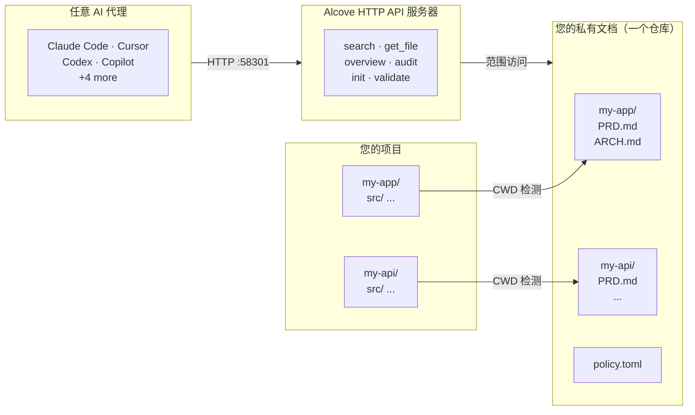

<p align="center">
  
</p>

<p align="center"><strong>你的 AI 代理不了解你的项目。Alcove 来解决。</strong></p>

<p align="center">
  <a href="../README.md">English</a> ·
  <a href="README.ko.md">한국어</a> ·
  <a href="README.ja.md">日本語</a> ·
  <a href="README.zh-CN.md">简体中文</a> ·
  <a href="README.es.md">Español</a> ·
  <a href="README.hi.md">हिन्दी</a> ·
  <a href="README.pt-BR.md">Português</a> ·
  <a href="README.de.md">Deutsch</a> ·
  <a href="README.fr.md">Français</a> ·
  <a href="README.ru.md">Русский</a>
</p>

<p align="center">
  <a href="https://glama.ai/mcp/servers/epicsagas/alcove"></a>
  <a href="https://crates.io/crates/alcove"></a>
  <a href="https://crates.io/crates/alcove"></a>
  <a href="../LICENSE"></a>
  <a href="https://buymeacoffee.com/epicsaga"></a>
</p>

Alcove 是一个 HTTP API 服务器，让 AI 编码代理按需访问您的私有项目文档 — **BM25 + 向量混合搜索**实现精准检索，**tree-sitter 代码索引**让代理理解您的代码库结构，**策略强制执行**确保文档一致性。无上下文膨胀，无文档泄露到公共仓库，无需为每个代理单独配置项目。

将 PRD、架构决策、密钥映射和内部运维手册集中保管。所有 AI 代理都获得相同的访问权限，跨所有项目，无需每个项目单独配置。

## 演示


> *Claude、Codex — 搜索 · 切换项目 · 全局搜索 · 验证与生成。一次配置。*

<details>
<summary>CLI 演示</summary>


> *`alcove search` · 切换项目 · `--scope global` · `alcove validate`*

</details>

## 问题所在

你的 AI 代理每次会话都从零开始。

它不了解你的架构。它忽略你已经做出的决策约束。每次会话都要求你解释同样的事情。

上下文窗口是瓶颈。每个 token 都消耗成本和注意力。将 10 个架构文档加载到上下文中，每次运行就浪费 50K+ token — 而且 Anthropic 的官方文档也警告，臃肿的配置文件会让代理*忽略你的实际指令*。

所以你有三个糟糕的选择：

**把所有东西塞进代理配置** — 每次运行都会将所有文件加载到上下文中。10 个文档 = 上下文膨胀 = 更慢、更贵、更不准确的响应。

**每次聊天都复制粘贴** — 一次可以，但无法扩展到多个会话。

**干脆不管** — 你的代理凭空编造你已经记录的需求，忽略你已经做出的决策约束，每个周一早上你都要重新解释同样的架构。

把它乘以 5 个项目和 3 个代理。每次切换，你都失去上下文。

## Alcove 如何解决这个问题

Alcove 将所有私有文档保存在**一个共享仓库**中，按项目组织。所有代理通过 HTTP API 以相同方式访问——无论您使用的是 Claude Code、Cursor 还是 Codex。

```
~/projects/my-app $ claude "/alcove 认证是如何实现的？"

  → Alcove 检测项目：my-app
  → 读取 ~/documents/my-app/ARCHITECTURE.md
  → 代理使用实际项目上下文回答
```

```
~/projects/my-api $ codex "/alcove 审查 API 设计"

  → Alcove 检测项目：my-api
  → 相同的文档结构，相同的工具模式
  → 不同的项目，相同的工作流
```

**随时切换代理。随时切换项目。文档层保持标准化。**

## 主要功能

- **一个文档仓库，多个项目** —— 私有文档按项目组织，集中管理
- **一次设置，任意代理** —— 配置一次，所有 AI 代理获得相同的访问权限
- **基于 CWD 自动检测项目** —— 无需每个项目单独配置
- **范围化访问** —— 每个项目只能看到自己的文档
- **智能搜索** —— BM25 排名搜索与自动索引；优先找到最相关的文档，需要时回退到 grep
- **跨项目搜索** —— 使用 `scope: "global"` 一次搜索所有项目——用作个人知识库
- **私有文档保持私密** —— 敏感文档（密钥映射、内部决策、技术债务）永远不会进入公共仓库
- **标准化文档结构** —— `policy.toml` 在所有项目和团队中强制执行一致的文档规范
- **跨仓库审计** —— 发现项目仓库中错误放置的内部文档并建议修复
- **文档验证** —— 检查缺失文件、未填充模板、必需章节
- **语义检查** —— 自动检测失效的 Wiki 链接、孤立文件、过期 WIP/DRAFT 标记及 2 年以上的日期表述
- **外部仓库引入** —— 一条命令将 Obsidian 等工具的笔记带入 doc-repo；根据文件名和内容自动路由到对应项目
- **支持 9+ 个代理** —— Claude Code、Cursor、Claude Desktop、Cline、OpenCode、Codex、Copilot

## 为什么选择 Alcove

| 没有 Alcove | 使用 Alcove |
|-------------|-------------|
| 内部文档分散在 Notion、Google Docs、本地文件中 | 一个文档仓库，按项目结构化 |
| 每个 AI 代理需要单独配置文档访问 | 一次设置，所有代理共享相同的访问权限 |
| 切换项目意味着丢失文档上下文 | CWD 自动检测，即时切换项目 |
| 代理搜索返回随机匹配行 | 混合搜索（BM25 + RAG） — 代理只拉取所需内容，按相关度排序 |
| 代理只能看到文本文档，不了解代码结构 | Tree-sitter 代码索引 — 代理理解 12 种语言的模块、函数和类型 |
| "搜索所有关于认证的笔记"——不可能 | 全局搜索一次查询所有项目 |
| 敏感文档有泄露到公共仓库的风险 | 私有文档与项目仓库物理隔离 |
| 文档结构因项目和团队成员而异 | `policy.toml` 在所有项目中强制执行标准 |
| 无法检查文档是否完整 | `validate` 捕获缺失文件、空模板、缺失章节 |
| 过期链接或 WIP 标记容易被忽视 | `lint` 自动检测失效链接、孤立文件及过期标记 |
| Obsidian 等外部工具的笔记处于孤立状态 | `promote` 一条命令将外部笔记整合到 doc-repo |

## 快速开始

> **必选**: 安装后运行一次 `alcove setup` 来配置文档根目录并启用全部功能。插件会自动启动 API 服务器，但在运行 `setup` 之前，Alcove 无法搜索或索引文档。
>
> **使用 Obsidian？** 请参阅[生态系统](#ecosystem)部分了解推荐的文档结构和保管库配置。

### Claude Code

```
/plugin marketplace add epicsagas/plugins
/plugin install alcove@epicsagas
```

自动安装二进制文件并在下次会话启动时启动 API 服务器。

> **必需**：安装后运行一次 `alcove setup` 以配置文档根目录并启用完整功能。插件会自动启动 API 服务器，但在运行 `setup` 之前，Alcove 无法搜索或索引文档。

```bash
alcove setup   # 插件安装后运行一次
```

使用 `claude plugin update epicsagas/alcove` 进行更新。

### Codex CLI

```bash
codex plugin marketplace add epicsagas/plugins
```

自动安装技能并启动 API 服务器。

立即可用 — 无需额外步骤。

使用 `codex plugin update alcove@epicsagas` 进行更新。

### macOS（仅限 Apple Silicon）

```bash
brew install epicsagas/tap/alcove
```

没有 Homebrew？使用安装脚本：

```bash
curl --proto '=https' --tlsv1.2 -LsSf \
  https://github.com/epicsagas/alcove/releases/latest/download/alcove-installer.sh | sh
```

### Linux (x86_64 / ARM64)

```bash
curl --proto '=https' --tlsv1.2 -LsSf \
  https://github.com/epicsagas/alcove/releases/latest/download/install.sh | sh
```

### Windows (x86_64 / ARM64)

```powershell
irm https://github.com/epicsagas/alcove/releases/latest/download/install.ps1 | iex
```

### Antigravity (Gemini CLI)

```bash
agy plugins install https://github.com/epicsagas/alcove
```

自动安装插件（API 服务器、技能、钩子）并在下次会话启动时启动。

```bash
alcove setup   # run once after plugin install
```

### 通过 Rust 工具链

```bash
cargo binstall alcove   # 预编译二进制，包含混合搜索
cargo install alcove --features full-macos   # 从源码构建 (macOS)
cargo install alcove --features full-cross   # 从源码构建 (Linux/Windows)
```

> **注意**：`cargo binstall` 下载包含混合搜索（向量 + BM25）的预编译二进制。从源码构建时，需要 `--features full-macos` 或 `--features full-cross` 才能启用混合搜索。不指定 features 只能使用 BM25（关键词）搜索。

### 首次设置（必选）

通过上述任意方式安装后，运行：

```bash
alcove setup
alcove --version
alcove doctor
```

`setup` 会以交互方式引导您完成所有配置：

1. 文档存放位置
2. 要跟踪的文档类别
3. 首选图表格式
4. 混合搜索的嵌入模型
5. **后台服务器** — 消除每次会话的冷启动延迟（macOS 登录项）
6. 要配置的 AI 代理（技能文件 — Claude Code 和 Codex 由其插件系统处理）

随时重新运行 `alcove setup` 来更改设置。它会记住您之前的选择。

**可选依赖**

| 工具 | 用途 | 安装 |
|---|---|---|
| `pdftotext` (poppler) | 完整 PDF 文本提取 — PDF 搜索所需 | macOS: `brew install poppler` · Debian/Ubuntu: `apt install poppler-utils` · Fedora: `dnf install poppler-utils` · Windows: [poppler for Windows](https://github.com/oschwartz10612/poppler-windows/releases) |

没有 `pdftotext` 时，Alcove 会回退到内置 PDF 解析器，但在某些文件上可能会失败。运行 `alcove doctor` 检查安装状态。

### 故障排除

**代理找不到 Alcove 工具**
重新运行 `alcove setup` — 它会重新配置所有已配置代理的 API 服务器。然后启动新的代理会话（更改在下次会话启动时生效）。

**搜索无结果**
索引可能尚未构建。运行 `alcove index` 构建，然后重试。

**后台服务器返回 403 Unauthorized**
Shell 中未设置 `ALCOVE_TOKEN`。运行 `alcove token` 查看令牌，然后将 `export ALCOVE_TOKEN="..."` 添加到 shell 配置文件并重新加载。

**`alcove doctor` 报告问题**
按照 `doctor` 输出的建议操作 — 它会检查二进制位置、API 服务器状态、索引状态和 `pdftotext` 等可选依赖。

## 使用方法

### CLI 搜索

直接从终端搜索您的文档。默认情况下，它会搜索**所有项目**（全局范围）。

```bash
# 基本搜索（全局范围）
alcove search "authentication"

# 限制搜索到当前项目（通过 CWD 自动检测）
alcove search "auth flow" --scope project

# 强制使用 grep 模式（精确子串匹配）
alcove search "TODO" --mode grep

# 强制使用排名模式（BM25/混合）
alcove search "data model" --mode ranked

# 调整结果限制
alcove search "deployment" --limit 5
```

### 编码代理 (HTTP API)

AI 编码代理通过**本地 HTTP API**（端口 58301）使用 Alcove。技能在内部调用 `curl http://localhost:58301/...`。通常您不需要手动调用这些 API；当您询问有关项目的问题时，代理会自动调用它们。

| 端点 | 方法 | 描述 |
|------|------|------|
| `/health` | GET | 健康检查 |
| `/search?q=...` | GET | 搜索文档 |
| `/v1/search` | POST | 使用 JSON 主体搜索 |
| `/projects` | GET | 列出所有项目 |
| `/projects` | POST | 初始化新项目 |
| `/projects/{name}/docs` | GET | 列出项目文档 |
| `/projects/{name}/audit` | GET | 文档健康审计 |
| `/projects/{name}/validate` | GET | 根据策略验证文档 |
| `/projects/{name}/config` | PUT | 更新项目设置 |
| `/docs/{path}` | GET | 读取文档文件 |
| `/rebuild` | POST | 重建搜索索引 |
| `/changes` | GET | 检查已更改文件 |
| `/lint` | GET | 文档 Lint |
| `/vaults` | GET | 列出 Vault |
| `/vaults/search?q=...` | GET | 搜索 Vault |
| `/vaults/backup` | POST | 备份 Vault |
| `/promote` | POST | 将文件导入 doc-repo |
| `/index-code` | POST | 索引代码结构 |
| `/mcp` | POST | JSON-RPC 代理（旧版 MCP） |

> **注意**: MCP 仍然可用于手动设置 — 如需基于 stdio 的访问，请参阅 `registry/mcp.json`。

**代理交互示例：**
> **用户：** "/alcove 我该如何添加一个新的 API 端点？"
> **代理：** (调用 `POST /v1/search`，`query="add api endpoint"`)
> **代理：** (通过 `GET /docs/{path}?project=...` 读取最相关的文档)
> **代理：** "根据 `ARCHITECTURE.md`，您需要..."

---

## 工作原理



文档组织在单独的目录（`DOCS_ROOT`）中，每个项目一个文件夹。Alcove 通过 HTTP 58301 端口管理文档并提供给 AI 代理。

## 文档分类

Alcove 将文档分为以下层级：

| 分类 | 位置 | 示例 |
|------|------|------|
| **doc-repo-required** | Alcove（私有） | PRD, Architecture, Decisions, Conventions |
| **doc-repo-supplementary** | Alcove（私有） | Deployment, Onboarding, Testing, Runbook |
| **reference** | Alcove `reports/` 文件夹 | 审计报告、基准测试、分析 |
| **project-repo** | GitHub 仓库（公开） | README, CHANGELOG, CONTRIBUTING |

`audit` 工具扫描文档仓库和本地项目目录，并建议操作——例如从私有 PRD 生成公开 README，或将错误放置的报告移回 alcove。

## API 端点

| 端点 | 方法 | 功能 |
|------|------|------|
| `/health` | GET | 健康检查 |
| `/search?q=...` | GET | 搜索文档 |
| `/v1/search` | POST | 使用 JSON 主体搜索 |
| `/projects` | GET | 列出所有项目 |
| `/projects` | POST | 初始化新项目 |
| `/projects/{name}/docs` | GET | 列出项目文档 |
| `/projects/{name}/audit` | GET | 文档健康审计 |
| `/projects/{name}/validate` | GET | 根据策略验证文档 |
| `/projects/{name}/config` | PUT | 更新项目设置 |
| `/docs/{path}` | GET | 读取文档文件 |
| `/rebuild` | POST | 重建搜索索引 |
| `/changes` | GET | 检查已更改文件 |
| `/lint` | GET | 文档 Lint |
| `/vaults` | GET | 列出 Vault |
| `/vaults/search?q=...` | GET | 搜索 Vault |
| `/vaults/backup` | POST | 备份 Vault |
| `/promote` | POST | 将文件导入 doc-repo |
| `/index-code` | POST | 索引代码结构 |
| `/mcp` | POST | JSON-RPC 代理（旧版 MCP） |

> **注意**: MCP 仍然可用于手动设置 — 请参阅 `registry/mcp.json`。

## CLI

```
alcove              启动 API 服务器（代理调用）
alcove setup        交互式设置——随时重新运行以重新配置
alcove doctor       检查安装健康状态
alcove validate     根据策略验证文档（--format json, --exit-code）
alcove lint         语义检查 — 失效链接、孤立文件、过期标记 (--format json)
alcove promote      将外部仓库笔记引入 doc-repo
alcove index        增量更新搜索索引（仅处理变更文件）
alcove rebuild      从头重建搜索索引（适用于模式变更后）
alcove search       从终端搜索文档
alcove index-code   从源代码生成代码结构索引 [--language LANG] [--source PATH]
alcove token        打印持有者令牌（用于后台服务器认证）
alcove uninstall    移除技能、配置和遗留文件

alcove mcp <CMD>      管理后台 API 服务器生命周期 (start, stop, status, enable, disable)

alcove vault create   创建新的知识库 vault
alcove vault link     将外部目录链接为 vault (例如 Obsidian)
alcove vault list     列出所有 vault 及其文档数量
alcove vault remove   移除 vault (对于符号链接：仅移除链接)
alcove vault add      向 vault 添加文档
alcove vault index    构建 vault 搜索索引
alcove vault rebuild  从头重建 vault 搜索索引
```

### 代码索引

使用 tree-sitter 解析源文件，生成 `CODE_INDEX.md`——代码库的模块级 Markdown 摘要，与 Tantivy 搜索管道集成。

```bash
# 索引当前项目源代码（自动检测所有语言）
alcove index-code --source ./src

# 单体仓库：一次性索引包含多种语言的目录
alcove index-code --source ./

# 仅索引单一语言
alcove index-code --source ./src --language typescript
alcove index-code --source ./src --language rust
```

**支持的语言:**

| 语言 | 功能标志 | 文件扩展名 |
|------|---------|-----------|
| Rust | `lang-rust` | `.rs` |
| Python | `lang-python` | `.py`, `.pyi` |
| TypeScript | `lang-typescript` | `.ts`, `.tsx` |
| JavaScript | `lang-javascript` | `.js`, `.jsx`, `.mjs` |
| Go | `lang-go` | `.go` |
| Java | `lang-java` | `.java` |
| Kotlin | `lang-kotlin` | `.kt`, `.kts` |
| C | `lang-c` | `.c`, `.h` |
| C++ | `lang-cpp` | `.cpp`, `.cc`, `.cxx`, `.hpp`, `.hxx`, `.h` |
| Swift | `lang-swift` | `.swift` |
| Ruby | `lang-ruby` | `.rb` |
| C# | `lang-csharp` | `.cs` |

官方二进制文件启用了全部 12 个解析器（`lang-all`）。不使用 `--language` 标志时，**自动索引所有已识别的扩展名**，适合单体仓库使用。

`--language` 标志支持缩写: `ts` → TypeScript、`cpp` → C++、`csharp` → C#、`py` → Python、`js` → JavaScript、`kt` → Kotlin、`rb` → Ruby。

### 检查（Lint）

```bash
# 检查当前项目（从 CWD 自动识别）
alcove lint

# 指定项目
alcove lint --project my-app

# 输出机器可读格式（适合 CI）
alcove lint --format json
```

检查涵盖四个方面：

| 检查项 | 检测内容 |
|--------|---------|
| `broken-link` | 指向不存在文件的 `[[wiki链接]]` 或 `[文字](路径)` |
| `orphan` | 没有任何文档链接的孤立文件 |
| `stale-marker` | WIP / TODO / FIXME / DRAFT / DEPRECATED 标记 |
| `stale-date` | 2 年以上的日期表述（如 "截至 2022 年"） |

### 引入（Promote）

```bash
# 将 Obsidian 笔记复制到 doc-repo（自动路由到匹配项目）
alcove promote ~/my-brain/Projects/auth-notes.md

# 指定项目
alcove promote ~/my-brain/Projects/auth-notes.md --project my-app

# 移动而非复制
alcove promote ~/my-brain/Projects/auth-notes.md --mv
```

没有匹配项目的文件将保存在 `inbox/` 中等待人工审查。

### 后台服务器

运行持久化后台服务器可以消除每次新代理会话的冷启动延迟。**`alcove setup` 默认启用此功能**（macOS 登录项）。

```bash
alcove mcp enable --now     # 启用并启动（重启后保持）
alcove mcp stop / start / restart / status
alcove mcp disable          # 禁用并移除登录项
```

当后台服务器运行时，stdio 进程作为轻量代理工作——不再每次会话加载搜索引擎，而是将请求转发给已运行的服务器。启动时，stdio 进程会检查 `GET /health` 并自动进入代理模式。

> **注意**: MCP 仍然可用于偏好基于 stdio 访问的用户。手动 MCP 设置请参阅 `registry/mcp.json`。

## 搜索

Alcove 自动选择最佳搜索策略。当搜索索引存在时，使用 **BM25 排名搜索**（基于 [tantivy](https://github.com/quickwit-oss/tantivy)）返回按相关度评分排序的结果。当索引不存在时，回退到 grep。您无需关心这些。

### 混合搜索 (RAG)

Alcove 支持将 BM25 与**向量相似度搜索**（基于 [fastembed](https://github.com/ankane/fastembed-rs)）相结合的**混合搜索**。

在 `alcove setup` 过程中，您可以选择嵌入模型并立即下载。也可以手动管理模型：

```bash
# 设置并下载嵌入模型
alcove model set ArcticEmbedXS
alcove model download

# 检查模型状态
alcove model status
```

#### 模型选择

| 模型 | 磁盘 | 维度 | 上下文 | 语言 | 推荐用途 | 峰值内存 |
|------|------|------|--------|------|----------|----------|
| **`ArcticEmbedXS`** (默认) | **90 MB** | **384** | **512** | **多语言** | **默认 — 最佳性价比** | **~400 MB** |
| `ArcticEmbedXSQ` | 90 MB | 384 | 512 | 多语言 | 量化，更小下载 | ~400 MB |
| `MultilingualE5Small` | 470 MB | 384 | 512 | 100+语言 | 韩语/CJK最佳品质 | ~1.2 GB |
| `BGEM3` | 600 MB | 1024 | 8192 | 100+语言 | 高级 — Dense+Sparse+ColBERT | ~2 GB |
| `ArcticEmbedMLong` | 430 MB | 768 | 8192 | 多语言 | 长文档 | ~1.5 GB |
| `JinaEmbeddingsV2BaseCode` | 550 MB | 768 | 8192 | 代码+英语 | 代码优化 | ~1.5 GB |

> 在 [fastembed-rs](https://github.com/Anush008/fastembed-rs#supported-models) 查看全部支持模型。任何模型都可以直接在配置文件中设置使用。

模型下载并准备就绪后，Alcove 会在 CLI 搜索和基于代理的 API 中自动使用混合搜索。这对多语言项目和复杂的语义查询尤其有效。

```bash
# 搜索当前项目（从 CWD 自动检测）
alcove search "authentication flow"

# 需要精确子串匹配时强制使用 grep 模式
alcove search "FR-023" --mode grep
```

索引在 API 服务器启动时在后台自动构建，检测到文件变化时自动重建。无需 cron 任务，无需手动操作。

**代理使用方式：** 代理只需用查询调用 `search_project_docs`。Alcove 处理其余一切——排名、去重（每个文件一个结果）、跨项目搜索和回退。代理永远不需要选择搜索模式。

#### 索引生命周期

`alcove index` 与 `alcove rebuild` 的区别：

| 命令 | 行为 | 使用时机 |
|------|------|----------|
| `alcove index` | 增量更新 — 仅处理新增/修改的文件 | 默认：添加或编辑文档后使用 |
| `alcove rebuild` | 完全重建 — 删除并重新创建所有索引数据 | 更改嵌入模型后，或索引损坏时 |

**首次设置：**

```bash
# 步骤 1：设置后 BM25 搜索立即可用
alcove index            # 构建全文索引（无需模型）

# 步骤 2：启用混合搜索（可选但推荐）
alcove model set ArcticEmbedXS
alcove model download   # ~90 MB 下载

# 步骤 3：为所有现有文档构建向量索引
alcove rebuild          # 首次完全重建
                        # ⚠ 峰值 RAM = 模型大小 + 语料向量（见下方说明）

# 之后：增量更新即可
alcove index            # 快速 — 仅重新嵌入已更改的文件
```

**切换模型：**

```bash
alcove model set BGEM3                     # 更改模型
alcove rebuild                            # 必须：向量是模型特定的
```

**rebuild 时的内存：**
峰值 RAM 因模型而异 — 参见上表的"峰值 RAM"列。大型模型（BGEM3、ArcticEmbedMLong）在 rebuild 期间可能使用 1.5-2 GB。rebuild 完成后，稳态内存根据 `[memory]` 配置降至 50-200 MB。通过降低 `max_hnsw_cache` 和缩短 `model_unload_secs` 可进一步减少稳态内存。

### 全局搜索

所有架构决策、所有运维手册、所有项目笔记 — 跨所有项目一次性搜索。

```bash
# 跨所有项目搜索
alcove search "rate limiting patterns" --scope global

## 项目检测

默认情况下，Alcove 从终端的工作目录（CWD）检测当前项目。您可以使用 `MCP_PROJECT_NAME` 环境变量覆盖：

```bash
MCP_PROJECT_NAME=my-api alcove
```

当您的 CWD 与文档仓库中的项目名称不匹配时很有用。

## 文档策略

在文档仓库的 `policy.toml` 中定义团队级文档标准：

```toml
[policy]
enforce = "strict"    # strict | warn

[[policy.required]]
name = "PRD.md"
aliases = ["prd.md", "product-requirements.md"]

[[policy.required]]
name = "ARCHITECTURE.md"

  [[policy.required.sections]]
  heading = "## Overview"
  required = true

  [[policy.required.sections]]
  heading = "## Components"
  required = true
  min_items = 2
```

策略文件按优先级解析：**项目**（`<project>/.alcove/policy.toml`）> **团队**（`DOCS_ROOT/.alcove/policy.toml`）> **内置默认值**（config.toml 的 core 文件列表）。这确保了所有项目具有一致的文档质量，同时允许按项目进行覆盖。

## 配置

配置文件位于 `~/.config/alcove/config.toml`：

```toml
docs_root = "/Users/you/documents"

[core]
files = ["PRD.md", "ARCHITECTURE.md", "PROGRESS.md", "DECISIONS.md", "CONVENTIONS.md", "SECRETS_MAP.md", "DEBT.md"]

[team]
files = ["ENV_SETUP.md", "ONBOARDING.md", "DEPLOYMENT.md", "TESTING.md", ...]

[public]
files = ["README.md", "CHANGELOG.md", "CONTRIBUTING.md", "SECURITY.md", ...]

[diagram]
format = "mermaid"
```

所有设置都可通过 `alcove setup` 交互式完成。您也可以直接编辑文件。

## 支持的代理

| 代理 | 访问方式 | 技能 |
|------|-----|------|
| Claude Code | `~/.claude.json` | `~/.claude/skills/alcove/` |
| Cursor | `~/.cursor/mcp.json` | `~/.cursor/skills/alcove/` |
| Claude Desktop | 平台配置 | — |
| Cline (VS Code) | VS Code globalStorage | `~/.cline/skills/alcove/` |
| OpenCode | `~/.config/opencode/opencode.json` | `~/.opencode/skills/alcove/` |
| Codex CLI | `~/.codex/config.toml` | `~/.codex/skills/alcove/` |
| Copilot CLI | `~/.copilot/mcp-config.json` | `~/.copilot/skills/alcove/` |
| Antigravity | `agy plugins install` | — |

## 支持的语言

CLI 会自动检测系统区域设置。您也可以使用 `ALCOVE_LANG` 环境变量覆盖。

| 语言 | 代码 |
|------|------|
| English | `en` |
| 한국어 | `ko` |
| 简体中文 | `zh-CN` |
| 日本語 | `ja` |
| Español | `es` |
| हिन्दी | `hi` |
| Português (Brasil) | `pt-BR` |
| Deutsch | `de` |
| Français | `fr` |
| Русский | `ru` |

```bash
# 覆盖语言
ALCOVE_LANG=zh-CN alcove setup
```

## 更新

| 方式 | 命令 |
|------|------|
| Homebrew | `brew upgrade alcove` |
| curl 安装脚本 | 重新运行上述安装脚本 |
| cargo binstall | `cargo binstall alcove@latest` |
| cargo install | `cargo install alcove@latest --features full-macos` |
| Claude Code 插件 | `claude plugin update epicsagas/alcove` |

```bash
alcove --version
```

## 卸载

```bash
alcove uninstall          # 移除技能和配置
cargo uninstall alcove    # 移除二进制文件
```

## 知识库 Vault

除了项目文档，Alcove 还支持**独立的知识库 Vault**，用于存放研究笔记、参考资料以及供 LLM 搜索的精选知识。

```bash
# 为 AI 研究笔记创建一个 vault
alcove vault create ai-research

# 链接一个现有的 Obsidian vault（不复制 —— 就地索引）
alcove vault link my-obsidian ~/Obsidian/research

# 添加文档
alcove vault add ai-research ~/Downloads/transformer-survey.md

# 构建 vault 搜索索引
alcove vault index

# 列出所有 vault
alcove vault list
#   areas (8 docs) → (linked)
#   resources (71 docs) → (linked)
#   zettelkasten (17 docs) → (linked)

# 从终端搜索
alcove search "attention mechanism" --vault ai-research

# 代理通过 MCP 搜索
search_vault(query="attention mechanism", vault="ai-research")

# 一次性搜索所有 vault
search_vault(query="transformer", vault="*")
```

Vault 与项目文档**完全隔离** —— 独立的索引、独立的缓存、独立的搜索。您的编码代理对项目文档的搜索不会受到 vault 活动的影响。

| 功能 | 项目文档 | Vault |
|---------|-------------|--------|
| 用途 | 按项目的文档化 | 通用知识库 |
| 存储 | `~/.alcove/docs/` | `~/.alcove/vaults/` |
| 索引 | 共享的项目索引 | 每个 vault 独立的索引 |
| 缓存 | `PROJECT_READER_CACHE` | `VAULT_READER_CACHE` |
| 搜索 | `search_project_docs` | `search_vault` |
| 符号链接 | 不支持 | 支持（链接外部目录） |

### Vault 配置

默认情况下，vault 存储在 `~/.alcove/vaults/`。您可以在 `config.toml` 中进行更改：

```toml
[vaults]
root = "/path/to/your/vaults"
```

有关 `config.toml` 的更多详细信息，请参阅[配置](#配置)部分。

## 生态系统

### [obsidian-forge](https://github.com/epicsagas/obsidian-forge)

Alcove 与 **obsidian-forge** 天然配合。obsidian-forge 是 Obsidian 知识库生成器和自动化守护进程。为了获得最佳集成效果，您的 Alcove **`docs_root`** 应该指向 obsidian-forge 项目归档。

**1. 设置文档根目录**
将您的主文档目录指向 obsidian-forge 项目目录（直接指向或通过符号链接）：
```bash
# 在 alcove setup 期间，将 docs_root 设置为：
~/Obsidian/SecondBrain/99-Archives/projects
```

**2. 将知识领域链接为 Vault**
将其他三个 obsidian-forge 类别链接为独立的 Alcove Vault。这会在 `~/.alcove/vaults/` 中创建符号链接：
```bash
# 链接 obsidian-forge 类别
alcove vault link areas ~/Obsidian/SecondBrain/02-Areas
alcove vault link resources ~/Obsidian/SecondBrain/03-Resources
alcove vault link zettelkasten ~/Obsidian/SecondBrain/10-Zettelkasten
```

现在您的智能体拥有结构化的访问权限：
- **`search_project_docs`**: 搜索归档的项目知识（PRD 等）
- **`search_vault`**: 搜索更广泛的知识领域和研究笔记。

您可以通过检查 `~/.alcove/vaults/` 中的符号链接来验证物理存储映射。

## 常见问题

### 为什么不直接用 ripgrep 作为 MCP 工具？

ripgrep 会返回整个文件。如果你的代理搜索 "auth" 并命中 5 个平均 200 行的文件，就会有大约 10K 个 token 被注入上下文——其中大部分是无关内容。Alcove 会将文档分块、对块进行排名，只返回最相关的段落。它还提供 ripgrep 无法实现的语义搜索（向量嵌入）——像 "部署流水线是怎样的结构" 这样的查询不会匹配 DEPLOYMENT.md 中的任何关键词，但 Alcove 的向量搜索可以找到它。

### 它会替代 CLAUDE.md / AGENTS.md 吗？

不会——它们的用途不同。代理配置文件（CLAUDE.md、AGENTS.md）定义的是**行为规则**：提交风格、语言偏好、安全约束。Alcove 管理的是**项目知识**：架构决策、进度跟踪、编码规范、代码结构。代理配置解决的是*代理应该如何行动*，Alcove 解决的是*代理应该知道什么*。

### 为什么用 Rust 编写？

单一二进制文件，无运行时依赖。Tantivy 是业界领先的 BM25 引擎。fastembed (ONNX Runtime) 让我们无需 Python 即可实现本地向量嵌入。一条 `cargo install` 或 curl 命令即可完成安装——无需 Docker、无需 Node.js、无需虚拟环境。

### 上下文窗口越来越大，这个问题不就不存在了吗？

更大的窗口解决不了相关性问题。即使 200K token 的窗口充满了无关文档，也会降低代理的输出质量——Anthropic 官方文档也警告，臃肿的配置文件会导致代理忽略实际指令。目标不是更多上下文，而是在正确的时间获取正确的上下文。

## 路线图

- **多用户远程访问** — 通过 LAN/VPN 共享团队文档（持有者令牌认证、速率限制已实现）。需要：写入 API、并发索引协调、项目生命周期管理。

## 贡献

欢迎提交错误报告、功能请求和拉取请求。请在 [GitHub](https://github.com/epicsagas/alcove/issues) 上开 Issue 开始讨论。

## 许可证

Apache-2.0
